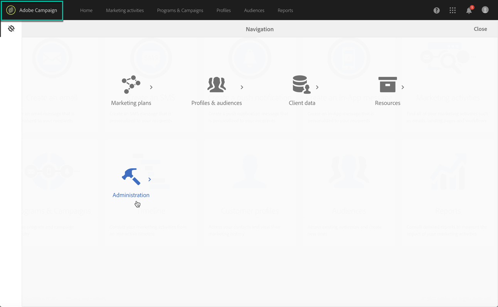

# 访问控制面板 {#accessing-control-panel}

可直接从 Experience Cloud 或产品本身访问控制面板。

仅&#x200B;**管理员用户**&#x200B;可以访问。有关如何将用户分配到“管理员”组的更多信息，请参阅[此小节](../../discover/using/managing-permissions.md)。

## 从 Experience Cloud Platform 访问 {#access-experience-cloud-platform}

要从 Adobe Experience Cloud 平台访问控制面板，请执行以下步骤。

1. 导航至 [Experience Cloud 主页](https://experiencecloud.adobe.com/){target="_blank"}。

1. 单击&#x200B;**快速访问**&#x200B;部分中的专用链接。

   

还可从 Experience Cloud 平台的&#x200B;**解决方案选取器**&#x200B;访问控制面板：

1. 在 [Adobe Experience Cloud 主页](https://experiencecloud.adobe.com/){target="_blank"}中，选择&#x200B;**快速访问**&#x200B;部分或右侧顶部菜单的 **Campaign**。

   

1. 此时将显示您的 Campaign 实例列表。单击&#x200B;**控制面板**&#x200B;信息卡进行启动。

   

## 从产品访问 {#access-product}

>[!NOTE]
>
>从产品内访问的方式仅适用于 [Campaign Standard](https://experienceleague.adobe.com/docs/campaign-standard/using/campaign-standard-home.html?lang=zh-Hans){target="_blank"}。

1. 打开您的 Campaign Standard 产品。

1. 从&#x200B;**[!UICONTROL 导航]**&#x200B;窗格中选择&#x200B;**管理**&#x200B;菜单。

   

1. 单击&#x200B;**[!UICONTROL 控制面板]**&#x200B;图标。

   
