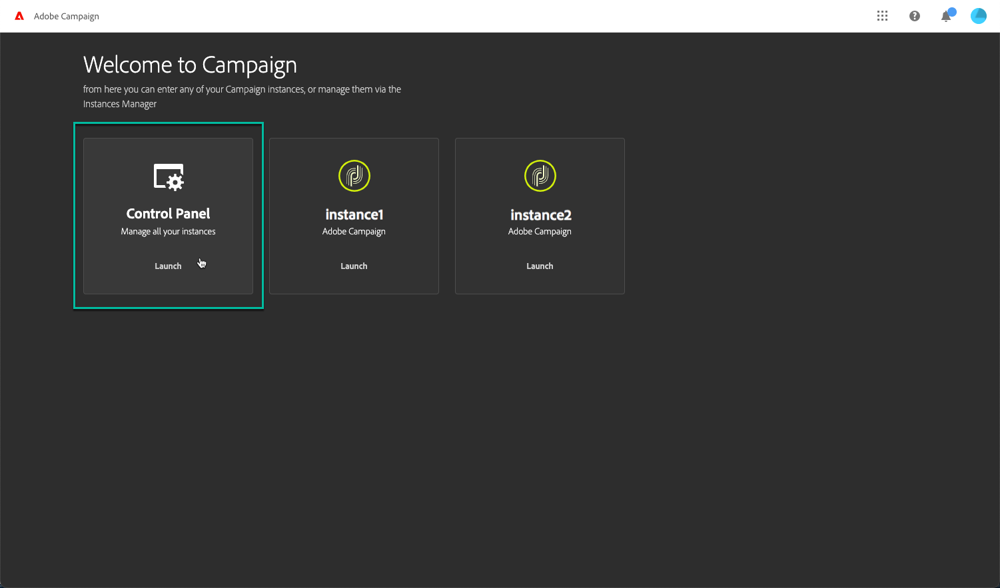

# 访问控制面板 {#accessing-control-panel}

可直接从 Experience Cloud 或产品本身访问控制面板。

## 先决条件 {#prerequisites}

对于 Campaign v7/v8，请注意，务必将您的实例托管在 Amazon Web Services (AWS) 上，并升级到最新的 [Campaign 稳定版本](https://experienceleague.adobe.com/docs/campaign-classic/using/release-notes/rn-overview.html?lang=zh-Hans#rn-statuses)或 9032 版本及以上。 在[本节](https://experienceleague.adobe.com/docs/campaign-classic/using/getting-started/starting-with-adobe-campaign/launching-adobe-campaign.html?lang=zh-Hans#getting-your-campaign-version)中了解如何确认您的版本。 要检查您的实例是否托管在 AWS 上，请按照[此页面](../../faq.md#hosted-aws)中详述的步骤操作。

在Microsoft Azure上托管的Campaign v8实例还可以访问控制面板功能的子集：[实例访问的IP允许列表](../../instances-settings/using/ip-allow-listing-instance-access.md)、[SFTP服务器的IP允许列表](../../sftp/using/ip-range-allow-listing.md)和[客户管理的SSL证书管理](../../subdomains-certificates/using/renewing-subdomain-certificate.md)。

>[!IMPORTANT]
>
>默认情况下，属于“管理员”产品配置文件的管理员用户可以访问控制面板。 根据您所属组织的配置，产品配置文件的命名会有所不同（“admin”、“admins”、“approval admin”等）。 **任何名称中包含“admin”一词的产品配置文件都将自动授予对控制面板**&#x200B;的访问权限。 请仔细审查您的产品配置文件命名，确保只有授权用户才有控制面板访问权限。 [了解如何管理控制面板](../../discover/using/managing-permissions.md)的权限。

## 从 Experience Cloud Platform 访问 {#access-experience-cloud-platform}

要从 Adobe Experience Cloud 平台访问控制面板，请执行以下步骤。

1. 导航至 [Experience Cloud 主页](https://experiencecloud.adobe.com/){target="_blank"}。

1. 单击&#x200B;**快速访问**&#x200B;部分中的专用链接。

   

还可从 Experience Cloud 平台的&#x200B;**解决方案选取器**&#x200B;访问控制面板：

1. 在 [Adobe Experience Cloud 主页](https://experiencecloud.adobe.com/){target="_blank"}中，从&#x200B;**快速访问**&#x200B;部分或右侧顶部菜单选择 **Campaign**。

   

1. 此时将显示您的 Campaign 实例列表。 单击&#x200B;**控制面板**&#x200B;信息卡进行启动。

   

## 从产品访问 {#access-product}

>[!NOTE]
>
>从产品内访问的方式仅适用于 [Campaign Standard](https://experienceleague.adobe.com/docs/campaign-standard/using/campaign-standard-home.html?lang=zh-Hans){target="_blank"}。

1. 打开您的 Campaign Standard 产品。

1. 从&#x200B;**[!UICONTROL 导航]**&#x200B;窗格中选择&#x200B;**管理**&#x200B;菜单。

   

1. 单击&#x200B;**[!UICONTROL 控制面板]**&#x200B;图标。

   
