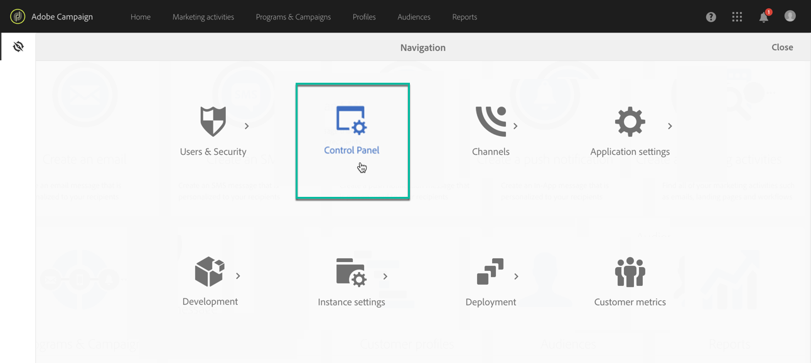

# 访问控制面板 {#accessing-control-panel}

控制面板可直接从Experience cloud或产品本身访问。

只有管理员用 **户才能访问** 它。 有关如何将用户分配到管理员组的详细信息，请参阅 [此部分](../../discover/using/managing-permissions.md)。

## 从Experience Cloud Platform访问 {#access-experience-cloud-platform}

要从 Experience Cloud Platform 访问“控制面板”，请导航到 [Experience Cloud Platform 主页](https://experiencecloud.adobe.com/)，然后单击&#x200B;**快速访问**&#x200B;部分中的专用链接。

控制面板也可从Experience Cloud Platform解决方案选取器 **访问**:

1. 导航到 [Adobe Experience Cloud](https://experiencecloud.adobe.com/)，然后从解决方案选 **择器中选** 择Campaign。

   

1. 此时将显示营销活动实例列表。 单击“ **控制面板** ”卡以启动它。

   

## 从产品访问 {#access-product}

>[!NOTE]
>
>从产品中访问仅可用于Campaign Standard。

1. 打开Campaign standard产品，然后从窗格 **[!UICONTROL Administration]**中选择菜**[!UICONTROL Navigation]** 单。

   

1. 单击该 **[!UICONTROL Control Panel]**图标。

   
