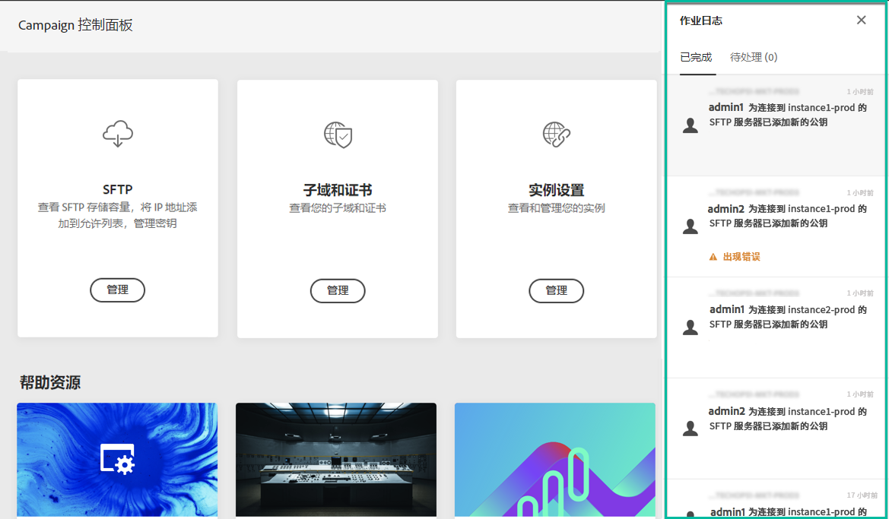
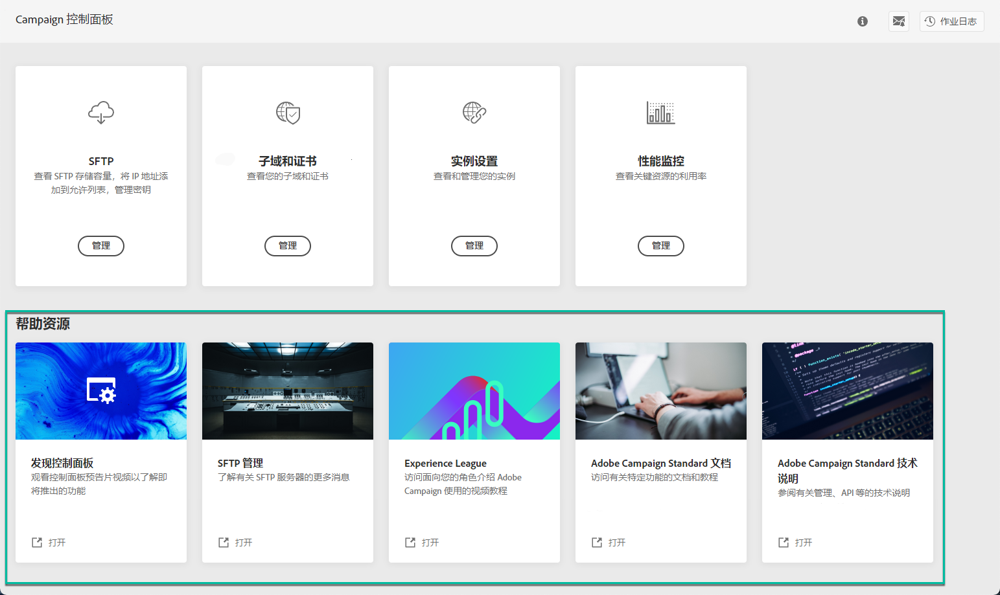

# 了解控制面板界面 {#discovering-interface}

通过控制面板主页，您可以访问可在 Campaign 实例上执行的所有操作。

它们由组织成主题的卡表示，例如&#x200B;**存储和数据库管理**。

随着即将发布的活动版本，将提供更多主题和卡。

## 作业日志{#job-logs}

通过右上角的&#x200B;**[!UICONTROL Job Logs]**&#x200B;按钮，可以审核组织用户所做的所有更改。

单击列表的元素可获取更多详细信息。

**[!UICONTROL Open]**&#x200B;按钮允许您直接访问已进行更改的控制面板选项卡。

## 帮助资源{#help-resources}

**[!UICONTROL Help Resources]**&#x200B;部分提供有用的文档，帮助您使用控制面板和活动产品。 不要犹豫去探索它们。

