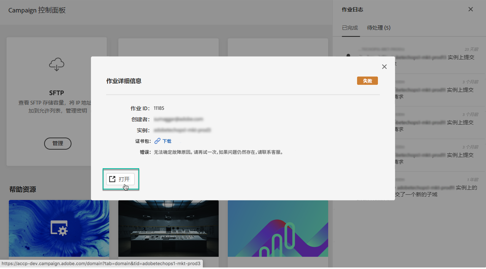

# 了解控制面板界面 {#discovering-interface}

通过控制面板主页，您可以访问可在 Campaign 实例上执行的所有操作。

例如，它們以組織成主題的卡片表示 **效能監視**.

<!--With upcoming Campaign releases, more topics and cards will be made available.-->

## 作业日志 {#job-logs}

此 **[!UICONTROL Job Logs]** 右上角的按鈕可讓您稽核組織的使用者所作的所有變更。

按一下清單的元素以取得更多詳細資訊。

此 **[!UICONTROL Open]** 按鈕可讓您直接存取已變更的「控制面板」標籤。

## 說明資源 {#help-resources}

此 **[!UICONTROL Help Resources]** 區段提供實用檔案，協助您使用控制面板和Campaign產品。 請隨時探索。

