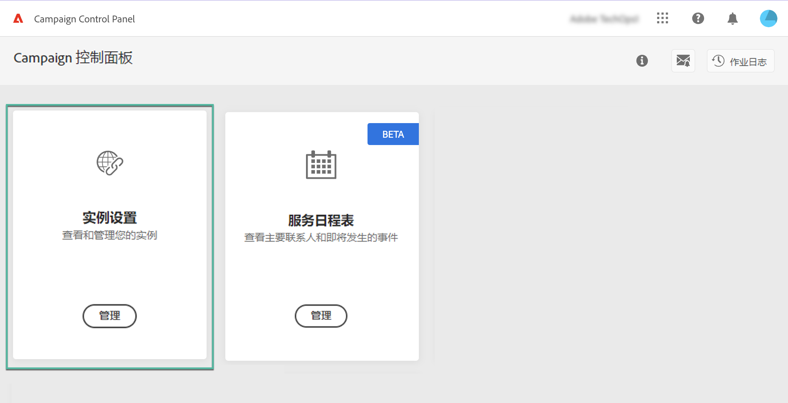
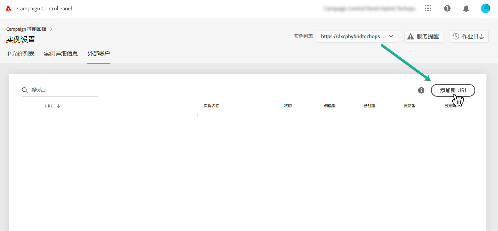
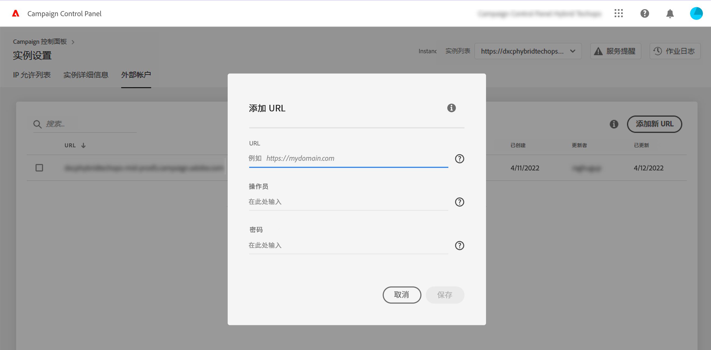
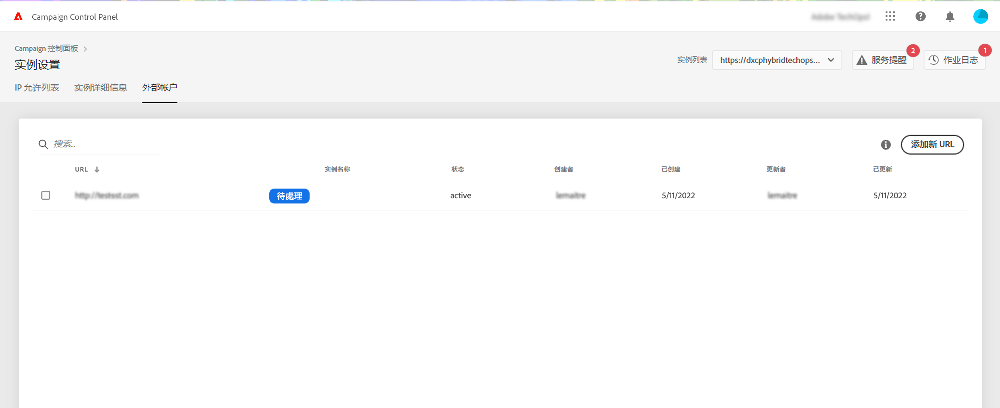
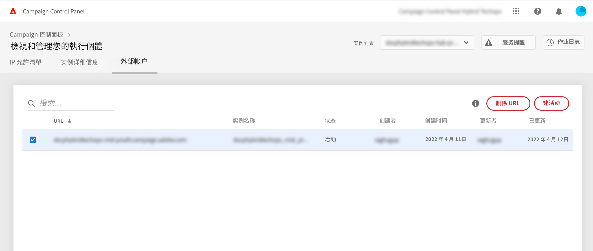
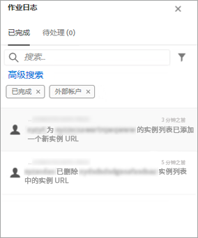

# 添加 MID/RT 实例（混合模型）{#add-mid-rt-instances-hybrid-model}

>[!CONTEXTUALHELP]
>id="cp_externalaccounts"
>title="外部帐户"
>abstract="在此屏幕中，为利用控制面板功能，使用混合托管模型的客户可在控制面板中提供其在营销实例中配置的 MID/RT 实例 URL。"

使用混合托管模型的客户可在控制面板中利用特定的控制面板功能。为此，您需要：

* 在“控制面板”中[提供在营销实例中配置的 MID/RT 实例 URL](#add)，
* [将 MID/RT 实例 IP 地址添加到允许列表](#ip)，以允许营销实例连接到该实例。

有关托管模型的更多信息，请参阅 [Campaign Classic 文档](https://experienceleague.adobe.com/docs/campaign-classic/using/installing-campaign-classic/architecture-and-hosting-models/hosting-models-lp/hosting-models.html?lang=zh-Hans)。

## 添加 MID/RT 实例 {#add}

>[!CONTEXTUALHELP]
>id="cp_externalaccounts_url"
>title="URL"
>abstract="可在 Campaign 客户端控制台中的“Administration”>“Platform”>“External Accounts”菜单中找到实例的 URL。"

>[!CONTEXTUALHELP]
>id="cp_externalaccounts_operator"
>title="操作员"
>abstract="会在 Adobe 管理员完成初始配置后提供操作员的 ID。"

>[!CONTEXTUALHELP]
>id="cp_externalaccounts_password"
>title="密码"
>abstract="会在 Adobe 管理员完成初始配置后提供操作员的密码。"

混合型客户应通过 Experience Cloud 连接到控制面板。首次访问控制面板时，主页上仅显示两张信息卡。

>[!NOTE]
>
>如果您在访问控制面板时遇到问题，很可能是因为您的营销实例尚未映射到您的[组织 ID](https://experienceleague.adobe.com/docs/core-services/interface/administration/organizations.html?lang=zh-Hans)。请联系客户关怀团队以完成此设置，然后继续下一步操作。成功连接后，就会显示控制面板主页。

要访问控制面板功能，您需要在以下位置提供MID/RT实例信息： **[!UICONTROL 实例设置]** 卡片。 为此，请执行以下步骤：

1. 在 **[!UICONTROL 实例设置]** 卡，选择 **[!UICONTROL 外部帐户]** 选项卡。

1. 从下拉列表中选择所需的营销实例，然后单击 **[!UICONTROL 添加新URL]**.

   

1. 提供要添加的 MID/RT 实例的相关信息。

   

   * **[!UICONTROL URL]**：可在的Campaign客户端控制台中找到实例的URL **[!UICONTROL 管理]** > **[!UICONTROL 平台]** > **[!UICONTROL 外部帐户]** 菜单。

     

   * **[!UICONTROL 运算符]** / **[!UICONTROL 密码]**：Adobe管理员在初始配置后提供的操作员的凭据。

     >[!NOTE]
     >
     >如果无法获取这些详细信息，请联系客户关怀团队。

1. 单击 **[!UICONTROL 保存]** 以确认。

添加 MID/RT URL 时，会触发异步进程以验证 URL 的正确性。此过程可能需要几分钟。在完成对 MID/RT 实例 URL 的验证之前，作业将处于待处理状态。仅在完成验证后，您才能访问控制面板的主要功能。

您可以随时从列表中选择 MID/RT 实例 URL，以将其移除或停用。

请注意，您可以监控在中执行的任何操作， **[!UICONTROL 外部帐户]** 选项卡，该URL位于 **[!UICONTROL 作业日志]**：

## 将 IP 地址添加到允许列表 {#ip}

添加 MID/RT 实例后，您需要将其 IP 地址添加到允许列表，以便营销实例可以连接到该实例。

这可以从以下位置执行： **[!UICONTROL IP允许列表]** 选项卡 **[!UICONTROL 实例设置]** 卡片。 [了解如何将 IP 地址添加到允许列表](ip-allow-listing-instance-access.md)

完成后，您可以将控制面板功能与 MID/RT 实例结合使用。

## 适用于混合型客户的功能 {#capabilities}

将 MID/RT 实例添加到控制面板后，就可以利用以下列出的功能：

* [监测关键联系人和事件](../../service-events/service-events.md)
* [查看实例详细信息](../../instances-settings/using/instance-details.md)，
* [向允许列表添加 IP 地址](../../instances-settings/using/ip-allow-listing-instance-access.md)，
* [设置新子域](../../subdomains-certificates/using/setting-up-new-subdomain.md)，
* [续订子域的 SSL 证书](../../subdomains-certificates/using/renewing-subdomain-certificate.md)。
