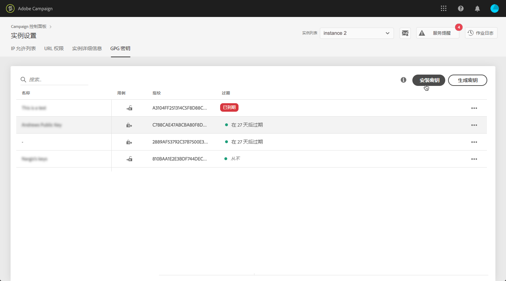
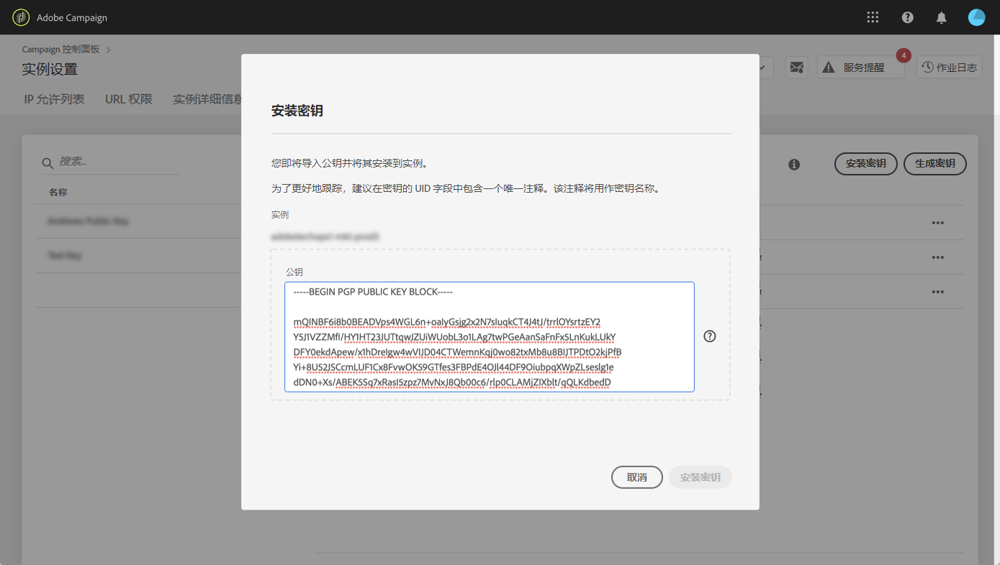
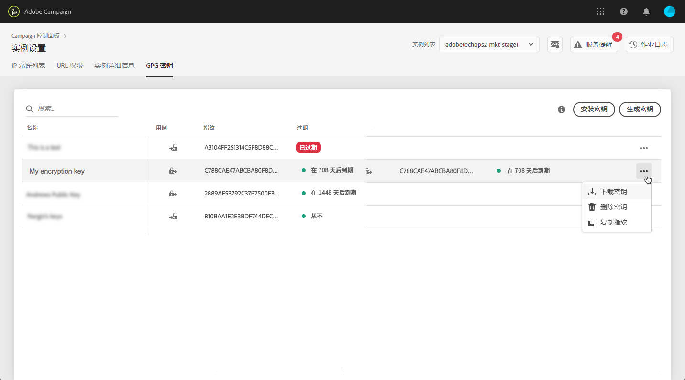
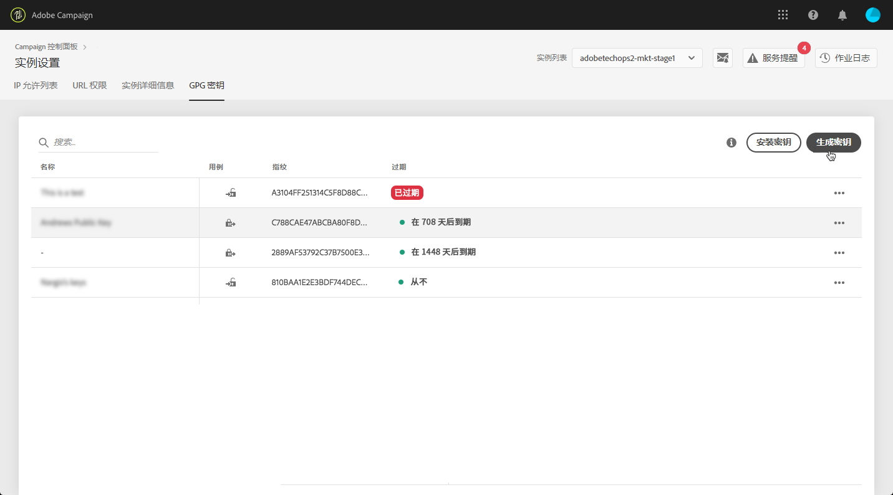
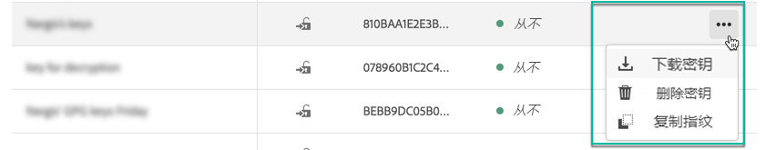
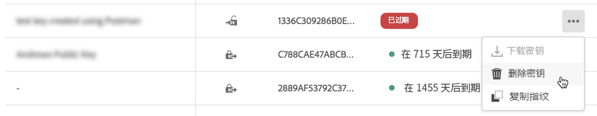

# GPG密钥管理 {#gpg-keys-management}

## 关于GPG加密 {#about-gpg-encryption}

GPG加密允许您使用遵循OpenPGP规范的公私钥对系统保护 [数据](https://www.openpgp.org/about/standard/) 。

实施后，您可以在传输发生之前对传入数据进行解密和加密，以确保没有有效匹配密钥对的任何人都无法访问它们。

要利用活动实现GPG加密，管理员用户必须直接从控制面板在营销实例上安装和／或生成GPG密钥。

然后，您将能够：

* **加密发送的数据**: Adobe Campaign在使用已安装的公钥对数据进行加密后将其发送出去。

* **解密传入数据**: Adobe Campaign使用从控制面板下载的公钥从外部系统接收已加密的数据。 Adobe Campaign使用从控制面板生成的私钥对数据进行解密。

## 加密数据 {#encrypting-data}

控制面板允许您加密从Adobe Campaign实例中传出的数据。

为此，您需要从PGP加密工具生成GPG密钥对，然后将公钥安装到控制面板中。 然后，您将能够在从实例发送数据之前对其进行加密。 为此，请执行以下步骤：

1. 使用遵循OpenPGP规范的GPG加密工具生成公共／私 [钥对](https://www.openpgp.org/about/standard/)。 为此，请安装GPG实用程序或GNuGP软件。

   >[!NOTE]
   >
   >提供用于生成密钥的开放源码免费软件。 但是，请确保遵循组织的准则，并使用IT/安全组织推荐的GPG实用程序。

1. 安装该实用程序后，在Mac Terminal或Windows命令中运行以下命令。

   `gpg --full-generate-key`

1. 出现提示时，为您的键指定所需的参数。 所需参数包括：

   * **键类型**: RSA
   * **密钥长度**: 1024 - 4096比特
   * **真实姓名** 和电 **子邮件地址**: 允许跟踪创建密钥对的人。 输入链接到您的组织或部门的名称和电子邮件地址。
   * **注释**: 在注释字段中添加标签可让您在控制面板键列表中轻松识别键。
   * **过期**: 日期或“0”表示无过期日期。
   * **密码**
   

1. 确认后，脚本将生成一个键，您可以将其导出到文件中，或直接粘贴到控制面板中。 要导出文件，请运行此命令，后跟生成的密钥的指纹。

   `gpg -a --export <fingerprint>`

1. 要将公钥安装到控制面板中，请打 **[!UICONTROL Instance settings]** 开卡，然后选择 **[!UICONTROL GPG keys]** 选项卡和所需的实例。

1. Click the **[!UICONTROL Install Key]** button.

   

1. 粘贴从PGP加密工具生成的公钥。 您还可以直接拖放公钥文件。

   >[!NOTE]
   >
   >公钥应采用OpenPGP格式。

   

1. Click the **[!UICONTROL Install Key]** button.

安装公钥后，该公钥将显示在列表中。 您可以使用。 **..按钮** ，下载它或复制其指纹。

然后该密钥可用于Adobe Campaign工作流。 在使用数据提取活动时，可以使用它加密数据。

有关此内容的详细信息，请参阅Adobe Campaign文档：

**Campaign Classic:**

* [压缩或加密文件](https://docs.adobe.com/content/help/en/campaign-classic/using/automating-with-workflows/general-operation/how-to-use-workflow-data.html#zipping-or-encrypting-a-file)
* [提取（文件）活动](https://docs.adobe.com/content/help/en/campaign-classic/using/automating-with-workflows/action-activities/extraction--file-.html)

**Campaign Standard:**

* [管理加密数据](https://docs.adobe.com/content/help/en/campaign-standard/using/managing-processes-and-data/workflow-general-operation/importing-data.html#managing-encrypted-data)
* [提取文件活动](https://docs.adobe.com/content/help/en/campaign-standard/using/managing-processes-and-data/data-management-activities/extract-file.html)

## 解密数据 {#decrypting-data}

控制面板允许您解密传入Adobe Campaign实例的外部数据。

为此，您需要直接从控制面板生成GPG密钥对。

* 公 **钥将** 与外部系统共享，外部系统将使用公钥加密要发送给活动的数据。
* 活动 **将使用** 私钥对传入的加密数据进行解密。

要在控制面板中生成键对，请执行以下步骤：

1. 打开卡 **[!UICONTROL Instance settings]** ，然后选择选 **[!UICONTROL GPG keys]** 项卡和所需的Adobe Campaign实例。

1. Click the **[!UICONTROL Generate Key]** button.

   

1. 指定键的名称，然后单击 **!UICONTROL Generate Key]**。 此名称将帮助您确定用于活动工作流解密的密钥

   

生成密钥对后，公共密钥将显示在列表中。 请注意，解密密钥对是在没有过期日期的情况下生成的。

您可以使用。 **..按钮** ，下载公钥或复制其指纹。

公共密钥随后可用于与任何外部系统共享。 Adobe Campaign将能够在数据加载活动中使用私钥来解密已用公钥加密的数据。

有关此内容的详细信息，请参阅Adobe Campaign文档：

**Campaign Classic:**

* [在处理文件之前解压缩或解密文件](https://docs.adobe.com/content/help/en/campaign-classic/using/automating-with-workflows/general-operation/importing-data.html#unzipping-or-decrypting-a-file-before-processing)
* [数据加载（文件）活动](https://docs.adobe.com/content/help/en/campaign-classic/using/automating-with-workflows/action-activities/data-loading--file-.html)

**Campaign Standard:**

* [管理加密数据](https://docs.adobe.com/content/help/en/campaign-standard/using/managing-processes-and-data/workflow-general-operation/importing-data.html#managing-encrypted-data)
* [加载文件活动](https://docs.adobe.com/content/help/en/campaign-standard/using/managing-processes-and-data/data-management-activities/load-file.html)

## 监视GPG密钥

要访问为实例安装和生成的GPG密钥，请打 **[!UICONTROL Instance settings]** 开卡，然后选择选 **[!UICONTROL GPG keys]** 项卡。

该列表显示已为实例安装和生成的所有加密和解密GPG密钥，其中包含有关每个密钥的详细信息：

* **[!UICONTROL Name]**: 安装或生成密钥时定义的名称。
* **[!UICONTROL Use case]**: 此列指定键的用例：

   : 该密钥已安装用于数据加密。

   : 已生成密钥以允许数据解密。

* **[!UICONTROL Fingerprint]**: 钥匙的指纹。
* **[!UICONTROL Expires]**: 密钥的过期日期。 请注意，当主要指标接近其到期日时，控制面板将提供可视指示：

   * 紧急（红色）在30天前显示。
   * 警告（黄色）在60天前显示。
   * 密钥过期后，将显示“已过期”红色横幅。
   >[!NOTE]
   >
   >请注意，控制面板不会发送任何电子邮件通知。

作为最佳实践，我们建议您删除不再需要的任何密钥。 要执行此操作，请单 **击。.** .按钮，然后选 **[!UICONTROL Delete Key]择。**.

>[!IMPORTANT]
>
>在删除密钥之前，请确保未在任何Adobe Campaign工作流中使用该密钥以防止其失败。
