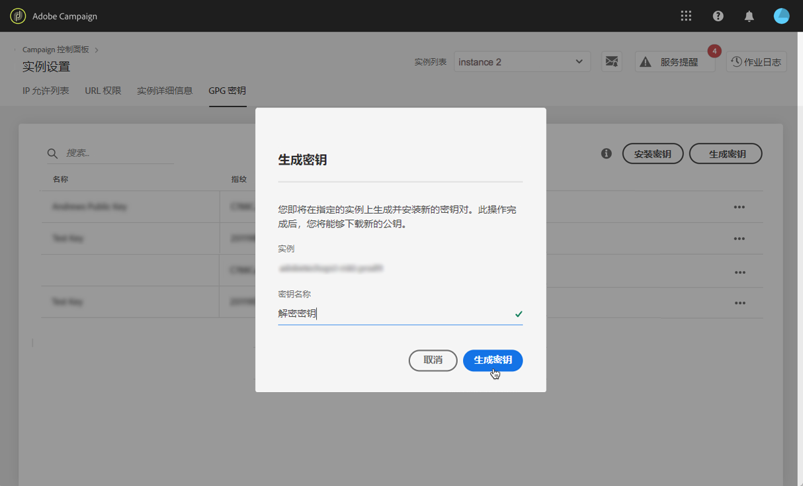

# GPG 密钥管理 {#gpg-keys-management}

>[!CONTEXTUALHELP]
>id="cp_instancesettings_gpg_management"
>title="关于 GPG 密钥"
>abstract="在此选项卡中，您可以在营销实例上安装和/或生成 GPG 密钥，以便加密从 Campaign 发送的数据和解密传入数据。"
>additional-url="https://experienceleague.adobe.com/docs/control-panel/using/performance-monitoring/about-performance-monitoring.html?lang=zh-Hans" text="关于性能监控"

## 关于GPG加密 {#about-gpg-encryption}

GPG加密允许您使用公钥和私钥对的系统保护数据，此系统遵循 [OpenPGP](https://www.openpgp.org/about/standard/) 规范。

实施后，您可以在传输前解密传入数据并加密传出数据，以确保任何没有有效匹配密钥对的人都不会访问这些数据。

要利用 Campaign 实现 GPG 加密，管理员用户必须直接从控制面板在营销实例上安装和/或生成 GPG 密钥。

然后，您将能够：

* **加密发送的数据**：Adobe Campaign会在使用安装的公钥加密数据之后发送该数据。

* **解密传入数据**：Adobe Campaign接收使用从控制面板下载的公共密钥从外部系统加密的数据。 Adobe Campaign使用从控制面板生成的私钥解密数据。

## 加密数据 {#encrypting-data}

控制面板允许您加密从 Adobe Campaign 实例中传出的数据。

为此，您需要从PGP加密工具生成GPG密钥对，然后将公钥安装到控制面板中。 然后，您就可以在从实例发送数据之前对其进行加密。 为此，请执行以下步骤：

>[!NOTE]
>
>您最多可以在控制面板中安装60个GPG密钥。

[ 在视频中发现此功能](#video)

1. 按照以下步骤，使用PGP加密工具生成公钥/私钥对 [OpenPGP规范](https://www.openpgp.org/about/standard/). 为此，请安装GPG实用程序或GNuGP软件。

   >[!NOTE]
   >
   >可以使用开源免费软件来生成密钥。 但是，请确保遵循贵组织的准则并使用IT/安全组织推荐的GPG实用程序。

1. 安装该实用程序后，在Mac“终端”或Windows命令中运行以下命令。

   `gpg --full-generate-key`

1. 出现提示时，为密钥指定所需的参数。 必需的参数包括：

   * **键类型**： RSA
   * **密钥长度**：3072 - 4096位
   * **实名** 和 **电子邮件地址**：用于跟踪密钥对创建者。 输入链接到您的组织或部门的名称和电子邮件地址。
   * **注释**：向评论字段添加标签将帮助您轻松识别用于加密数据的密钥。
     >[!IMPORTANT]
     >
     >确保此字段不留空并且已填充评论。

   * **过期**：日期或“0”，表示无到期日期。
   * **密码短语**

   

1. 确认后，脚本将生成一个密钥及其关联的指纹，您可以将该密钥导出到文件中，或直接粘贴到控制面板中。 要导出文件，请运行此命令，后跟您生成的密钥的指纹。

   `gpg -a --export <fingerprint>`

1. 要将公钥安装到控制面板中，请打开 **[!UICONTROL 实例设置]** 信息卡，然后选择 **[!UICONTROL GPG密钥]** 选项卡和所需的实例。

1. 单击 **[!UICONTROL 安装密钥]** 按钮。

   

1. 粘贴从PGP加密工具生成的公钥。 您还可以直接拖放导出的公钥文件。

   >[!NOTE]
   >
   >公钥应采用OpenPGP格式。

   

1. 单击 **[!UICONTROL 安装密钥]** 按钮。

安装公钥后，它将显示在列表中。 您可以使用 **...** 按钮进行下载或复制其指纹。

然后，即可在Adobe Campaign工作流中使用密钥。 在使用数据提取活动时，您可以使用它来加密数据。

[ 在视频中发现此功能](#video)

有关此主题的更多信息，请参阅Adobe Campaign文档：

**Campaign v7/v8：**

* [压缩或加密文件](https://experienceleague.adobe.com/docs/campaign-classic/using/getting-started/importing-and-exporting-data/managing-data-encryption-compression/zip-encrypt.html)
* [用例：使用安装在控制面板上的密钥加密和导出数据](https://experienceleague.adobe.com/docs/campaign-standard/using/managing-processes-and-data/importing-and-exporting-data/managing-encrypted-data.html#use-case-gpg-encrypt)

**Campaign Standard:**

* [管理加密数据](https://experienceleague.adobe.com/docs/campaign-standard/using/managing-processes-and-data/importing-and-exporting-data/managing-encrypted-data.html)
* [用例：使用安装在控制面板上的密钥加密和导出数据](https://experienceleague.adobe.com/docs/campaign-classic/using/getting-started/importing-and-exporting-data/managing-data-encryption-compression/zip-encrypt.html#use-case-gpg-encrypt)

## 解密数据 {#decrypting-data}

控制面板允许您解密传入Adobe Campaign实例的外部数据。

要实现此目的，您需要直接从控制面板生成GPG密钥对。

* 此 **公钥** 外部系统将使用它来加密要发送到Campaign的数据。
* 此 **私钥** Campaign将用于对传入的加密数据进行解密。

[ 在视频中发现此功能](#video)

要在控制面板中生成密钥对，请执行以下步骤：

1. 打开 **[!UICONTROL 实例设置]** 信息卡，然后选择 **[!UICONTROL GPG密钥]** 选项卡和所需的Adobe Campaign实例。

1. 单击 **[!UICONTROL 生成密钥]** 按钮。

   

1. 指定键的名称，然后单击 **[!UICONTROL 生成密钥]**. 此名称将帮助您识别在Campaign工作流中用于解密的密钥

   

生成密钥对后，公钥将显示在列表中。 请注意，生成解密密钥对时没有到期日期。

您可以使用 **...** 按钮以下载公钥或复制其指纹。

然后，公共密钥便可与任何外部系统共享。 Adobe Campaign将能够在数据加载活动中使用私钥来解密已使用公钥加密的数据。

有关更多信息，请参阅Adobe Campaign文档：

**Campaign v7和v8：**

* [在处理之前解压缩或解密文件](https://experienceleague.adobe.com/docs/campaign-classic/using/getting-started/importing-and-exporting-data/managing-data-encryption-compression/unzip-decrypt.html)
* [用例：导入使用控制面板生成的密钥加密的数据](https://experienceleague.adobe.com/docs/campaign-classic/using/getting-started/importing-and-exporting-data/managing-data-encryption-compression/unzip-decrypt.html#use-case-gpg-decrypt)

**Campaign Standard:**

* [管理加密数据](https://experienceleague.adobe.com/docs/campaign-standard/using/managing-processes-and-data/importing-and-exporting-data/managing-encrypted-data.html)
* [用例：导入使用控制面板生成的密钥加密的数据](https://experienceleague.adobe.com/docs/campaign-standard/using/managing-processes-and-data/importing-and-exporting-data/managing-encrypted-data.html#use-case-gpg-decrypt)

## 监控GPG密钥

要访问为实例安装和生成的GPG密钥，请打开 **[!UICONTROL 实例设置]** 信息卡，然后选择 **[!UICONTROL GPG密钥]** 选项卡。

该列表显示已为实例安装并生成的所有加解密GPG密钥，以及每个密钥的详细信息：

* **[!UICONTROL 名称]**：安装或生成密钥时定义的名称。
* **[!UICONTROL 用例]**：此列指定键的用例：

  ：已安装用于数据加密的密钥。

  ：密钥已生成以允许数据解密。

* **[!UICONTROL 指纹]**：键的指纹。
* **[!UICONTROL 过期]**：密钥的过期日期。 请注意，控制面板将在关键日期临近时提供视觉指示：

   * 紧急（红色）在30天前显示。
   * 警告（黄色）在60天前显示。
   * 一旦键过期，将显示“已过期”红色横幅。

  >[!NOTE]
  >
  >请注意，控制面板不会发送电子邮件通知。

作为最佳实践，我们建议您删除不再需要的任何密钥。 要执行此操作，请单击 **...** 按钮，然后选择 **[!UICONTROL Delete键].**.

>[!IMPORTANT]
>
>在删除键之前，请确保未将其用于任何Adobe Campaign工作流，以防止其失败。

## 教程视频 {#video}

以下视频介绍如何生成和安装用于数据加密的GPG密钥。

中提供了与GPG密钥管理相关的其他操作方法视频  [Campaign v7/v8](https://experienceleague.adobe.com/docs/campaign-standard-learn/control-panel/instance-settings/gpg-key-management/gpg-key-management-overview.html#instance-settings) 和 [Campaign Standard](https://experienceleague.adobe.com/docs/campaign-classic-learn/control-panel/instance-settings/gpg-key-management/gpg-key-management-overview.html#instance-settings) 教程页面。

>[!VIDEO](https://video.tv.adobe.com/v/36386?quality=12)
