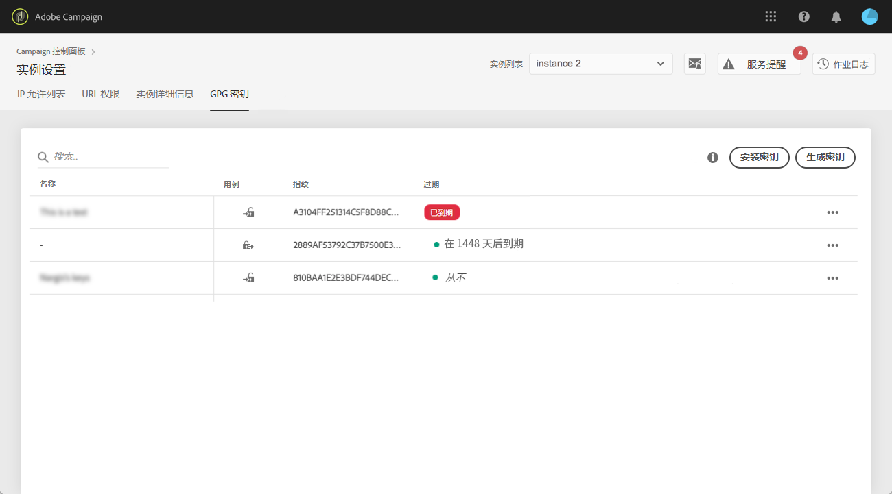

# GPG 密钥管理 {#gpg-keys-management}

>[!CONTEXTUALHELP]
>id="cp_instancesettings_gpg_management"
>title="关于 GPG 密钥"
>abstract="在此选项卡中，您可以在营销实例上安装和/或生成 GPG 密钥，以便加密从 Campaign 发送的数据和解密传入数据。"
>additional-url="https://experienceleague.adobe.com/docs/control-panel/using/performance-monitoring/about-performance-monitoring.html?lang=zh-Hans" text="关于性能监控"

## 关于 GPG 加密 {#about-gpg-encryption}

GPG 加密允许您使用公钥和私钥对系统保护数据，此系统遵循 [OpenPGP](https://www.openpgp.org/about/standard/) 规范。

实施后，您可以在传输前解密传入数据并加密传出数据，确保任何没有有效匹配密钥对的人都不能访问这些数据。

要利用 Campaign 实现 GPG 加密，管理员用户必须直接从控制面板在营销实例上安装和/或生成 GPG 密钥。

然后，您将能够：

* **加密发送的数据**：在使用安装的公钥加密数据后，Adobe Campaign 会发送该数据。

* **解密传入数据**：Adobe Campaign 使用从控制面板下载的公钥接收从外部系统加密的数据。Adobe Campaign 使用从控制面板生成的私钥解密数据。

## 加密数据 {#encrypting-data}

控制面板允许您加密从 Adobe Campaign 实例中传出的数据。

为此，您需要从 PGP 加密工具生成 GPG 密钥对，然后将公钥安装到控制面板中。然后，您就可以在从实例发送数据之前对其进行加密。为此，请执行以下步骤。

>[!NOTE]
>
>您最多可以在控制面板中安装 60 个 GPG 密钥。

通过观看[视频了解此功能](#video)

1. 按照 [OpenPGP 规范](https://www.openpgp.org/about/standard/)，使用 PGP 加密工具生成公钥/私钥对。为此，请安装 GPG 实用程序或 GNuGP 软件。

   >[!NOTE]
   >
   >可以使用开源免费软件来生成密钥。但是，请确保遵循您所属组织的指导原则并使用 IT/安全组织推荐的 GPG 实用程序。

1. 安装该实用程序后，在 Mac 终端或 Windows 命令中运行以下命令。

   `gpg --full-generate-key`

1. 出现提示时，为密钥指定所需的参数。必需的参数包括：

   * **密钥类型**：RSA
   * **密钥长度**：3072 - 4096 位
   * **实名**&#x200B;和&#x200B;**电子邮件地址**：用于跟踪密钥对创建者。输入链接到您所属组织或部门的名称和电子邮件地址。
   * **注释**：向注释字段添加标签，有助于您轻松识别用于加密数据的密钥。
     >[!IMPORTANT]
     >
     >确保此字段未留空并且已填写注释。

   * **过期**：具体日期或表示无过期日期的“0”。
   * **密码短语**

   

1. 确认后，脚本将生成一个密钥及其关联的指纹，您可以将其导出到文件中，或直接粘贴到控制面板中。要导出文件，请运行此命令（后跟所生成密钥的指纹）。

   `gpg -a --export <fingerprint>`

1. 要将公钥安装到控制面板中，请打开&#x200B;**[!UICONTROL 实例设置]**&#x200B;信息卡，然后选择 **[!UICONTROL GPG 密钥]**&#x200B;选项卡和所需的实例。

1. 单击&#x200B;**[!UICONTROL 安装密钥]**&#x200B;按钮。

   

1. 粘贴从 PGP 加密工具生成的公钥。您还可以直接拖放导出的公钥文件。

   >[!NOTE]
   >
   >公钥应采用 OpenPGP 格式。

   

1. 单击&#x200B;**[!UICONTROL 安装密钥]**&#x200B;按钮。

安装公钥后，它将显示在列表中。您可以使用 **...** 按钮进行下载或复制其指纹。

然后，即可在 Adobe Campaign 工作流中使用密钥。在使用数据提取活动时，您可以将其用于加密数据。

通过观看[视频](#video)了解此功能

有关此主题的更多信息，请参阅 Adobe Campaign 文档：

**Campaign v7/v8：**

* [压缩或加密文件](https://experienceleague.adobe.com/docs/campaign-classic/using/getting-started/importing-and-exporting-data/managing-data-encryption-compression/zip-encrypt.html?lang=zh-Hans)
* [用例：使用安装在控制面板上的密钥加密和导出数据](https://experienceleague.adobe.com/docs/campaign-standard/using/managing-processes-and-data/importing-and-exporting-data/managing-encrypted-data.html?lang=zh-Hans#use-case-gpg-encrypt)

**Campaign Standard：**

* [管理加密数据](https://experienceleague.adobe.com/docs/campaign-standard/using/managing-processes-and-data/importing-and-exporting-data/managing-encrypted-data.html?lang=zh-Hans)
* [用例：使用安装在控制面板上的密钥加密和导出数据](https://experienceleague.adobe.com/docs/campaign-classic/using/getting-started/importing-and-exporting-data/managing-data-encryption-compression/zip-encrypt.html?lang=zh-Hans#use-case-gpg-encrypt)

## 解密数据 {#decrypting-data}

控制面板允许您解密传入 Adobe Campaign 实例的外部数据。

为此，您需要直接从控制面板生成 GPG 密钥对。

* **公钥**&#x200B;会被共享给外部系统，外部系统将使用该公钥加密数据以发送到 Campaign。
* Campaign 将使用&#x200B;**私钥**&#x200B;来解密传入的加密数据。

通过观看[视频](#video)了解此功能

要在控制面板中生成密钥对，请执行以下步骤：

1. 打开&#x200B;**[!UICONTROL 实例设置]**&#x200B;信息卡，然后选择 **[!UICONTROL GPG 密钥]**&#x200B;选项卡和所需的 Adobe Campaign 实例。

1. 单击&#x200B;**[!UICONTROL 生成密钥]**&#x200B;按钮。

   

1. 指定密钥的名称，然后单击&#x200B;**[!UICONTROL 生成密钥]**。此名称有助于您识别在 Campaign 工作流中用于解密的密钥

   

生成密钥对后，公钥将显示在列表中。请注意，解密密钥对在生成时没有过期日期。

您可以使用 **...** 按钮下载公钥或复制其指纹。

然后，便可将公钥共享给任何外部系统。Adobe Campaign 将能够在数据加载活动中使用私钥来解密已使用公钥加密的数据。

有关更多信息，请参阅 Adobe Campaign 文档：

**Campaign v7 和 v8：**

* [在处理之前解压缩或解密文件](https://experienceleague.adobe.com/docs/campaign-classic/using/getting-started/importing-and-exporting-data/managing-data-encryption-compression/unzip-decrypt.html?lang=zh-Hans)
* [用例：使用控制面板生成的密钥导入加密数据](https://experienceleague.adobe.com/docs/campaign-classic/using/getting-started/importing-and-exporting-data/managing-data-encryption-compression/unzip-decrypt.html?lang=zh-Hans#use-case-gpg-decrypt)

**Campaign Standard：**

* [管理加密数据](https://experienceleague.adobe.com/docs/campaign-standard/using/managing-processes-and-data/importing-and-exporting-data/managing-encrypted-data.html?lang=zh-Hans)
* [用例：使用控制面板生成的密钥导入加密数据](https://experienceleague.adobe.com/docs/campaign-standard/using/managing-processes-and-data/importing-and-exporting-data/managing-encrypted-data.html?lang=zh-Hans#use-case-gpg-decrypt)

## 监控 GPG 密钥

要访问为实例安装和生成的 GPG 密钥，请打开&#x200B;**[!UICONTROL 实例设置]**&#x200B;信息卡，然后选择 **[!UICONTROL GPG 密钥]**&#x200B;选项卡。

该列表显示已为实例安装并生成的所有加密和解密 GPG 密钥，以及每个密钥的详细信息：

* **[!UICONTROL 名称]**：安装或生成密钥时定义的名称。
* **[!UICONTROL 用例]**：此列指明了密钥的用例：

  ：已安装用于数据加密的密钥。

  ：已生成用于数据解密的密钥。

* **[!UICONTROL 指纹]**：密钥的指纹。
* **[!UICONTROL 过期]**：密钥的过期日期。请注意，控制面板将在密钥过期日期临近时提供可视化提醒：

   * 在过期前 30 天显示为紧急状态（红色）。
   * 在过期前 60 天显示为警告状态（黄色）。
   * 密钥过期后，将显示“已过期”红色横幅。

  >[!NOTE]
  >
  >请注意，控制面板不会发送电子邮件通知。

作为最佳实践，我们建议您移除不再需要的任何密钥。为此，请单击 **...** 按钮，然后选择&#x200B;**[!UICONTROL 删除密钥]**。

>[!IMPORTANT]
>
>在移除密钥之前，请确保未将其用于任何 Adobe Campaign 工作流，以防止移除失败。

## 教程视频 {#video}

以下视频介绍如何生成和安装用于数据加密的 GPG 密钥。

[Campaign v7/v8](https://experienceleague.adobe.com/docs/campaign-standard-learn/control-panel/instance-settings/gpg-key-management/gpg-key-management-overview.html?lang=zh-Hans#instance-settings) 和 [Campaign Standard](https://experienceleague.adobe.com/docs/campaign-classic-learn/control-panel/instance-settings/gpg-key-management/gpg-key-management-overview.html?lang=zh-Hans#instance-settings) 教程页面中提供了与 GPG 密钥管理相关的其他操作方法视频。

>[!VIDEO](https://video.tv.adobe.com/v/327881?captions=chi_hans&quality=12)
