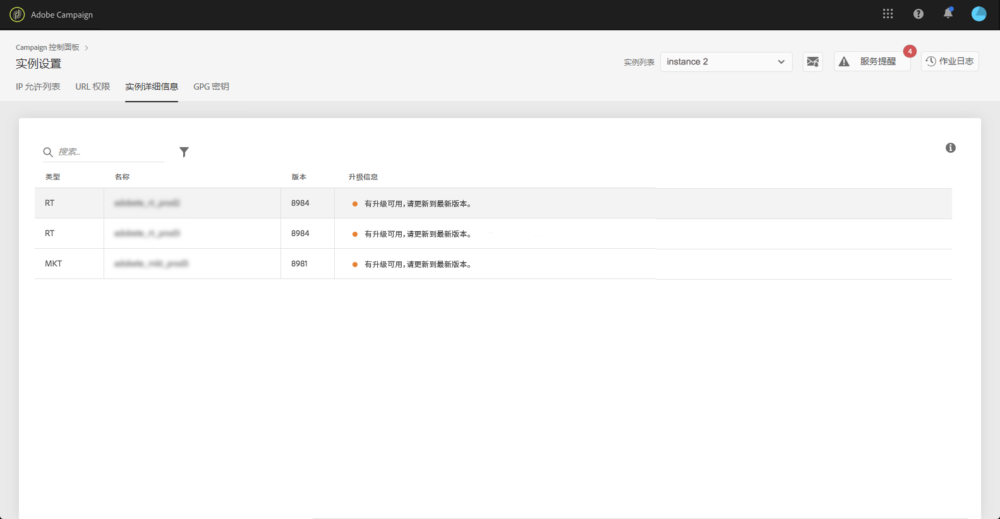

# 实例详细信息 {#instance-details}

>[!CONTEXTUALHELP]
>id="cp_instancesettings_instancedetails"
>title="关于实例详细信息"
>abstract="查看 Adobe Campaign 实例的详细信息：类型、名称、内部版本信息和可能的升级建议。"
>additional-url="https://docs.adobe.com/content/help/zh-Hans/campaign-classic/using/release-notes/latest-release.html" text="Campaign Classic 发行说明"
>additional-url="https://docs.adobe.com/content/help/zh-Hans/campaign-standard/using/release-notes/release-notes.html" text="Campaign Standard 发行说明"

>[!IMPORTANT]
>
>此功能仅适用于 Campaign Classic 实例。

## 关于实例详细信息 {#about-instance-details}

您的 Adobe Campaign Classic 实例架构可以包含多个服务器，以实现营销活动的灵活性。例如，您可以拥有支持您的实例的营销、实时（或消息中心）和中间采购服务器。

“实例详细信息”功能允许您查看实例的平面架构。除了服务器信息外，您还可以获悉实例是否为最新的内部版本，并获得建议以在需要时进行升级。

>[!NOTE]
>
>我们建议您的实例每年至少升级一次，以避免性能下降，并能够利用 Adobe Campaign Classic 提供的最新功能和修复。

**相关主题：**

* [执行内部版本升级](https://docs.campaign.adobe.com/doc/AC/getting_started/EN/buildUpgrade.html)
* [更新 Adobe Campaign](https://docs.campaign.adobe.com/doc/AC/en/PRO_Updating_Adobe_Campaign_Introduction.html)

## 检索实例相关信息 {#retrieving-information-about-instances}

要获取有关连接到实例的服务器信息，请执行以下步骤：

1. 打开卡 **[!UICONTROL Instances Settings]**&#x200B;以访问 **[!UICONTROL Instance Details]** 选项卡。

   >[!NOTE]
   >
   >如果控制面板的主页上未显示“实例设置”卡，则表示您的IMS组织ID未与任何Adobe Campaign经典实例关联

1. 在左窗格中选择所需的 Campaign Classic 实例。

   >[!NOTE]
   >
   >您的所有 Campaign 实例都将显示在左窗格列表中。由于“实例详细信息”功能仅专用于 Campaign Classic 实例，因此，如果您选择了 Campaign Standard 实例，则会显示“非适用的实例”消息。

1. 将显示连接到实例的服务器。

   

可用信息包括：

* **[!UICONTROL Type]**：服务器的类型。可能的值包括 MKT（营销）、MID（中间采购）和 RT（消息中心/实时消息）。
* **[!UICONTROL Name]**：服务器的名称。
* **[!UICONTROL Build:]**：服务器上安装的内部版本。
* **[!UICONTROL Upgrade info]**：此列将通知您服务器是否需要任何更新。
   * 绿色：表示您的服务器为最新版本，无需升级。
   * 黄色：表示您应考虑升级。您缺少最新功能和修复。
   * 红色：表示应尽快升级。您缺少新功能，服务器性能可能不佳。

如果您的其中一个服务器需要升级，请参阅[本文档](https://docs.campaign.adobe.com/doc/AC/getting_started/EN/buildUpgrade.html)，了解有关操作方法的详细信息。

## 常见问题 {#common-questions}

**我在实例架构上看不到 MID 服务器，这是否意味着我的实例无法正常运行？我是否需要 RT 实例才能完成今天无法完成的任务？**

您自己的实例看起来可能会非常不同，它可能并不具有所有类型的服务器，也可能具有多个相同的服务器。没有一种或另一种类型的服务器并不意味着您无法发送实时消息或执行其他类型的活动。您可以请求额外的服务器容量，但需支付额外费用。

如果您认为某些服务器未显示在“实例详细信息”页面，请联系客户关怀团队。请确保记下消息中的特定实例 URL。
