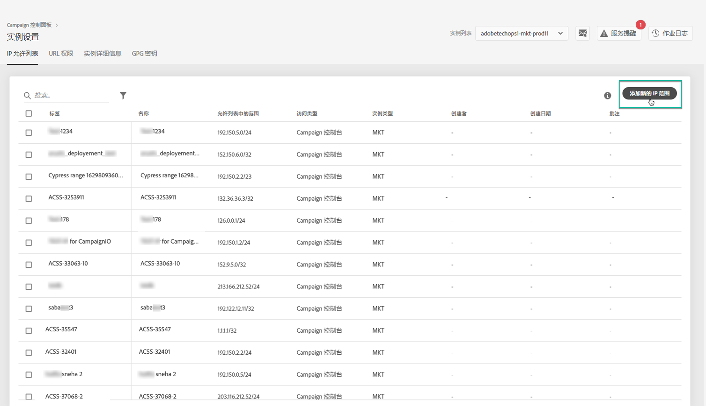
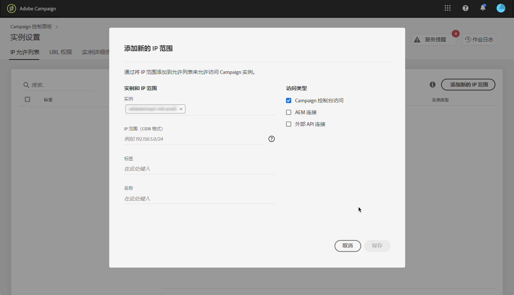
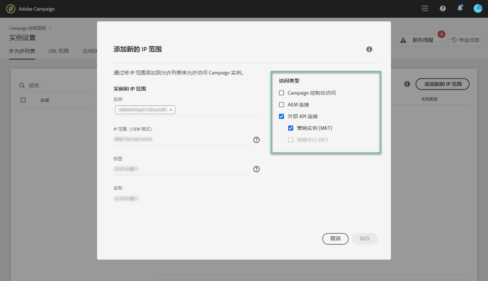

# IP 允许列表 {#ip-allow-listing}

>[!CONTEXTUALHELP]
>id="cp_instancesettings_iprange"
>title="关于 IP 允许列表"
>abstract="向允许列表添加 IP 地址以进行访问实例。"
>additional-url="https://images-tv.adobe.com/mpcv3/045cac99-f948-478e-ae04-f8c161dcb9e2_1568132508.1920x1080at3000_h264.mp4" text="观看演示视频"

## 关于 IP 允许列表 {#about-ip-allow-listing}

>[!IMPORTANT]
>
>此功能仅适用于Campaign Classicv7和Campaign v8实例。

默认情况下，您的 Adobe Campaign 实例无法从各种 IP 地址访问。

如果您的 IP 地址未添加到允许列表，您将无法从此地址登录到实例。同样，如果 IP 地址未明确与实例一起添加到允许列表，则您可能无法将 API 连接到消息中心或营销实例。

控制面板允许您通过将 IP 地址范围添加到允许列表来设置与实例的新连接。为此，请执行以下所述步骤：

将 IP 地址添加到允许列表后，您可以创建 Campaign 运算符并将其链接到它们，以便用户能够访问该实例。

 [在视频中发现此功能](https://experienceleague.adobe.com/docs/campaign-classic-learn/control-panel/instance-settings/ip-allow-listing.html?lang=en#instance-settings)

## 最佳实践 {#best-practices}

在控制面板中将 IP 地址添加到允许列表时，请确保遵循以下建议和限制条件。

* **如果您不打算将 IP 地址连接到 RT 服务器**&#x200B;或 AEM 安全区域，请勿启用对所有访问类型的 IP 访问。
* **如果您临时启用了对 IP 地址实例的访问**，请确保在不再需要连接到实例时从允许列表中删除 IP 地址。
* **我们不建议将公共场所的 IP 地址添加到允许列表**（机场、酒店等）。请始终使用公司 VPN 地址来保护实例的安全。

## 向允许列表添加IP地址以进行实例访问 {#adding-ip-addresses-allow-list}

>[!CONTEXTUALHELP]
>id="cp_instancesettings_iprange_add"
>title="IP范围配置"
>abstract="定义要添加到允许列表以连接到实例的 IP 范围。"

要向允许列表添加 IP 地址，请执行以下步骤：

1. 打开 **[!UICONTROL Instances Settings card]**&#x200B;以访问 IP 允许列表选项卡，然后单击 **[!UICONTROL Add new IP Range]**。

   >[!NOTE]
   >
   >如果“实例设置”卡未显示在控制面板的主页上，则表示您的IMS组织ID未与任何Adobe Campaign Classic实例关联

   

1. 按如下所述填写要添加到允许列表的 IP 范围信息。

   

   * **[!UICONTROL Instance(s)]**：IP 地址能够连接的实例。可以同时处理多个实例。例如，可以通过同一步骤对生产实例和阶段实例将 IP 添加到允许列表。
   * **[!UICONTROL IP Range]**：要添加到允许列表的 IP 范围（CIDR 格式）。请注意，IP 范围不能与允许列表上的现有范围重叠。在这种情况下，首先删除包含重叠 IP 的范围。

   >[!NOTE]
   >
   >CIDR（无类域间路由）是在控制面板界面中添加 IP 范围时受支持的格式。语法依次由 IP 地址、“/”字符和十进制数字组成。[本文](https://whatismyipaddress.com/cidr)详细介绍了格式及其语法。
   >
   >您可以在互联网上搜索免费的在线工具，这些工具将帮助您将现有的 IP 范围转换为 CIDR 格式。

   * **[!UICONTROL Label]**：将在允许列表中显示的标签。
   * **[!UICONTROL Name]**：针对访问类型、实例（如果是外部 API 连接）和 IP 地址的名称必须是唯一的。

1. 指定要授予 IP 地址的访问类型：

   * **[!UICONTROL Campaign Console Access]**:允许IP地址连接到Campaign客户端控制台。请注意，仅对营销实例启用控制台访问。不允许访问 MID 和 RT 实例，因此不启用。
   * **[!UICONTROL AEM connection]**：允许指定的 AEM IP 地址连接到营销实例。
   * **[!UICONTROL External API connection]**：允许具有指定 IP 地址的外部 API 连接到营销和/或消息中心 (RT) 实例。请注意，未启用与 RT 实例控制台的连接。

   

1. 单击&#x200B;**[!UICONTROL Save]**&#x200B;按钮。IP 范围将添加到允许列表。

   

要从允许列表中删除 IP 范围，请选中要删除的 IP 范围，然后单击 **[!UICONTROL Delete IP range]** 按钮。

**相关主题：**

* [将安全区域链接到运算符](https://docs.campaign.adobe.com/doc/AC/en/INS_Additional_configurations_Configuring_Campaign_server.html#Linking_a_security_zone_to_an_operator)
