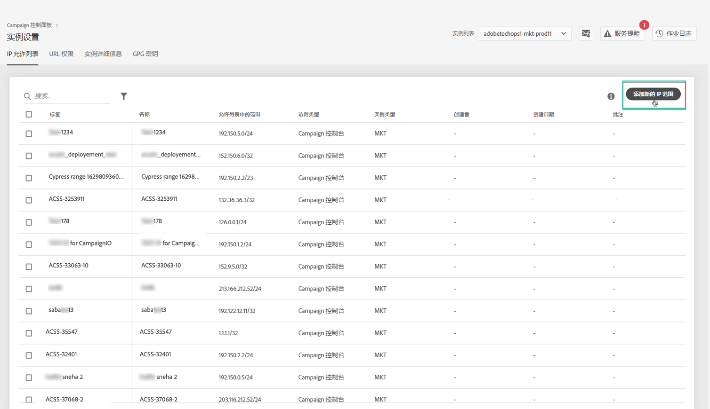
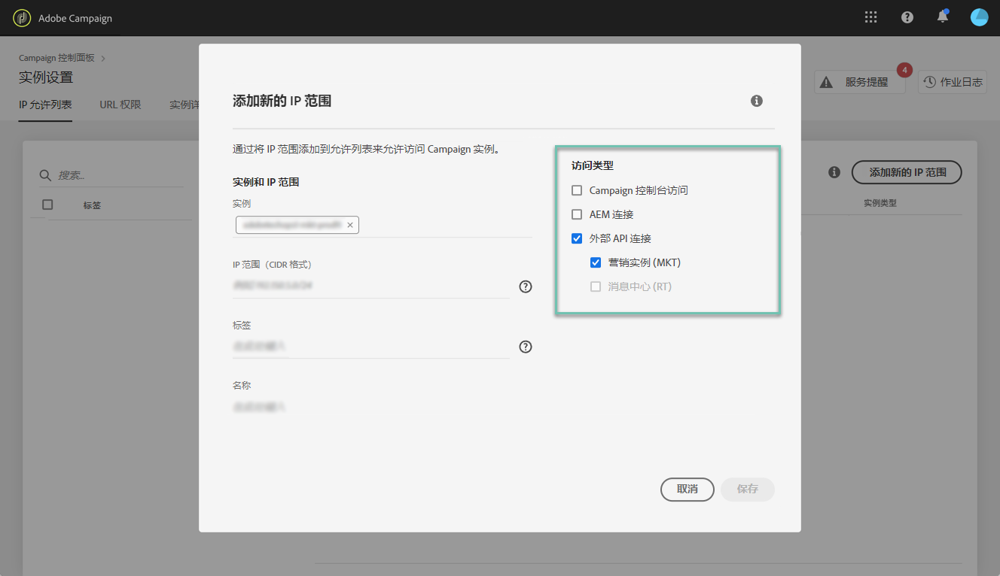

# IP白名单 {#ip-whitelisting}

>[!CAUTION]
>
>此功能仅对Campaign Classic实例可用。

## 关于IP白名单 {#about-ip-whitelisting}

默认情况下，您的Adobe Campaign Classic实例无法从各种IP地址访问。

如果您的IP地址未列入白名单，您将无法从此地址登录到实例。 同样，如果IP地址未与实例明确列入白名单，则您可能无法将API连接到消息中心或营销实例。

控制面板允许您通过将IP地址范围列入白名单来设置到实例的新连接。 为此，请按照以下步骤操作。

将IP地址列入白名单后，您可以创建Campaign操作符并将其关联到它们，以便用户能够访问该实例。

## 最佳实践 {#best-practices}

确保在控制面板中将IP地址列入白名单时遵循以下建议和限制。

* **如果您不想将IP地址连接到RT服务器或AEM安全区，请勿启用对所有访问类型的IP访问。**
* **如果您暂时启用了对某个IP地址的实例的访问**，请确保在不再需要连接到实例时从列入白名单的IP地址中删除IP地址。
* **我们不建议将公共场所** （机场、酒店等）的IP地址列入白名单。 请始终使用您的公司VPN地址来保护您的实例的安全。

## 实例访问的白名单IP地址 {#whistelisting-ip-addresses}

要将IP地址列入白名单，请执行以下步骤：

1. 打开 **[!UICONTROL Instances Settings card]**以访问IP白名单选项卡，然后单击**[!UICONTROL Add new IP Range]**。

   >[!NOTE]
   >
   >如果“实例设置”卡未显示在控制面板的主页上，则表示您的IMS ORG ID未与任何Adobe Campaign Classic实例关联

   

1. 按如下所述填写要列入白名单的IP范围信息。

   

   * **[!UICONTROL Instance(s)]**:IP地址将能够连接到的实例。 可以同时操作多个实例。 例如，可以通过同一步骤对生产实例和舞台实例执行IP白名单。
   * **[!UICONTROL IP Range]**:要以CIDR格式列入白名单的IP范围。 请注意，IP范围不能与现有的白名单范围重叠。 在这种情况下，首先删除包含重叠IP的范围。
   >[!NOTE]
   >
   >CIDR（无类域间路由）是在控制面板界面中添加IP范围时支持的格式。 语法由IP地址、字符“/”和小数组成。 本文对格式及其语法进行了详 [细介绍](https://whatismyipaddress.com/cidr)。
   >
   >您可以在Internet上搜索免费的在线工具，这些工具将帮助您将手头的IP范围转换为CIDR格式。

   * **[!UICONTROL Label]**:将显示在白名单IP地址列表中的标签。
   * **[!UICONTROL Name]**:该名称对于访问类型、实例（在外部API连接情况下）和IP地址必须是唯一的。

1. 指定要授予IP地址的访问类型：

   * **[!UICONTROL Campaign Console Access]**:IP地址将被允许连接到营销活动经典控制台。 请注意，仅对Marketing实例启用了控制台访问权限。 不允许访问MID和RT实例，因此不启用。
   * **[!UICONTROL AEM connection]**:将允许指定的AEM IP地址连接到Marketing实例。
   * **[!UICONTROL External API connection]**:将允许具有指定IP地址的外部API连接到营销和／或消息中心(RT)实例。 请注意，未启用与RT实例控制台的连接。
   

1. Click the **[!UICONTROL Save]**button. IP范围将添加到列入白名单的IP地址列表中。

   

要删除已列入白名单的IP范围，请选择它们，然后单击 **[!UICONTROL Delete IP range]**按钮。

**相关主题：**
* [IP白名单（教程视频）](https://docs.adobe.com/content/help/en/campaign-learn/campaign-classic-tutorials/administrating/control-panel-acc/ip-whitelisting.html)
* [将安全区关联到运营商](https://docs.campaign.adobe.com/doc/AC/en/INS_Additional_configurations_Configuring_Campaign_server.html#Linking_a_security_zone_to_an_operator)
