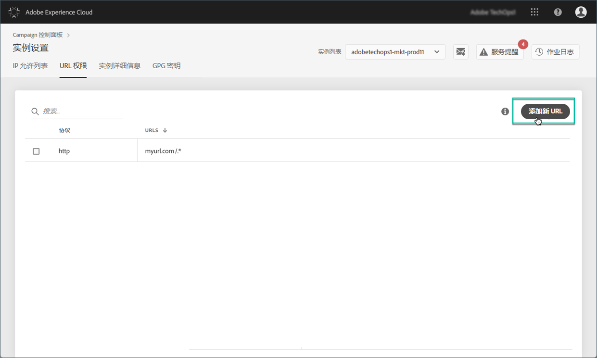
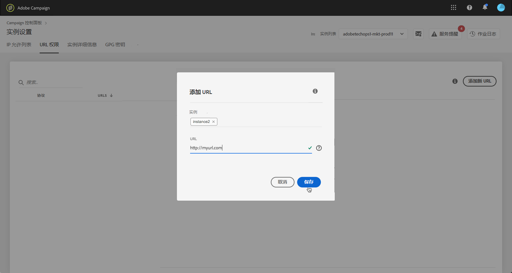
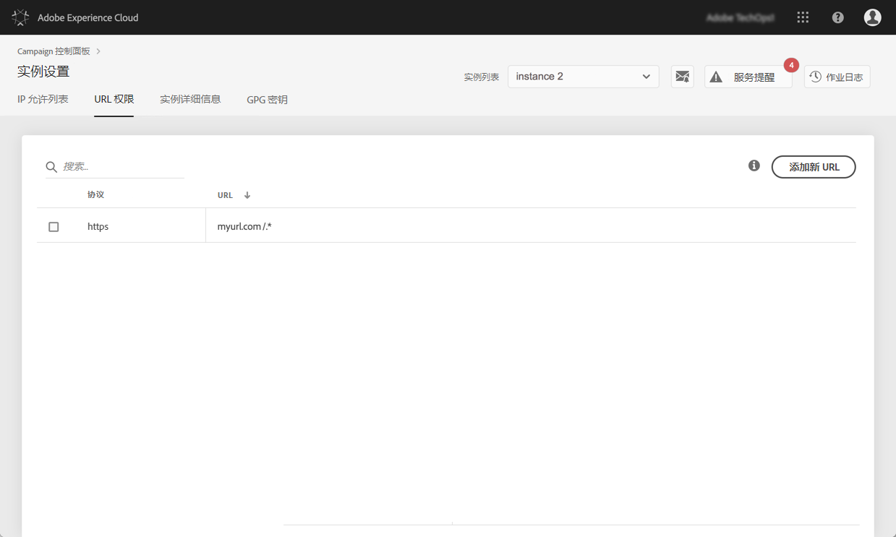

# URL 权限 {#url-permissions}

>[!CONTEXTUALHELP]
>id="cp_instancesettings_urlpermissions"
>title="关于 URL 权限"
>abstract="管理 Adobe Campaign 实例可以连接的 URL。"
>additional-url="https://images-tv.adobe.com/mpcv3/91206a19-d9af-4b6a-8197-0d2810a78941_1563488165.1920x1080at3000_h264.mp4" text="观看演示视频"

## 关于 URL 权限 {#about-url-permissions}

>[!IMPORTANT]
>
>此功能仅适用于版本8850中的Campaign v8和Campaign Classicv7实例。 如果您使用的是以前的版本，则需要升级才能使用此功能。

Campaign Classic 实例可以通过 JavaScript 代码（工作流等）的URL数量有限。 这些 URL 允许实例正常运行。

默认情况下，实例不允许连接到外部 URL。控制面板允许您向经授权的 URL 列表添加一些外部 URL，以便您的实例可以连接到这些 URL。这允许您将 Campaign 实例连接到外部系统，例如 SFTP 服务器或网站，以启用文件和/或数据传输。

添加 URL 后，该 URL 将在实例的配置文件 (serverConf.xml) 中引用。

 [在视频中发现此功能](https://experienceleague.adobe.com/docs/campaign-classic-learn/control-panel/instance-settings/adding-url-permissions.html?lang=en#instance-settings)

**相关主题：**

* [配置 Campaign 服务器](https://docs.campaign.adobe.com/doc/AC/en/INS_Additional_configurations_Configuring_Campaign_server.html)
* [外连接保护](https://experienceleague.adobe.com/docs/campaign-classic/using/installing-campaign-classic/security-privacy/server-configuration.html#outgoing-connection-protection)

## 最佳实践 {#best-practices}

* 请勿将您的 Campaign 实例连接到您不打算连接的网站/服务器。
* 删除您不再使用的 URL。但是，请注意，如果您公司的其他部分仍连接到您删除的 URL，则任何人都无法再次使用该 URL。
* 控制面板支持 **http**、**https** 和 **sftp** 协议。输入无效的 URL 或协议将导致错误。

## 管理 URL 权限 {#managing-url-permissions}

>[!CONTEXTUALHELP]
>id="cp_instancesettings_url_add"
>title="URL定义"
>abstract="添加 URL 以允许与 Campaign 实例建立连接。"

要添加实例可以连接到的 URL，请执行以下步骤：

1. 打开卡 **[!UICONTROL Instances Settings]**&#x200B;以访问 **[!UICONTROL URL Permissions]** 选项卡。

   >[!NOTE]
   >
   >如果“实例设置”卡未显示在控制面板的主页上，则表示您的IMS组织ID未与任何Adobe Campaign实例关联
   >
   ><b>URL 权限</b>选项卡列出了实例可以连接到的所有外部 URL。此列表不包括 Campaign 运行所需的 URL（例如基础结构件之间的连接）。

1. 从左窗格中选择所需的实例，然后单击 **[!UICONTROL Add new URL]**&#x200B;按钮。

   

   >[!NOTE]
   >
   >您的所有 Campaign 实例都将显示在左窗格列表中。
   >
   >由于 URL 权限管理仅专用于 Campaign Classic 实例，因此，如果您选择了 Campaign Standard 实例，则会显示“非适用的实例”消息。

1. 键入要授权的 URL 及其关联协议（http、https 或 sftp）。

   >[!NOTE]
   >
   >可以授权多个实例以连接到 URL。要执行此操作，请直接在实例字段中键入实例的首字母以添加。

   

1. 该 URL 已添加到列表，您现在可以连接到 URL。

   >[!NOTE]
   >
   >“/”。验证后，您输入的 URL 的末尾会自动添加“*”字符，以涵盖输入页面的所有子页面。

   

您可以随时删除 URL，方法是选择该 URL 并单击 **[!UICONTROL Delete URL]**&#x200B;按钮。

请记住，如果删除 URL，您的实例将无法再次调用它。

## 常见问题 {#common-questions}

**我添加了一个新 URL，但我的实例仍无法连接到该 URL。这是为什么？**

在某些情况下，您尝试连接的 URL 需要添加到允许列表、输入密码或其他身份验证形式。控制面板不管理其他身份验证。
