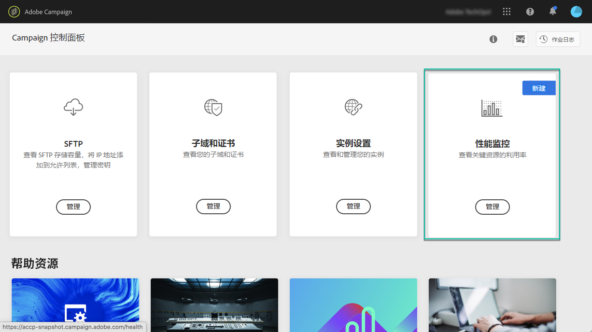

# 关于性能监视{#about-performance-monitoring}

控制面板提供多种功能，帮助您监控实例并确保最佳性能。

控制面板主页中的&#x200B;**[!UICONTROL Performance monitoring]**&#x200B;卡允许您监视活动实例的使用情况，例如，其数据库容量。 如需详细信息，请参阅[此部分](../../performance-monitoring/using/database-monitoring.md)。

>[!NOTE]
>
>在即将发布的控制面板版本中，此卡将提供其他监控功能。

此外，控制面板允许您注册以在每次检测到某个活动实例出现问题时接收电子邮件通知。 如需详细信息，请参阅[此部分](../../performance-monitoring/using/email-alerting.md)。

