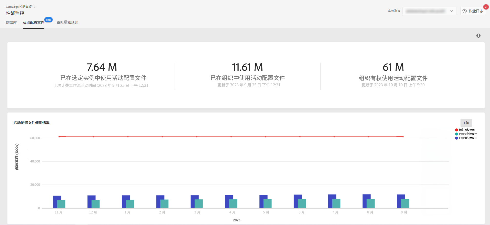

# 活动用户档案监控 {#active-profiles-monitoring}

## 关于活动用户档案 {#about-active-profiles}

>[!IMPORTANT]
>
>测试版中提供控制面板的活动用户档案监控，如有频繁更新和修改，恕不另行通知。它可从Campaign Standard10368内部版本中获取。

根据您的合同，您的每个 Campaign 实例都会配置特定数量的活动用户档案，并对这些活动用户档案进行计数以计费。请参阅您的最新合同，了解已购买的活动用户档案数量。

“用户档案”是指代表最终客户或潜在客户的信息记录（例如 nmsRecipient 表或外部表中的记录，包含 cookie ID、客户 ID、移动标识符或与特定渠道相关的其他信息）。

如果用户档案在过去 12 个月中通过任何渠道被定向或与其联系，则视为处于活动状态。

>[!NOTE]
>
>Facebook 和 Twitter 渠道不包含在內。

有关活动配置文件的更多信息，请参阅[Campaign Standard](https://experienceleague.adobe.com/docs/campaign-standard/using/profiles-and-audiences/managing-profiles/active-profiles.html)和[Campaign Classicv7](https://experienceleague.adobe.com/docs/campaign-classic/using/getting-started/profile-management/about-profiles.html#active-profiles)文档。

## 监控活动用户档案 {#monitoring-active-profiles}

>[!CONTEXTUALHELP]
>id="cp_performancemonitoring_active_profile"
>title="关于活动用户档案监控"
>abstract="在此选项卡中，您可以获取有关每个Campaign实例最新和历史活动用户档案使用情况和演变的实时信息。"
>additional-url="https://experienceleague.adobe.com/docs/control-panel/using/performance-monitoring/about-performance-monitoring.html" text="关于性能监控"

控制面板允许您监控每个 Campaign 实例的活动用户档案使用情况。

为此，请执行以下步骤：

1. 打开 **[!UICONTROL Performance Monitoring]** 卡，然后选择 **[!UICONTROL Active Profiles]** 选项卡。

1. 从&#x200B;**[!UICONTROL Instance List]**&#x200B;中选择所需的实例。

1. 系统将显示实例使用的活动用户档案数以及实例上次运行计费工作流的时间。

>[!NOTE]
>
>活动用户档案基于每天在您的实例上运行的专用技术工作流进行计数：
>
>* Campaign Standard 的[“计费](https://experienceleague.adobe.com/docs/campaign-standard/using/administrating/application-settings/technical-workflows.html)”工作流，
>* Campaign Classic [的“活动计费用户档案的数量”](https://experienceleague.adobe.com/docs/campaign-classic/using/automating-with-workflows/advanced-management/about-technical-workflows.html)工作流。

下面的区域以图形形式显示了过去 30 天内活动用户档案的使用情况。您可以使用右上角的可用过滤器将显示的时间段更改为 1 年。

将鼠标悬停在图中的竖条上可获得选定时段使用的活动用户档案的确切数量。
