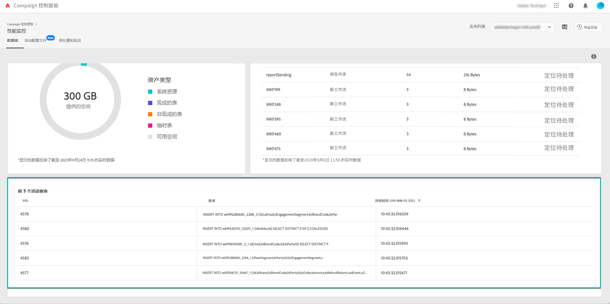

# 监测活动查询 {#long-running-queries}

**[!UICONTROL Databases]** 选项卡的 **[!UICONTROL Active queries]** 区域列出了在选定实例上运行时间最长的五个查询。

**[!UICONTROL Duration]** 列指定查询在实例上运行的时长。持续时间以以下格式显示：`hh:mm:ss.ms`。

>[!IMPORTANT]
>
>如果其中一个查询处于活动状态超过 24 小时，请联系客户关怀团队，以便他们识别并解决问题。在这种情况下，您需要向他们提供 **[!UICONTROL PID]** 列值，这是查询的唯一标识符。
