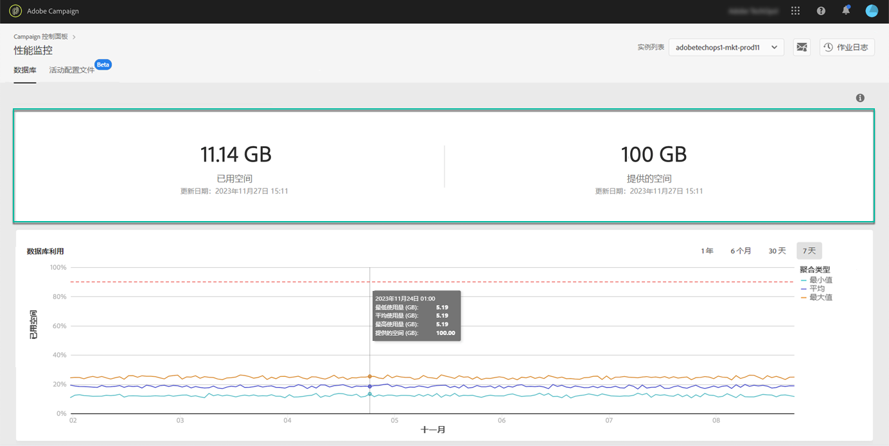
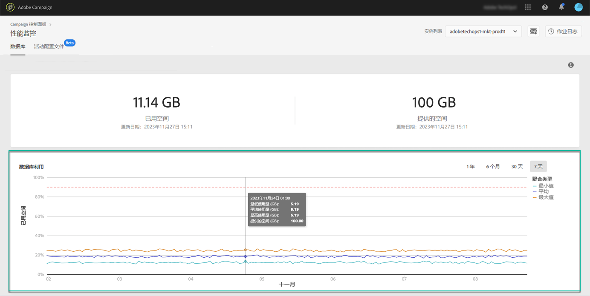
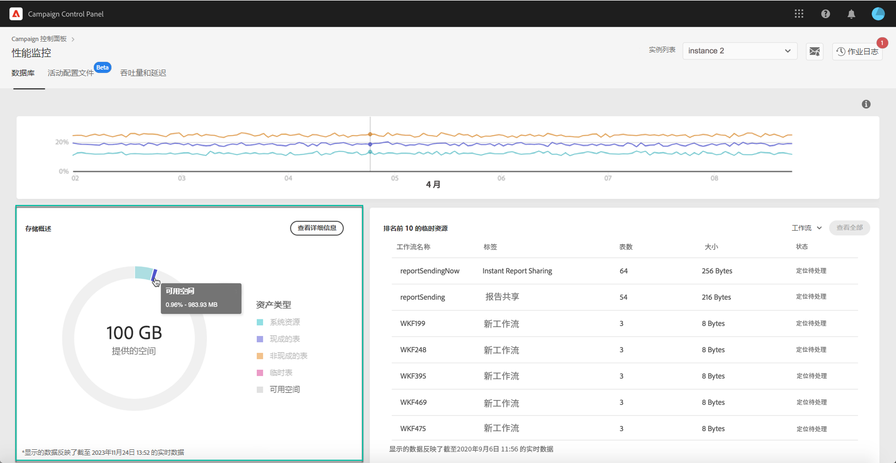
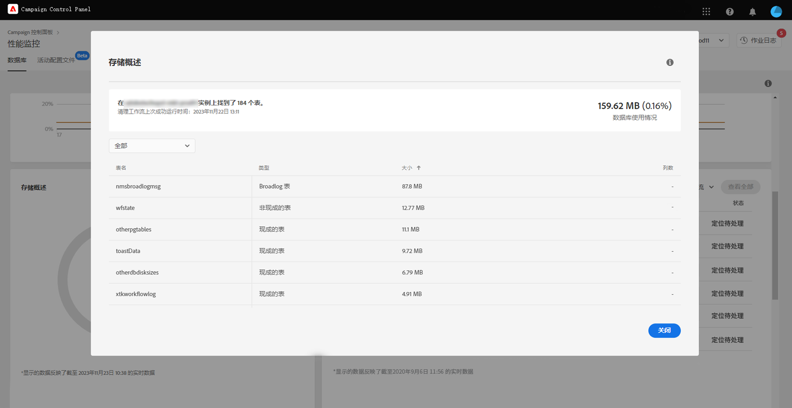
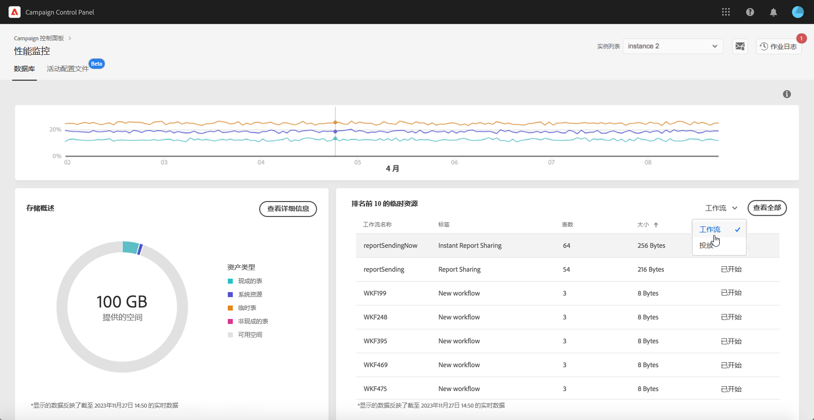

# 数据库监测 {#database-monitoring}

## 关于实例数据库 {#about-instances-databases}

根据您的合同，您的每个 Campaign 实例都会配备特定大小的数据库空间。

数据库包括存储在 Adobe Campaign 中的所有&#x200B;**资源**、**工作流**&#x200B;和&#x200B;**数据**。

随着时间的推移，数据库会达到其最大容量，尤其是从不删除实例中存储的资源时，或者存在许多处于暂停状态的工作流时。

实例数据库溢出可能导致若干问题（无法登录、无法发送电子邮件等）。因此，监测实例的数据库对于确保最佳性能至关重要。

>[!NOTE]
>
>如果控制面板中显示提供的数据库空间大小与合同中规定的大小不一致，请联系客户关怀团队。

## 监测数据库使用{#monitoring-instances-database}

 在使用 [Campaign Classic](https://experienceleague.adobe.com/docs/campaign-classic-learn/control-panel/performance-monitoring/monitoring-databases.html?lang=zh-Hans#performance-monitoring) 或 [Campaign Standard](https://experienceleague.adobe.com/docs/campaign-standard-learn/control-panel/performance-monitoring/monitoring-databases.html?lang=zh-Hans#performance-monitoring) 的视频中了解这一功能

控制面板允许您监测每个 Campaign 实例的数据库使用情况。为此，请打开 **[!UICONTROL Performance Monitoring]** 信息卡，然后选择 **[!UICONTROL Databases]** 选项卡。

从 **[!UICONTROL Instance List]** 中选择所需的实例，以显示有关该实例的数据库容量和已用空间的信息。

>[!NOTE]
>
>请注意，此仪表板中的数据会根据运行在 Campaign 实例上的&#x200B;**[!UICONTROL Database cleanup technical workflow]**&#x200B;更新（请参阅 [Campaign Standard](https://docs.adobe.com/help/zh-Hans/campaign-standard/using/administrating/application-settings/technical-workflows.html#list-of-technical-workflows) 和 [Campaign Classic](https://docs.adobe.com/help/zh-Hans/campaign-classic/using/monitoring-campaign-classic/data-processing/database-cleanup-workflow.html) 文档）。
>
>您可以进行传统的检查，当某个数据库在最近一次达到其容量上限、工作流在低于 **[!UICONTROL Used Space]** 和 **[!UICONTROL Provided Space]** 指标下运行时，您会收到通知。请注意，如果工作流已超过 3 天未运行，我们建议您联系 Adobe 客户关怀团队，以便让他们调查工作流未运行的原因。

本仪表板中还提供如下所述的其他指标，可帮助您分析实例数据库的使用情况。

### 数据库利用率 {#database-utilization}

**[!UICONTROL Database utilization]** 区域以图表形式呈现过去 7 天内最低、平均和最高数据库利用率，以及用红色点状虚线表示的 90% 数据库利用率阈值。

如需更改时间段，请使用图表右上角的过滤器。

为了提高可读性，您还可以突出显示图表中的一条或多条曲线。要执行此操作，请从 **[!UICONTROL Aggregation Type]** 图例中选择它们。

如需特定时间段的更多详细信息，将鼠标悬停在图表上会显示该时段的数据库使用情况的信息。

### 存储概述 {#storage-overview}

**[!UICONTROL Storage overview]** 区域以图表形式呈现以下资源所占空间：

* **[!UICONTROL System resources]**

   请注意，如果系统资源占用了大部分数据库空间，我们建议您联系客户关怀团队。

* 您的 Campaign 实例默认提供的 **[!UICONTROL Out-of-the-box tables]**，
* 由工作流和投放创建的 **[!UICONTROL Temporary tables]**，
* 创建自定义资源后生成的 **[!UICONTROL Non-out of the box tables]**。

单击 **[!UICONTROL View details]** 按钮可获取有关占用数据库空间的不同资源的更多详细信息。

使用过滤器来优化您的搜索，仅显示特定资源类型的图表。

### 十大临时资源 {#top-10}

**[!UICONTROL Top 10 temporary resources]** 区域列出了工作流和投放生成的十大临时资源。

监测正在创建大型临时资源的工作流和投放是监测数据库的关键步骤。如果任何临时资源占用的数据库空间过多，请确保此工作流或投放是必要的，并最终导航到您的实例以停止它。

>[!IMPORTANT]
>
>一般建议是避免在非开箱即用资源中设置&#x200B;**超过 40 列**。

>[!NOTE]
>
>如果发现某个工作流涉及大量图表或占用大量数据库空间，我们建议查看该工作流，以调查它生成如此多数据的原因。
>
>Campaign Standard 和 Classic 资源也会在本页末尾显示，以帮助您防止数据库过载。

点击 **[!UICONTROL View all]** 按钮可访问这些临时资源的详细信息。

>[!NOTE]
>
>**[!UICONTROL Keep interim results]** 列中的值表示该选项在 Campaign 中是启用（“1”）还是禁用（“0”）。**[!UICONTROL Keep interim results]** 选项可在工作流属性中访问。它允许您保存工作流的各个活动之间的过渡结果（请参阅 [Campaign Standard](https://docs.adobe.com/content/help/zh-Hans/campaign-standard/using/managing-processes-and-data/executing-a-workflow/managing-execution-options.html) 和 [Campaign Classic](https://docs.adobe.com/content/help/zh-Hans/campaign-classic/using/automating-with-workflows/general-operation/workflow-best-practices.html#logs) 文档）。
>
>如果为某个工作流启用了此选项，则数据库清理工作流将无法回收临时结果占用的空间。因此，我们建议查看工作流以确认该选项是否可以关闭。

## 防止数据库过载{#preventing-database-overload}

Campaign Standard 和 Classic 提供各种防止数据库磁盘空间过度消耗的方法。

以下部分提供了来自 Campaign 文档的实用资源，以帮助您优化数据库使用：

**工作流监测**

* [工作流最佳实践](https://docs.adobe.com/content/help/zh-Hans/campaign-standard/using/managing-processes-and-data/workflow-general-operation/best-practices-workflows.html) (Campaign Standard)
* [监测工作流执行](https://docs.adobe.com/help/zh-Hans/campaign-classic/using/automating-with-workflows/monitoring-workflows/monitoring-workflow-execution.html) (Campaign Classic)

**数据库维护**

* 数据库清理技术工作流 ([Campaign Standard](https://docs.adobe.com/help/zh-Hans/campaign-standard/using/administrating/application-settings/technical-workflows.html#list-of-technical-workflows) / [Campaign Classic](https://docs.adobe.com/help/zh-Hans/campaign-classic/using/monitoring-campaign-classic/data-processing/database-cleanup-workflow.html))
* [数据库维护指南](https://docs.adobe.com/content/help/zh-Hans/campaign-classic/using/monitoring-campaign-classic/database-maintenance/recommendations.html) (Campaign Classic)
* [数据库性能故障排除](https://experienceleague.adobe.com/docs/campaign-classic/using/monitoring-campaign-classic/troubleshooting-toc/database-issues-toc/database-performances.html?lang=zh-Hans) (Campaign Classic)
* [数据库相关选项](https://docs.adobe.com/help/zh-Hans/campaign-classic/using/installing-campaign-classic/appendices/configuring-campaign-options.html#database) (Campaign Classic)
* 数据保留 ([Campaign Standard](https://docs.adobe.com/help/zh-Hans/campaign-standard/using/administrating/application-settings/data-retention.html) / [Campaign Classic](https://docs.adobe.com/help/zh-Hans/campaign-classic/using/configuring-campaign-classic/data-model/data-model-best-practices.html#data-retention))

>[!NOTE]
>
>此外，当某个数据库达到其容量上限时，您还可以收到通知。为此，请订阅[电子邮件提醒](../../performance-monitoring/using/email-alerting.md)。
