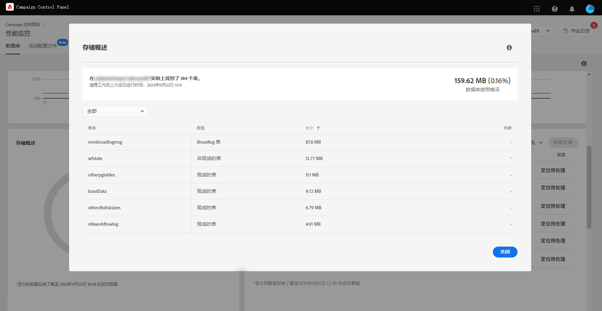

# 存储概述 {#storage-overview}

>[!CONTEXTUALHELP]
>id="cp_dbdetails_storagedetails"
>title="关于存储概述"
>abstract="在此选项卡中，您可以获取有关占用数据库空间的不同 Campaign 资源的详细信息。"

**[!UICONTROL 存储概述]**&#x200B;区域以图表形式呈现以下资源所占空间：

* **[!UICONTROL 系统资源]**

  请注意，如果系统资源占用了大部分数据库空间，我们建议您联系客户关怀团队。

* Campaign 实例默认提供的&#x200B;**[!UICONTROL 现成表格]**。
* 由工作流和投放创建的&#x200B;**[!UICONTROL 临时表格]**。
* 创建自定义资源后生成的&#x200B;**[!UICONTROL 非现成表格]**。

单击&#x200B;**[!UICONTROL 查看详细信息]**&#x200B;按钮，获取有关占用数据库空间的不同资源的更多详细信息。

您可以使用下拉列表优化搜索并显示仅来自特定资源类型（工作流、投放、收件人）的表格。

请注意，您可以通过此屏幕监控可能需要特别关注的工作流参数，以避免实例上出现任何问题。请参阅[此页面](workflow-monitoring.md)以了解详情。
