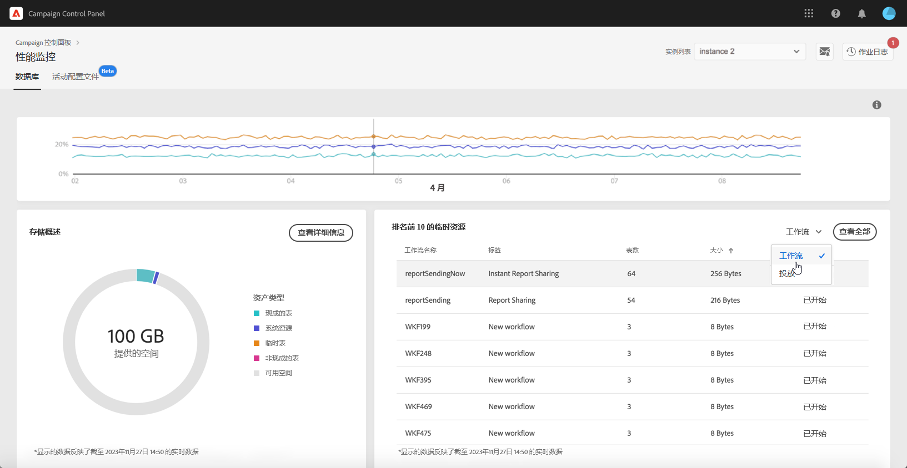

# 排名前 10 的临时资源 {#top-10}

**[!UICONTROL 排名前 10 的临时资源]**&#x200B;区域列出了工作流和投放生成的十大临时资源。

监测正在创建大型临时资源的工作流和投放是监测数据库的关键步骤。如果任何临时资源占用的数据库空间过多，请确保此工作流或投放是必要的，并最终导航到您的实例以停止它。

>[!IMPORTANT]
>
>一般建议是避免在非开箱即用资源中设置&#x200B;**超过 40 列**。如果发现某个工作流涉及大量图表或占用大量数据库空间，我们建议审视该工作流，以调查它生成如此多数据的原因。
>
>[此页面](database-preventing-overload.md)还提供了有关 Campaign Standard 和 Classic 的指导准则，可以帮助您防止数据库过载。

您可以使用&#x200B;**[!UICONTROL 查看全部]**&#x200B;按钮访问&#x200B;**[!UICONTROL 存储概述]**&#x200B;详细信息，从而获取有关这些临时资源的详细信息。有关详细信息，请参见[此页面](database-storage-overview.md)。
