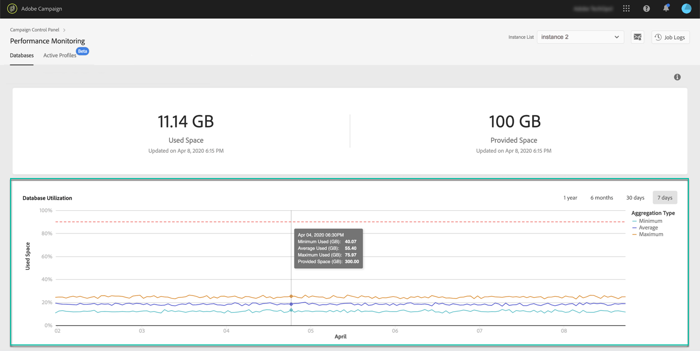

# 数据库利用率 {#database-utilization}

**[!UICONTROL 数据库利用率]**&#x200B;区域以图表形式呈现过去 7 天内最低、平均和最高数据库利用率，以及用红色点状曲线表示的 90% 数据库利用率阈值。

如需更改时间段，请使用图表右上角的过滤器。

为了提高可读性，您还可以突出显示图表中的一条或多条曲线。 要执行此操作，请从&#x200B;**[!UICONTROL 聚合类型]**&#x200B;图例中选择它们。

如需特定时间段的更多详细信息，将鼠标悬停在图表上会显示该时段的数据库使用情况的信息。

