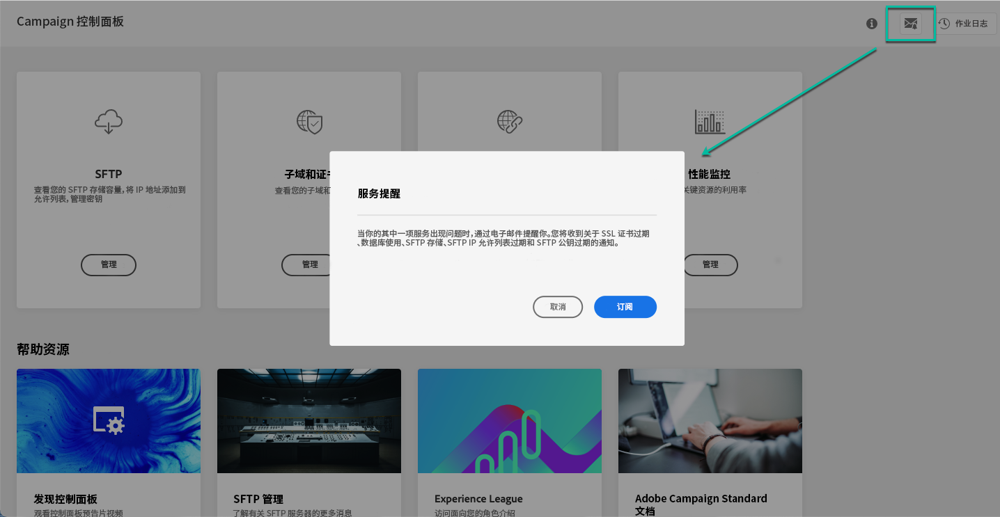
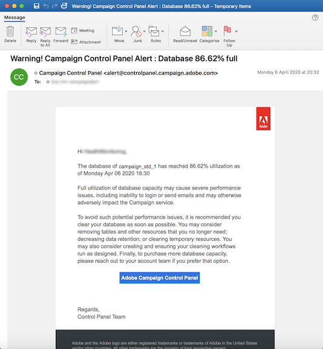

# 电子邮件警报 {#email-alerting}

为了给您的工作提供更大的灵活性，控制面板配备了实时电子邮件警报功能。

## 警报列表 {#list}

警报列表如下：

* **SFTP存储使用情况**：其中一个SFTP服务器已达到其容量的80%或更多。 请参阅 [SFTP 存储管理](../../sftp/using/sftp-storage-management.md)。

* **数据库使用**：其中一个实例的数据库已达到其容量的80%或更多。 请参阅 [数据库监测](../../performance-monitoring/using/database-monitoring.md).

* **SFTP IP允许列表到期**：您定义的某个IP范围已过期或将在10天或更短时间内过期。 请参阅 [将IP范围添加到允许列表](../../sftp/using/ip-range-allow-listing.md).

* **SFTP公钥过期**：您定义的公钥之一已过期或将在10天或更短时间内过期。 请参阅 [密钥管理](../../sftp/using/key-management.md).

* **SSL证书过期**：子域的SSL证书之一已过期或将在30天或更短时间内过期。 请参阅 [监控子域的SSL证书](../../subdomains-certificates/using/monitoring-ssl-certificates.md).

<!--* **Long running Queries**: A query has been running for more than 24 hours on one of your instances. See [Monitoring active queries](database-active-queries.md).-->

>[!NOTE]
>
>此外，控制面板还允许您 **设置提醒** ，以便在实例中发生事件（版本和服务评审）之前通过电子邮件接收通知。
>
>为此，您需要订阅电子邮件警报并为所需的即将发生的事件设置提醒。 [了解如何为即将举行的活动设置提醒](../../service-events/service-events.md#reminders)

## 订阅警报 {#subscribe}

要订阅这些警报，请执行以下步骤：

1. 单击 **[!UICONTROL Alerting notifications]** 按钮在控制面板中的任意位置可用，然后单击 **[!UICONTROL Subscribe]**.

   

1. 将发送一封电子邮件以确认您的订阅。

   

1. 订阅后，控制面板将通知系统问题并建议要采取的操作。 电子邮件警报会发送给已注册的每个人 **所有实例** 他们是的管理员。

   
