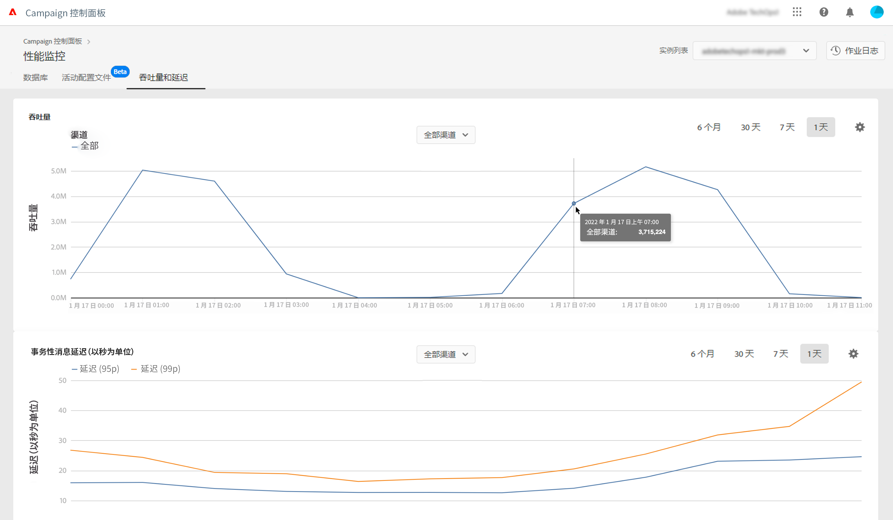
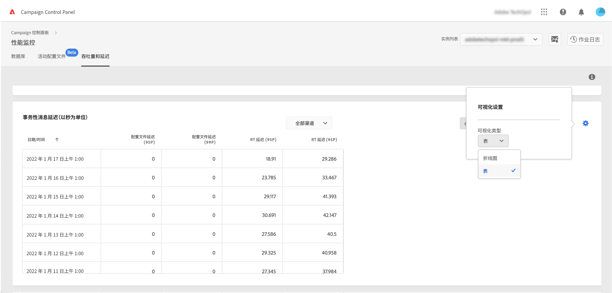
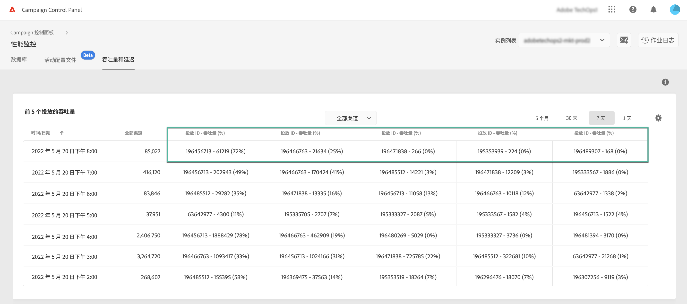
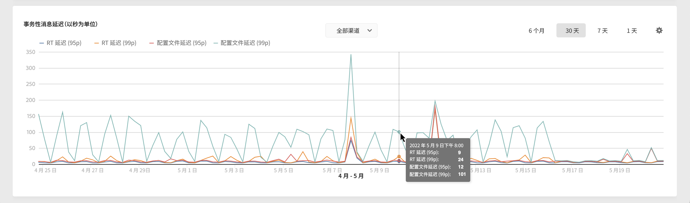
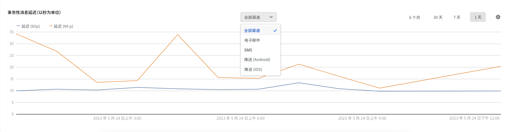

# 吞吐量和延迟监测 {#throughputs-latency-monitoring}

>[!CONTEXTUALHELP]
>id="cp_performancemonitoring_throughputslatencies"
>title="关于吞吐量和延迟监测 "
>abstract="在此选项卡中，您可以监测在实例上一段时间内的投放吞吐量和延迟趋势。要了解关于对吞吐量有贡献的投放的信息，请切换到表格视图。"

您可通过控制面板监控每个实例的投放吞吐量和延迟。

>[!IMPORTANT]
>
>此功能适用于所有Campaign Standard、v8客户以及版本号为9032及更高版本的Campaign v7客户，包括 [独立部署](https://experienceleague.adobe.com/docs/campaign-classic/using/installing-campaign-classic/deployment-types-/standalone-deployment.html?lang=zh-Hans) （不含任何mid实例）。

监测一段时间内投放吞吐量和延迟的趋势对于了解实例的使用情况并确保它们正常运行至关重要。

可在控制面板的 **[!UICONTROL Throughputs & Latency]** 选项卡，**[!UICONTROL Performance Monitoring]** 信息卡中查看每个 Campaign 实例的此类信息（请注意，控制面板可能需要长达 1 小时才能显示相关数字）。

>[!NOTE]
>
>此区域中显示的所有数字都是近似的，仅供参考。

默认情况下，将显示当天的数据。您可以使用 **[!UICONTROL 6 months]**、**[!UICONTROL 30 days]** 和 **[!UICONTROL 7 days]** 按钮更改显示的时间段。数据将以下列频率显示：
* 1 天和 7 天视图的间隔为 1 小时，
* 30 天视图的间隔为 6 小时，
* 6 个月视图的间隔为 1 天。

您还可以使用可排序的列而非图形，以表格格式显示信息。为此，请单击 **[!UICONTROL Visualization settings]** 按钮，然后选择 **[!UICONTROL Table]**。

## 监测吞吐量 {#throughput}

**[!UICONTROL Throughput]** 区域提供您有权访问的所有通信渠道的、从选定的 Campaign 实例每小时发送的消息数的相关信息。

>[!NOTE]
>
>对于 Campaign v7/v8，显示的吞吐量数值是由中间（中间源）实例实现的吞吐量。对于独立营销 (MKT) 部署（不含任何中间实例），则将显示 MKT 实例的吞吐量。

此外，通过“控制面板”，您还可以确定在选定时间段内对吞吐量有贡献的前 5 个投放的 ID。此信息仅在表格视图中可用：

## 监测延迟 {#latency}

**[!UICONTROL Latency]** 区域提供发送实时事务型通信时在选定实例上遇到的延迟的相关信息。

>[!NOTE]
>
>请注意，与&#x200B;**用户档案延迟**&#x200B;有关的信息也仅适用于 [!DNL Campaign Standard] 实例。

延迟的捕获和显现位置为第 95 和第 99 个百分位数，这意味着 95% 和 99% 的请求应比给定的延迟更快。

默认情况下，会显示所有渠道的延迟。您可以使用下拉列表显示特定渠道的延迟。

>[!NOTE]
>
>渠道筛选仅适用于 Campaign Classic v7/v8 实例。
