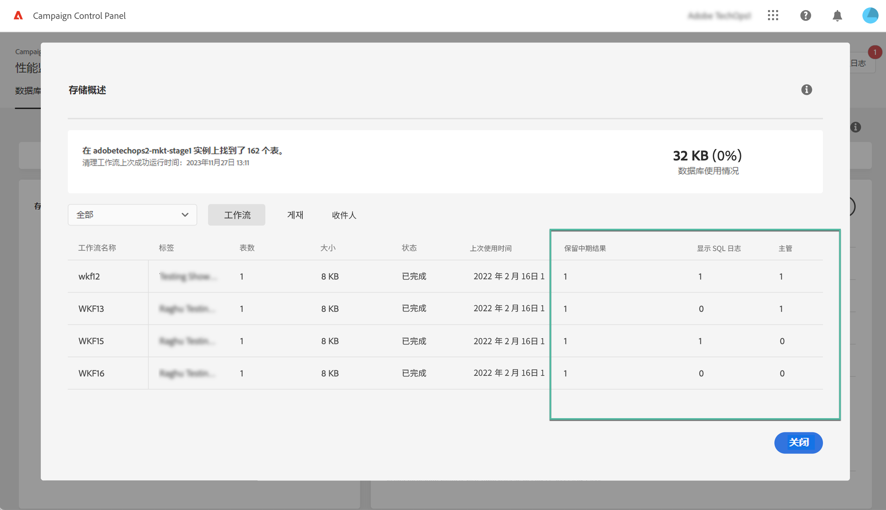
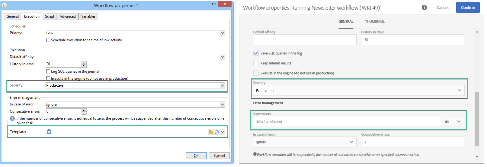

# 监测工作流 {#monitor-workflows}

<!-- Clean paused and completed workflows

When [!DNL Adobe Campaign] workflows are paused or completed, they leave temporary tables on your instances database that consume space and can lead to performance issues.

Control Panel allows you to identify those workflows and clean the temporary resources generated on your instances.

>[!NOTE]
>
>Technically, this operation executes the **[!UICONTROL Database cleanup technical workflow]** that runs on your Campaign instance everyday (see [Campaign Standard](https://experienceleague.adobe.com/docs/campaign-standard/using/administrating/application-settings/technical-workflows.html#list-of-technical-workflows) and [Campaign Classic](https://experienceleague.adobe.com/docs/campaign-classic/using/monitoring-campaign-classic/data-processing/database-cleanup-workflow.html) documentation). 

To clean paused and completed workflows, follow these steps:

1. Navigate to the **[!UICONTROL Performance monitoring]** card.

1. In the **[!UICONTROL Databases]** tab, select the instance where you want to perform the operation.

1. Access the **[!UICONTROL Storage overview]** details, then filter the list on **[!UICONTROL Temporary tables]**. Learn more on **[!UICONTROL Storage overview]** in [this page](database-storage-overview.md).

    

1. All temporary tables generated on your instances by workflows and deliveries display. Click the **[!UICONTROL Clean now]** button to delete the resources generated by paused and completed workflows.

    

1. Once the operation is confirmed, you can track the estimated remaining time in the **[!UICONTROL Storage overview]** list.

    

Monitor workflow parameters -->

在Adobe Campaign中，某些工作流参数可能需要特别注意以避免实例上出现任何问题。 控制面板 **[!UICONTROL Storage overview]** 利用详细信息，可检查是否为工作流启用了这些选项。

## **[!UICONTROL Keep interim results]** {#keep-results}

启用后（值“1”），此选项会保存工作流各种活动之间过渡的结果。 在 [Campaign Standard](https://experienceleague.adobe.com/docs/campaign-standard/using/managing-processes-and-data/executing-a-workflow/managing-execution-options.html?lang=zh-Hans) 和 [Campaign Classic](https://experienceleague.adobe.com/docs/campaign-classic/using/automating-with-workflows/introduction/workflow-best-practices.html?lang=zh-Hans#logs) 文档。

>[!IMPORTANT]
>
>不得在生产工作流中勾选此选项。它用于分析和测试目的，因此必须仅用于开发或暂存环境。 我们强烈建议在Campaign中将其关闭。

## **[!UICONTROL Show SQL log]** {#sql}

启用此选项后，工作流执行期间发送到数据库的SQL查询将显示在Adobe Campaign中。 在 [Campaign Standard](https://experienceleague.corp.adobe.com/docs/campaign-standard/using/managing-processes-and-data/executing-a-workflow/managing-execution-options.html?lang=en) 和 [Campaign Classic](https://experienceleague.adobe.com/docs/campaign-classic/using/automating-with-workflows/advanced-management/workflow-properties.html?lang=en#execution) 文档。

值“1”表示工作流具有 **严重性** 字段设置为“生产”，并且已启用SQL查询日志选项。

>[!IMPORTANT]
>
>激活此选项可能会影响性能并填充服务器上的日志文件。 它只应用于分析和诊断目的。

## **[!UICONTROL Supervisors]** {#supervisors}

利用此字段，可向工作流分配运算符。 如果工作流失败，关联的运算符将收到警报。 在 [Campaign Standard](https://experienceleague.corp.adobe.com/docs/campaign-standard/using/managing-processes-and-data/executing-a-workflow/monitoring-workflow-execution.html?lang=en#error-management) 和 [Campaign Classic](https://experienceleague.adobe.com/docs/campaign-classic/using/automating-with-workflows/advanced-management/workflow-properties.html?lang=en#error-management) 文档。

值“1”表示工作流具有 **严重性** 字段设置为“生产”，且尚未将主管组分配到工作流。

