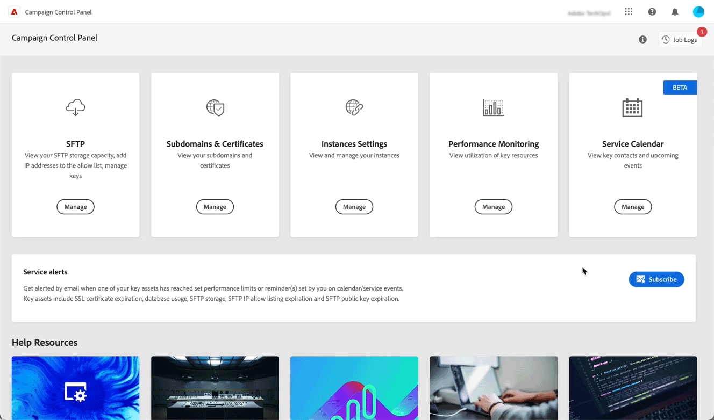

# 2023 年版发行说明 {#rn-2023}

## 2023 年 9 月 {#september-2023}

<table>
<thead>
<tr>
<th><strong>DMARC 和 BIMI 记录管理</strong> </th>
</tr>
</thead>
<tbody>
<tr>
<td>

您现在可以直接从控制面板添加 DMARC 和 BIMI 记录：

<ul><li><strong>DMARC 记录</strong>可以验证发件人的域并防止在未经授权的情况下将域用于恶意目的。<a href="../subdomains-certificates/using/dmarc.md">了解如何添加 DMARC 记录</a></li>
<li><strong>BIMI 记录</strong>允许您在邮箱提供商收件箱中的电子邮件旁边显示认证徽标，以增强品牌辨识度和信任度。<a href="../subdomains-certificates/using/bimi.md">了解如何添加 BIMI 记录</a></li></ul>
</td>
</tr>
</tbody>
</table>

## 2023 年 6 月 {#june-2023}

* 现在，您可以直接从子域列表将已委派子域的 SSL 证书委派给 Adobe。[了解详情](../subdomains-certificates/using/delegate-ssl.md)

* 警报电子邮件发件人已更改为 `"alert@notifications.campaign.adobe.com"`。

## 2023 年 5 月改进 {#may-2023}

**对 Adobe 的子域 SSL 证书委派**

您现在可以使用 Adobe 管理子域的 SSL 证书。如果您使用 CNAME 设置您的子域，则将自动生成并提供证书记录，以便在您的域托管解决方案中生成证书。

请注意，仅在设置新子域时有此功能可用。无法为现有委派的子域委派证书。[了解详情](../subdomains-certificates/using/setting-up-new-subdomain.md)

>[!NOTE]
>
>Adobe 管理的 SSL 是一项免费功能，可供用户免费使用。

## 2023 年 3 月 {#march-2023}

**移除 CNAME 的子域委派**

现在，您可以移除已使用 CNAME 配置的子域委派。[了解详情](../subdomains-certificates/using/remove-delegated-subdomains.md)

## 2023 年 2 月 {#february-2023}

**移除委派给 Adobe 的子域委派**

您现在可以移除已完全委派给 Adobe 的子域委派。[了解详情](../subdomains-certificates/using/remove-delegated-subdomains.md)

>[!NOTE]
>
>目前，委派移除不适用于使用 CNAME 设置的子域。

**服务日历**

现在，服务日历提供日历视图，用于跟踪实例上发生的重要事件。此外，在向订阅“控制面板”警报的用户发送通知时添加了信息。[了解详情](../service-events/service-events.md)

## 2023 年 1 月 {#january-2023}

**新的混合托管模型功能**

现在，具有混合托管模型的客户可以向允许列表添加 IP 地址以访问 MID 实例。[了解详情](../instances-settings/using/ip-allow-listing-instance-access.md)

**证书签名请求 (CSR) 增强功能**

现在，在生成证书签名请求时，“城市/地区”字段是可选项。
