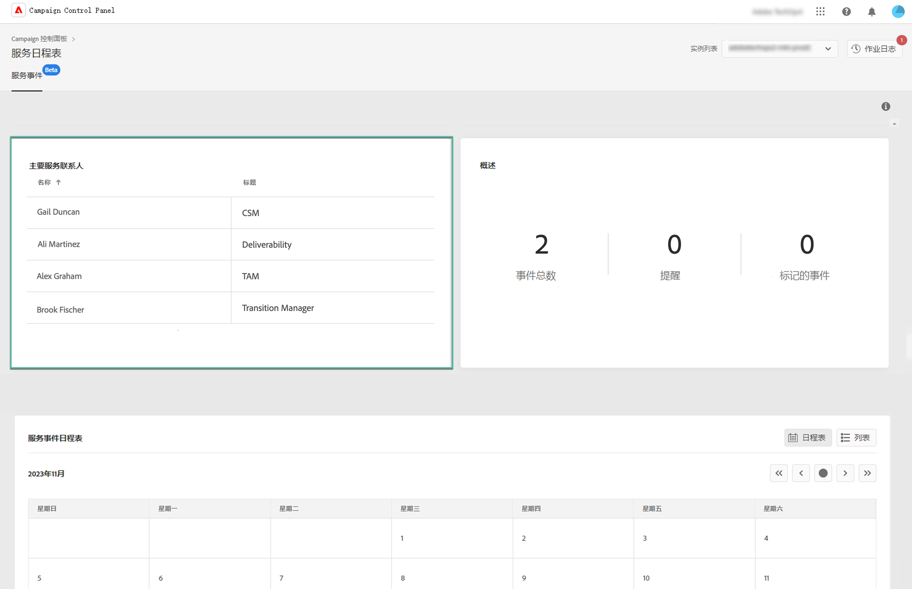
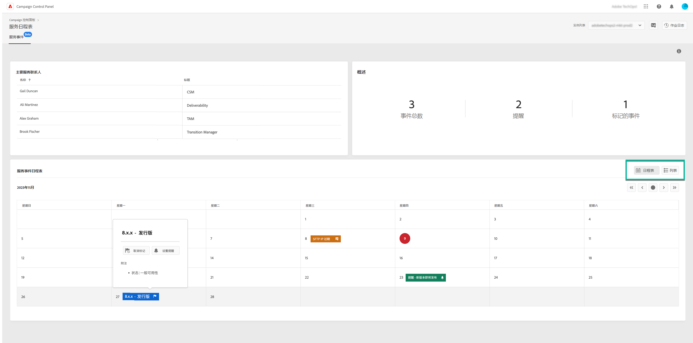
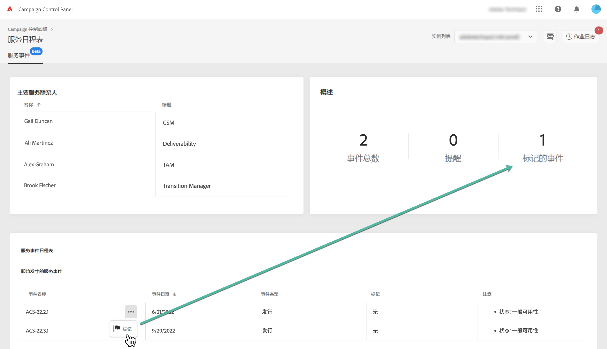
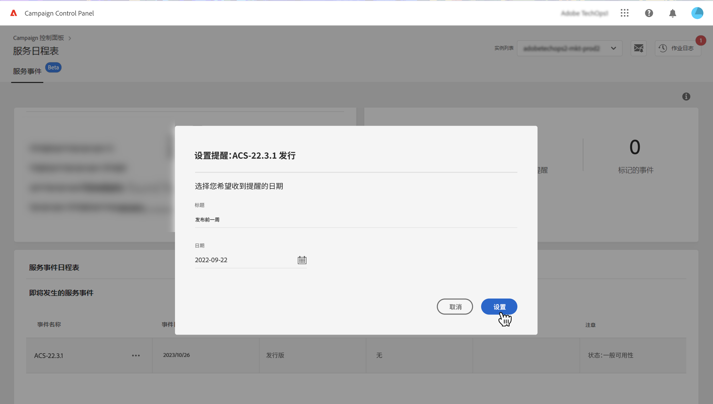
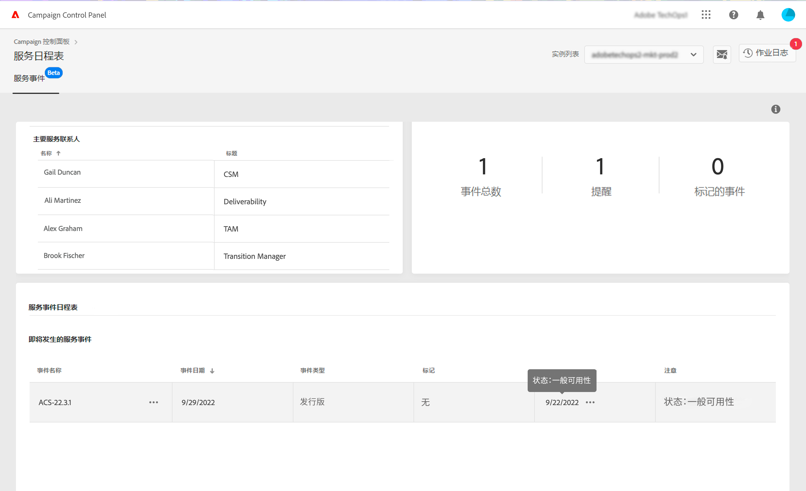

# 监测关键联系人和事件 {#keycontacts-events}

>[!CONTEXTUALHELP]
>id="cp_servicecalendar_serviceevents"
>title="服务日历"
>abstract="“关键联系人”部分列出了可联系的 Adobe 人员，以便您针对实例提出任何请求或问题。 在“Service Event Calendar”部分中，您可以确定所选实例的版本和服务评审，并为即将发生的事件设置提醒。"

>[!IMPORTANT]
>
>服务日历将在测试版中提供，如有频繁更新和修改，恕不另行通知。

识别实例中计划的事件对于监测 Campaign 实例至关重要。

使用控制面板，可监测实例中发生的版本发布和服务评审，并可访问 Adobe 关键联系人列表以提出任何请求或问题。

可在控制面板主页的 **[!UICONTROL Service Calendar]** 信息卡中获得这些信息。

## 关键联系人 {#key-contacts}

**[!UICONTROL Key contacts]** 部分列出了可联系的 Adobe 人员列表，以便您针对实例提出任何请求或问题。

>[!NOTE]
>
>此部分将仅显示托管服务帐户的信息。

主要联系人包括以下角色：

* **[!UICONTROL TAM]**：技术客户经理、
* **[!UICONTROL CSM]**：客户成功经理、
* **[!UICONTROL Deliverability]**：可交付性操作联系人、
* **[!UICONTROL Transition Manager]**：Managed Services 过渡经理（仅限 Managed Services 帐户）、
* **[!UICONTROL On-boarding Specialist]**：分配给帐户的专家，可帮助您熟悉 Campaign Classic（仅限 Managed Services 帐户）。

## 事件 {#events}

### 监测事件 {#monitor-events}

**[!UICONTROL Service Event Calendar]** 部分显示选定实例的所有过去和即将发布的版本和服务评审。

**[!UICONTROL Note]** 列提供有关每个版本状态的信息：

* **[!UICONTROL General availability]**：最新发布的稳定版本。
* **[!UICONTROL Limited availability]**：仅限按需部署。
* **[!UICONTROL Release candidate]**：工程部门已验证。 等待生产校样。
* **[!UICONTROL Pre release]**：提前提供以满足特定客户需求。
* **[!UICONTROL No longer available]**：该版本不存在重大问题，但新版本可供使用，并包含其他错误修复。 需要进行升级。
* **[!UICONTROL Deprecated]**：版本嵌入已知回归。
不再支持该版本。 必须进行升级。

可为一个或多个即将发生的事件分配一个标记以进行跟踪。 要实现这一点，请单击事件名称旁边的椭圆按钮。

### 设置提醒 {#reminders}

使用“服务日历”，您可以设置提醒，以便在事件发生之前通过电子邮件接收通知。

>[!NOTE]
>
>要接收有关即将发生的事件的通知，请确保您已在控制面板中订阅电子邮件警报。[了解详情](../performance-monitoring/using/email-alerting.md)

要针对某一事件设置警报，请执行以下步骤：

1. 单击要为其设置提醒的事件旁边的椭圆按钮，然后选择 **[!UICONTROL Set Reminder]**。

1. 为提醒设置一个标题，然后选择要在事件发生之前收到通知的日期。

   

   >[!NOTE]
   >
   >如果您未订阅控制面板警报，则会显示一条消息，使您可以进行注册以接收电子邮件通知。

1. 现已为选定事件设置提醒。您可以随时将鼠标悬停在该事件上以显示其标题。

   

   >[!NOTE]
   >
   >您最多可以为同一事件设置 2 个提醒。

1. 在提醒中指定的日期，会发送一封电子邮件，通知您即将发生的事件，并将提醒从“Service Calendar”菜单中的 **[!UICONTROL Reminders]** 计数中自动删除。
