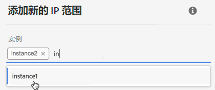

# IP 范围允许列表 {#ip-range-allow-listing}

>[!CONTEXTUALHELP]
>id="cp_ip_whitelist"
>title="关于 IP 允许列表"
>abstract="在此选项卡中，您可以向允许列表添加 IP 范围，以建立与 SFTP 服务器的连接。此处仅显示您有权访问的 SFTP 服务器。请联系您的管理员以请求访问其他 SFTP 服务器。"
>additional-url="https://images-tv.adobe.com/mpcv3/8a977e03-d76c-44d3-853c-95d0b799c870_1560205338.1920x1080at3000_h264.mp4#t=98" text="观看演示视频"

SFTP 服务器受到保护。为了能够访问这些服务器以查看文件或编写新文件，您需要将访问服务器的系统或客户端的公共 IP 地址添加到允许列表。

在介绍如何使用 [Campaign v7/v8](https://experienceleague.adobe.com/docs/campaign-classic-learn/control-panel/sftp-management/adding-ip-range-to-allow-list.html#sftp-management) 或 [Campaign Standard](https://experienceleague.adobe.com/docs/campaign-standard-learn/control-panel/sftp-management/adding-ip-range-to-allow-list.html?lang=zh-Hans#sftp-management) 的视频中了解这一功能

## 关于 CIDR 格式 {#about-cidr-format}

CIDR（无类域间路由）是在控制面板界面中添加 IP 范围时受支持的格式。

语法依次由 IP 地址、“/”字符和十进制数字组成。[本文](https://whatismyipaddress.com/cidr){target="_blank"}详细介绍了格式及其语法。

您可以在互联网上搜索免费的在线工具，这些工具将帮助您将现有的 IP 范围转换为 CIDR 格式。

## 最佳实践 {#best-practices}

在控制面板中将 IP 地址添加到允许列表时，请确保遵循以下建议和限制条件。

* **将 IP 范围添加到允许列表**，而不是单个 IP 地址。要将单个 IP 地址添加到允许列表，请在其中附加“/32”，以标识该范围仅包含单个 IP 地址。
* **请勿向允许列表添加非常宽的范围**，例如，包括 > 265 个 IP 地址。控制面板将拒绝任何介于 /0 和 /23 之间的 CIDR 格式范围。
* 只能将&#x200B;**公共 IP 地址**&#x200B;添加到允许列表。
* 请确保从允许列表中&#x200B;**定期删除不再需要的 IP 地址**。

## 向允许列表添加 IP 地址 {#adding-ip-addresses-allow-list}

>[!CONTEXTUALHELP]
>id="cp_sftp_iprange_add"
>title="IP 范围配置"
>abstract="定义要添加到允许列表以连接到 SFTP 服务器的 IP 范围。"

要向允许列表添加 IP 范围，请执行以下步骤：

1. 打开 **[!UICONTROL SFTP]** 信息卡，然后选择 **[!UICONTROL IP 允许列表]**&#x200B;选项卡。
1. 将为每个实例显示允许列表上的 IP 地址列表。从左侧列表中选择所需的实例，然后单击&#x200B;**[!UICONTROL 添加新 IP 范围]**&#x200B;按钮。

   

1. 定义要添加到允许列表的 IP 范围。该字段仅接受 CIDR 格式的 IP 范围，例如 *192.150.5.0/24*。

   

   >[!IMPORTANT]
   >
   >IP 范围不能与允许列表上的现有范围重叠。在这种情况下，首先删除包含重叠 IP 的范围。

1. 可以将一个范围添加到多个实例的允许列表中。为此，请按向下箭头键或键入所需实例的前几个字母，然后从建议列表中选择该实例。

   

1. 定义将在列表中针对此 IP 范围显示的标签。

   

   >[!NOTE]
   >
   >**[!UICONTROL 标签]**字段中允许使用以下特殊字符：
   > `. _ - : / ( ) # , @ [ ] + = & ; { } ! $`

1. 为了更好地管理您的 IP 允许列表，您可以设置每个 IP 范围的有效期。为此，请在&#x200B;**[!UICONTROL 类型]**&#x200B;下拉列表中选择一个单位，并在相应的字段中定义有效期。有关 IP 范围过期的详细信息，请参阅[此小节](#expiry)。

   

   >[!NOTE]
   >
   >默认情况下，**[!UICONTROL 类型]**&#x200B;字段设置为&#x200B;**[!UICONTROL 无限制]**，这意味着 IP 范围永不过期。

1. 在&#x200B;**[!UICONTROL 注释]**&#x200B;字段中，您可以指明允许使用此 IP 范围的原因（原因、对象等）。

1. 单击&#x200B;**[!UICONTROL 保存]**&#x200B;按钮。添加到允许列表中的 IP 范围将显示为&#x200B;**[!UICONTROL 待处理]**，直到请求得到完全处理，这应该只需要几秒钟。

   

>[!IMPORTANT]
>
>如果您尝试将 SFTP 服务器连接到新系统，从而将新的 IP 范围添加到允许列表中，则可能需要输入新的公钥才能完成连接。有关更多信息，请参阅[此小节](key-management.md)。

## 管理 IP 范围 {#managing-ip-ranges}

您创建的 IP 范围显示在 **[!UICONTROL IP 允许列表]**&#x200B;选项卡中。

您可以根据创建日期或版本日期、创建或编辑项目的用户以及 IP 范围到期时间对项目进行排序。

您还可以通过键入标签、范围、名称或注释来搜索 IP 范围。

要编辑一个或多个 IP 范围，请参阅[此小节](#editing-ip-ranges)。

要从允许列表中删除一个或多个 IP 范围，请将其选中，然后单击&#x200B;**[!UICONTROL 删除 IP 范围]**&#x200B;按钮。

### 过期 {#expiry}

**[!UICONTROL 过期]**&#x200B;列显示了 IP 范围过期前的剩余天数。

如果您订阅了[电子邮件警报](../../performance-monitoring/using/email-alerting.md)，您将在 IP 范围过期前 10 天和 5 天以及到期当天收到电子邮件通知。收到警报后，您可以[编辑 IP 范围](#editing-ip-ranges)以根据需要延长有效期。

过期的 IP 范围在 7 天后会被自动删除。它在&#x200B;**[!UICONTROL 过期]**&#x200B;列中显示为&#x200B;**[!UICONTROL 已过期]**。在这 7 天内：

* 无法再使用已过期的 IP 范围访问 SFTP 服务器。

* 无法创建与过期范围重叠的其他 IP 范围。您需要先删除过期的 IP 范围，然后再创建新范围。

* 您可以[编辑](#editing-ip-ranges)过期的 IP 范围并更新其有效期，以便再次使用。

* 您可以将其从允许列表中删除。

## 编辑 IP 范围 {#editing-ip-ranges}

>[!CONTEXTUALHELP]
>id="cp_sftp_iprange_update"
>title="更新 IP 范围"
>abstract="更新允许连接到 SFTP 服务器的选定 IP 范围。"

要编辑 IP 范围，请执行以下步骤。

>[!NOTE]
>
>您只能编辑通过 2021 年 10 月版或更新版本的控制面板创建的 IP 范围。

<!--Edition is not available for IP ranges that have been created before the Control Panel October 2021 release.-->

1. 从 **[!UICONTROL IP 允许列表]**&#x200B;中选择一个或多个 IP 范围。

1. 单击&#x200B;**[!UICONTROL 更新 IP 范围]**&#x200B;按钮。

   

1. 您只能编辑 IP 范围到期日和/或添加新注释。

   >[!NOTE]
   >
   >要修改 CIDR 格式、其标签或编辑相关实例，必须先删除 IP 范围，并根据需要创建新范围。

   

1. 保存您的更改。

## 监控更改 {#monitoring-changes}

通过控制面板主页中的&#x200B;**[!UICONTROL 作业日志]**，您可以跟踪并监控对允许列表上的 IP 地址做出的所有更改。

有关控制面板界面的详细信息，请参阅[此小节](../../discover/using/discovering-the-interface.md)。

