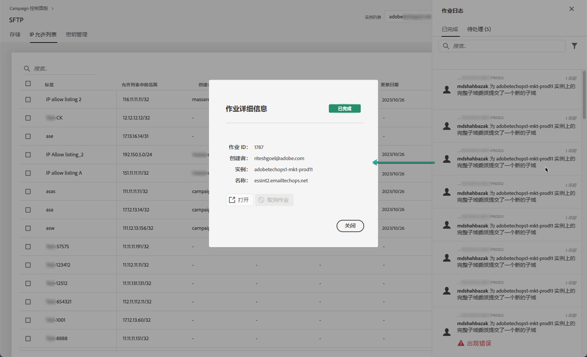

# 将 IP 范围添加到允许列表 {#ip-range-allow-listing}

>[!CONTEXTUALHELP]
>id="cp_ip_whitelist"
>title="关于 IP 允许列表"
>abstract="在此选项卡中，您可以向允许列表添加 IP 范围，以建立与 SFTP 服务器的连接。此处仅显示您有权访问的 SFTP 服务器。请联系您的管理员以请求访问其他 SFTP 服务器。"
>additional-url="https://images-tv.adobe.com/mpcv3/8a977e03-d76c-44d3-853c-95d0b799c870_1560205338.1920x1080at3000_h264.mp4#t=98" text="观看演示视频"

SFTP 服务器受到保护。为了能够访问这些服务器以查看文件或编写新文件，您需要将访问服务器的系统或客户端的公共IP地址添加到允许列表。

 使用 [Campaign v7/v8](https://experienceleague.adobe.com/docs/campaign-classic-learn/control-panel/sftp-management/adding-ip-range-to-allow-list.html#sftp-management) 或 [Campaign Standard](https://experienceleague.adobe.com/docs/campaign-standard-learn/control-panel/sftp-management/adding-ip-range-to-allow-list.html#sftp-management)

## 关于 CIDR 格式 {#about-cidr-format}

CIDR（无类域间路由）是在控制面板界面中添加 IP 范围时受支持的格式。

语法依次由 IP 地址、“/”字符和十进制数字组成。格式及其语法在 [本文](https://whatismyipaddress.com/cidr){target=&quot;_blank&quot;}。

您可以在Internet上搜索免费的在线工具，这些工具将帮助您将现有的IP范围转换为CIDR格式。

## 最佳实践 {#best-practices}

在控制面板中将 IP 地址添加到允许列表时，请确保遵循以下建议和限制条件。

* **将 IP 范围添加到允许列表**，而不是单个 IP 地址。要将单个 IP 地址添加到允许列表，请在其中附加“/32”，以标识该范围仅包含单个 IP 地址。
* **请勿向允许列表添加非常宽的范围**，例如，包括 > 265 个 IP 地址。控制面板将拒绝任何介于 /0 和 /23 之间的 CIDR 格式范围。
* 只能将&#x200B;**公共 IP 地址**&#x200B;添加到允许列表。
* 确保 **定期删除IP地址** 不再需要允许列表。

## 向允许列表添加 IP 地址 {#adding-ip-addresses-allow-list}

>[!CONTEXTUALHELP]
>id="cp_sftp_iprange_add"
>title="IP范围配置"
>abstract="定义要添加到允许列表以连接到 SFTP 服务器的 IP 范围。"

要向允许列表添加 IP 范围，请执行以下步骤：

1. 打开 **[!UICONTROL SFTP]** 卡，然后选择 **[!UICONTROL IP Allow Listing]** 选项卡。
1. 将为每个实例显示允许列表上的 IP 地址列表。从左侧列表中选择所需的实例，然后单击 **[!UICONTROL Add new IP range]**&#x200B;按钮。

   

1. 定义要添加到允许列表的IP范围。 此字段仅接受CIDR格式的IP范围，例如 *192.150.5.0/24*.

   

   >[!IMPORTANT]
   >
   >IP 范围不能与允许列表上的现有范围重叠。在这种情况下，首先删除包含重叠 IP 的范围。

1. 可以向允许列表添加多个实例的范围。 为此，请按向下箭头键或键入所需实例的前几个字母，然后从建议列表中选择该实例。

   

1. 定义将在列表中为此IP范围显示的标签。

   

   >[!NOTE]
   >
   >在 **[!UICONTROL Label]** 字段：
   > `. _ - : / ( ) # , @ [ ] + = & ; { } ! $`

1. 为了更好地管理您的IP允许列表，您可以为每个IP范围的可用性设置持续时间。 为此，请在 **[!UICONTROL Type]** 下拉列表中，并在相应的字段中定义持续时间。 有关IP范围到期的更多信息，请参阅 [此部分](#expiry).

   

   >[!NOTE]
   >
   >默认情况下， **[!UICONTROL Type]** 字段设置为 **[!UICONTROL Unlimited]**，这表示IP范围永不过期。

1. 在 **[!UICONTROL Comment]** 字段中，您可以指明允许此IP范围的原因（原因、对象等）。

1. 单击 **[!UICONTROL Save]** 按钮。允许列表的IP范围附加项将显示为 **[!UICONTROL Pending]** 在请求完全处理之前，此过程只需几秒钟即可完成。

   

>[!IMPORTANT]
>
>如果您尝试将SFTP服务器连接到新系统，从而将新IP范围添加到允许列表，则可能需要输入新的公钥才能完成连接。 有关更多信息，请参阅[此章节](key-management.md)。

## 管理IP范围 {#managing-ip-ranges}

您创建的IP范围将显示在 **[!UICONTROL IP Allow Listing]** 选项卡。

您可以根据创建日期或编辑日期、创建或编辑项目的用户以及IP范围到期情况对项目进行排序。

您还可以通过开始键入标签、范围、名称或评论来搜索IP范围。

要编辑一个或多个IP范围，请参阅 [此部分](#editing-ip-ranges).

要从允许列表中删除一个或多个IP范围，请选择它们，然后单击 **[!UICONTROL Delete IP range]** 按钮。

### 到期 {#expiry}

的 **[!UICONTROL Expires]** 列显示在IP范围过期之前还剩多少天。

如果您订阅了 [电子邮件警报](../../performance-monitoring/using/email-alerting.md)，则会在IP范围过期的前10天和5天以及过期的当天通过电子邮件收到通知。 收到警报后，您可以 [编辑IP范围](#editing-ip-ranges) 以延长有效期（如有需要）。

过期的IP范围将在7天后自动删除。 显示为 **[!UICONTROL Expired]** 在 **[!UICONTROL Expires]** 列。 在此7天内：

* 过期的IP范围不能再用于访问SFTP服务器。

* 不能创建与过期范围重叠的其他IP范围。 您需要先删除过期的IP范围，然后再创建新范围。

* 您可以 [编辑](#editing-ip-ranges) 过期的IP范围并更新其持续时间以使其再次可用。

* 您可以从允许列表中删除它。

## 编辑IP范围 {#editing-ip-ranges}

>[!CONTEXTUALHELP]
>id="cp_sftp_iprange_update"
>title="更新IP范围"
>abstract="更新允许连接到SFTP服务器的选定IP范围。"

要编辑IP范围，请执行以下步骤。

>[!NOTE]
>
>您只能编辑自2021年10月版控制面板以来创建的IP范围。

<!--Edition is not available for IP ranges that have been created before the Control Panel October 2021 release.-->

1. 从 **[!UICONTROL IP Allow Listing]** 列表。

1. 单击 **[!UICONTROL Update IP range]** 按钮。

   

1. 您只能编辑IP范围到期和/或添加新注释。

   >[!NOTE]
   >
   >要修改CIDR格式、其标签或编辑相关实例，您必须先删除IP范围，并创建一个符合您需求的新实例。

   

1. 保存更改。

## 监控更改 {#monitoring-changes}

的 **[!UICONTROL Job Logs]** 在“控制面板”主页中，您可以跟踪和监视对允许列表上的IP地址所做的所有更改。

有关控制面板界面的详细信息，请参阅[此部分](../../discover/using/discovering-the-interface.md)。

