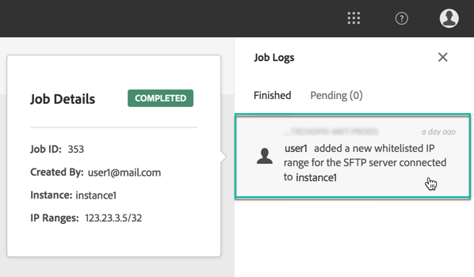

# IP范围白名单 {#ip-range-whitelisting}

SFTP服务器受保护。 为了能够访问它们以查看文件或编写新文件，您需要将访问服务器的系统或客户端的公共IP地址列入白名单。

## 关于CIDR格式 {#about-cidr-format}

CIDR（无类域间路由）是在控制面板界面中添加IP范围时支持的格式。

语法由IP地址、字符“/”和小数组成。 本文对格式及其语法进行了详 [细介绍](https://whatismyipaddress.com/cidr)。

您可以在Internet上搜索免费的在线工具，这些工具将帮助您将手头的IP范围转换为CIDR格式。

## 最佳实践 {#best-practices}

确保在控制面板中将IP地址列入白名单时遵循以下建议和限制。

* **白名单IP范围** ，而不是单个IP地址。 要将单个IP地址列入白名单，请在其后面附加一个“/32”，以指示该范围仅包括单个IP。
* **请勿将很宽的范围列入白名单**，例如，包括&gt; 265个IP地址。 控制面板将拒绝任何介于/0和/23之间的CIDR格式范围。
* 只有 **公共IP地址** ，才能列入白名单。
* 确保定 **期删除您不再需要的白名单** IP地址。

## 白名单IP地址 {#whitelisting-ip-addresses}

要将IP范围列入白名单，请执行以下步骤：

1. Open the **[!UICONTROL SFTP]** card, then select the **[!UICONTROL IP Whistelisting]** tab.
1. 将显示每个实例的白名单IP地址列表。 从左侧列表中选择所需的实例，然后单击按 **[!UICONTROL Add new IP range]** 钮。

   

1. 以CIDR格式定义要列入白名单的IP范围，然后定义将在列表中显示的标签。

   >[!NOTE]
   >
   >标签字段中允许使用以下特殊字符：
   > `. _ - : / ( ) # , @ [ ] + = & ; { } ! $`

   

   >[!CAUTION]
   >
   >IP范围不能与现有的白名单范围重叠。 在这种情况下，首先删除包含重叠IP的范围。
   >
   >可以将多个实例的范围列入白名单。 为此，请按向下箭头键或键入所需实例的前字母，然后从建议列表中选择它。

   

1. Click the **[!UICONTROL Save]** button. 在完全处理请求之前，IP白名单的添加将显示为“待定”。 这只需几秒钟。

要删除已列入白名单的IP范围，请选择它们，然后单击 **[!UICONTROL Delete IP range]** 按钮。

>[!NOTE]
>
>当前无法编辑列入白名单的范围。 要修改IP范围，请删除它，然后创建一个与您的需求对应的IP范围。

## 监视更改 {#monitoring-changes}

通过 **[!UICONTROL Job Logs]** 控制面板主页中的显示功能，可以监视对列入白名单的IP地址所做的所有更改。

有关控制面板界面的详细信息，请参 [阅此部分](../../discover/using/discovering-the-interface.md)。

