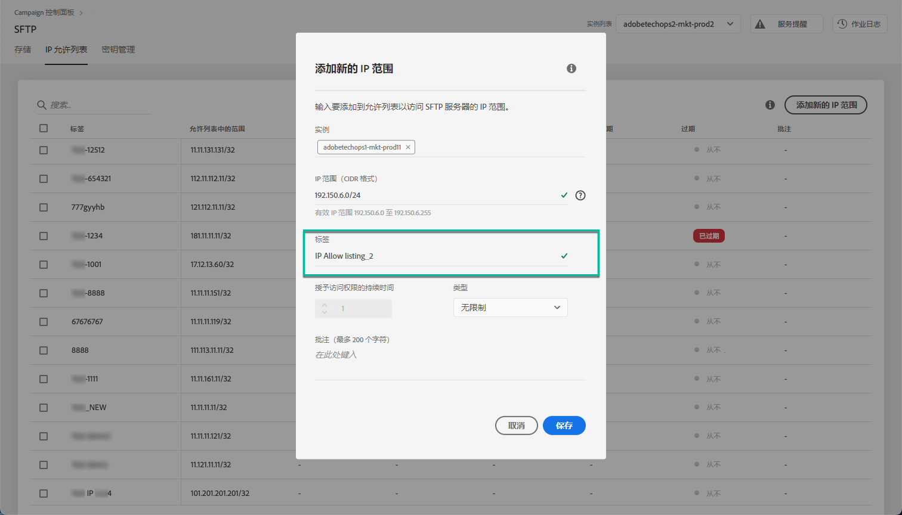
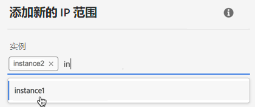
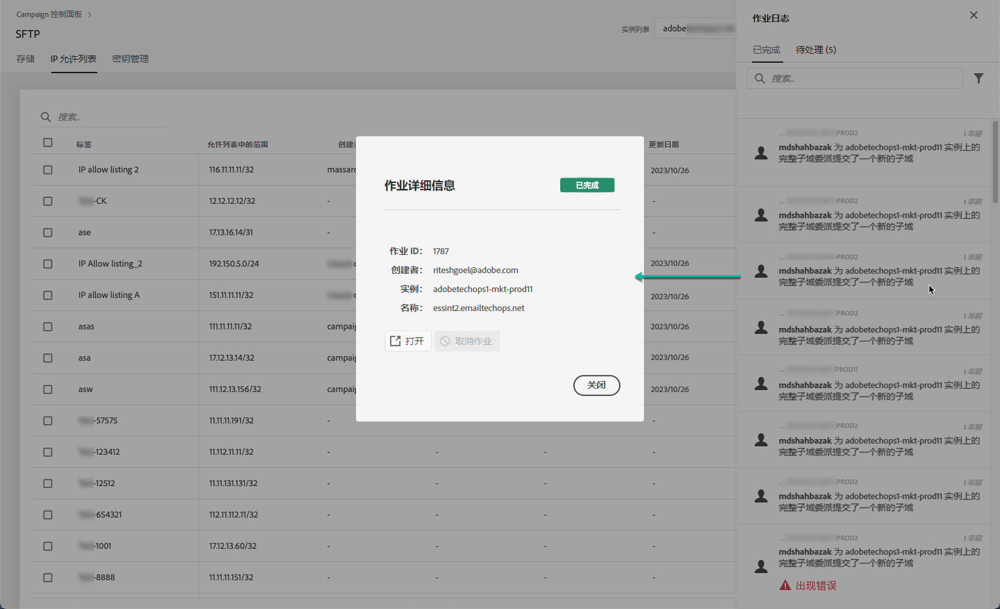

# IP范围允许列表 {#ip-range-whitelisting}

>[!CONTEXTUALHELP]
>id="cp_ip_whitelist"
>title="关于IP允许列表"
>abstract="在此选项卡中，您可以向允许列表添加IP范围，以建立与SFTP服务器的连接。 此处仅显示您有权访问的 SFTP 服务器。请联系您的管理员以请求访问其他 SFTP 服务器。"
>additional-url="https://images-tv.adobe.com/mpcv3/8a977e03-d76c-44d3-853c-95d0b799c870_1560205338.1920x1080at3000_h264.mp4#t=98" text="观看演示视频"

SFTP 服务器受到保护。为了能够访问它们以视图文件或写入新文件，您需要将访问服务器的系统或客户端的公共IP地址添加到允许列表。

## 关于 CIDR 格式 {#about-cidr-format}

CIDR（无类域间路由）是在控制面板界面中添加 IP 范围时受支持的格式。

语法依次由 IP 地址、“/”字符和十进制数字组成。[本文](https://whatismyipaddress.com/cidr)详细介绍了格式及其语法。

您可以在互联网上搜索免费的在线工具，这些工具将帮助您将现有的 IP 范围转换为 CIDR 格式。

## 最佳做法 {#best-practices}

确保在控制面板中向允许列表添加IP地址时遵循以下建议和限制。

* **将IP范围添加到允许列表** ，而不是单个IP地址。 要向允许列表添加单个IP地址，请在列表后面附加“/32”，以指示该范围仅包括单个IP。
* **请勿向允许列表添加非常宽的范围**，例如，包括> 265个IP地址。 控制面板将拒绝任何介于 /0 和 /23 之间的 CIDR 格式范围。
* 只 **能将公共** IP地址添加到允许列表。
* 请确保 **定期从允许列表** 中删除不再需要的IP地址。

## 将IP地址添加到允许列表 {#whitelisting-ip-addresses}

>[!CONTEXTUALHELP]
>id="cp_sftp_iprange_add"
>title="添加新 IP 范围"
>abstract="定义要添加到允许列表以连接到SFTP服务器的IP范围。"

要向允许列表添加IP范围，请执行以下步骤：

1. 打开 **[!UICONTROL SFTP]**&#x200B;卡，然后选择 **[!UICONTROL IP Whistelisting]** 选项卡。
1. “允许”列表上的IP地址列表显示每个实例。 从左侧列表中选择所需的实例，然后单击 **[!UICONTROL Add new IP range]**&#x200B;按钮。

   

1. 以CIDR格式定义要添加到允许列表的IP范围，然后定义将在列表中显示的标签。

   >[!NOTE]
   >
   >标签字段中允许使用以下特殊字符：
   > `. _ - : / ( ) # , @ [ ] + = & ; { } ! $`

   

   >[!IMPORTANT]
   >
   >IP范围不能与允许列表上的现有范围重叠。 在这种情况下，首先删除包含重叠 IP 的范围。
   >
   >可以在允许列表上为多个实例添加一个范围。 为此，请按向下箭头键或键入所需实例的前几个字母，然后从建议列表中选择该实例。

   

1. 单击&#x200B;**[!UICONTROL Save]**&#x200B;按钮。在完全处理请求之前，添加到允许列表的IP将显示为PENDING。 此处理操作只需要几秒钟即可完成。

要从允许列表中删除IP范围，请选择它们，然后单击 **[!UICONTROL Delete IP range]** 按钮。

>[!NOTE]
>
>当前无法编辑允许列表上的范围。 要修改 IP 范围，请将其删除，然后创建一个符合您的需求的 IP 范围。

## 监控更改 {#monitoring-changes}

The **[!UICONTROL Job Logs]** in the Control Panel home page let you monitor all changes that have been made to IP addresses on the allow list.

有关控制面板界面的详细信息，请参阅[此部分](../../discover/using/discovering-the-interface.md)。

