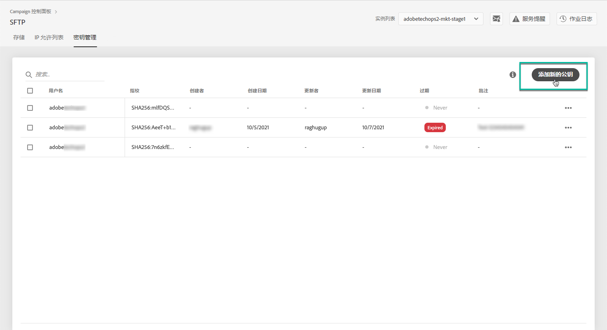
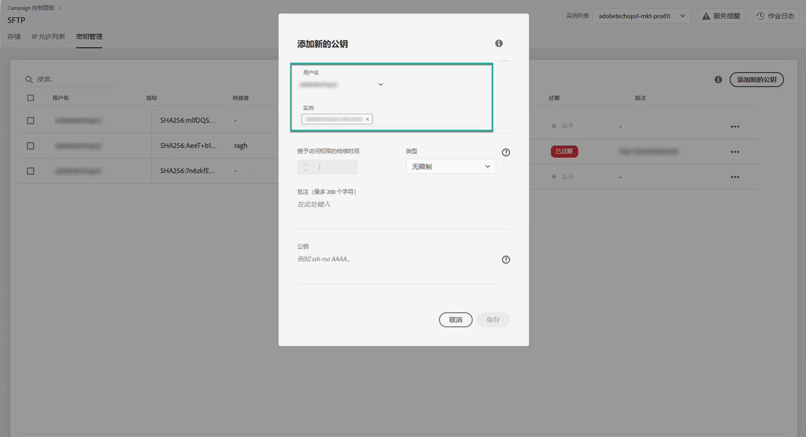
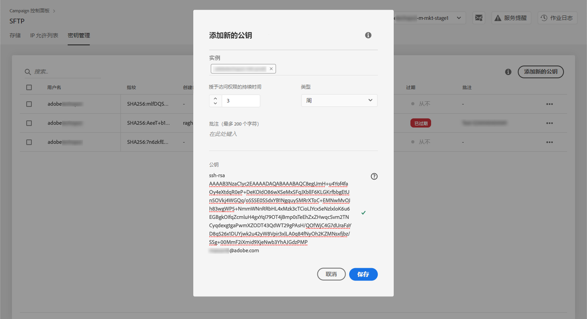
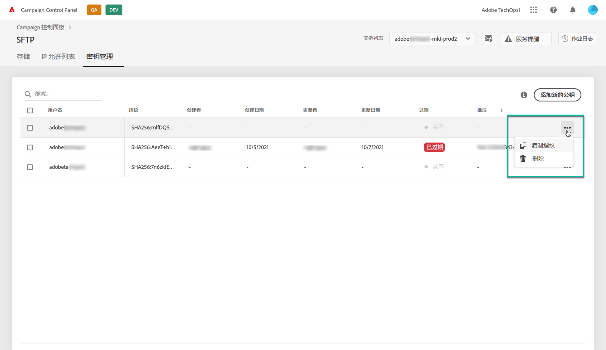

# 密钥管理 {#key-management}

>[!CONTEXTUALHELP]
>id="cp_key_management"
>title="关于密钥管理"
>abstract="在此选项卡中，您可以管理公钥。"
>additional-url="https://images-tv.adobe.com/mpcv3/8a977e03-d76c-44d3-853c-95d0b799c870_1560205338.1920x1080at3000_h264.mp4#t=166" text="观看演示视频"

Adobe 建议所有客户使用&#x200B;**公钥和私钥对**&#x200B;建立其与 SFTP 服务器的连接。

下面介绍了生成公共 SSH 密钥并添加此密钥以访问 SFTP 服务器的步骤，以及有关身份验证的建议。

服务器的访问权限设置完毕后，请记得&#x200B;**添加 IP 地址，您需要这些地址才能访问允许列表**&#x200B;的服务器，以便连接到该服务器。如需详细信息，请参阅[此部分](../../instances-settings/using/ip-allow-listing-instance-access.md)。

>[!NOTE]
>
>当前无法删除 SSH 公钥。

 使用活动类Campaign Standard在视频中 [发现](https://experienceleague.adobe.com/docs/campaign-classic-learn/control-panel/sftp-management/generate-ssh-key.html?lang=en#sftp-management) 此功 [能](https://experienceleague.adobe.com/docs/campaign-standard-learn/control-panel/sftp-management/generate-ssh-key.html?lang=en#sftp-management)

## 最佳做法 {#best-practices}

**关于公共 SSH 密钥**

确保始终使用相同的身份验证连接到服务器，并且您正在使用受支持的密钥格式。

**API 与用户名和密码集成**

在极少数情况下，某些 SFTP 服务器上启用了基于密码的身份验证。Adobe 建议您使用基于密钥的身份验证，因为此方法更有效、更安全。您可以通过联系客户关怀团队，请求切换到基于密钥的身份验证。

>[!IMPORTANT]
>
>如果您的密码过期，即使系统中已安装密钥，您也将无法登录 SFTP 帐户。

## 安装 SSH 密钥 {#installing-ssh-key}

>[!CONTEXTUALHELP]
>id="cp_sftp_publickey_add"
>title="添加新的公钥"
>abstract="为实例添加新的公钥。"

>[!IMPORTANT]
>
>以下步骤仅是创建 SSH 密钥的示例，请遵循您的组织指南中有关 SSH 密钥的规定。以下示例仅是指示如何执行此操作的其中一个示例，并作为向团队或内部网络组传达要求的有用参考点。

1. 导览至 **[!UICONTROL Key Management]**&#x200B;选项卡，然后单击 **[!UICONTROL Add new public key]** 按钮。

   

1. 在打开的对话框中，选择要为其创建公钥的用户名以及要为其激活密钥的服务器。

   >[!NOTE]
   >
   >该界面将检查给定实例上的给定用户名是否处于活动状态，并为您提供一个选项以在一个或多个实例上激活密钥。
   >
   >可以为每个用户添加一个或多个公共 SSH 密钥。

   

1. 复制粘贴公共 SSH 密钥。要生成公钥，请按照对应操作系统的以下步骤操作：

   >[!NOTE]
   >
   >公共 SSH 密钥大小应为 **2048 位**。

   **Linux 和 Mac：**

   使用终端生成公钥和私钥对：
   1. 输入以下命令：`ssh-keygen -m pem -t rsa -b 2048 -C "your_email@example.com"`。
   1. 在出现提示时，为您的密钥提供名称。如果 .ssh 目录不存在，系统将为您创建一个目录。
   1. 在出现提示时输入密码，然后重新输入一次。也可保留为空。
   1. 密钥对“name”和“name.pub”由系统创建。搜索“name.pub”文件，然后将其打开。该文件应具有以您指定的电子邮件地址结尾的字母数字字符串。

   **Windows：**

   您可能需要安装第三方工具，该工具将帮助您以相同格式“name.pub”生成私钥/公钥对。

1. 打开 .pub 文件，然后将以“ssh..”开头的整个字符串复制并粘贴到控制面板。

   

1. 单击&#x200B;**[!UICONTROL Save]**&#x200B;按钮以创建密钥。控制面板保存公钥及其关联的指纹，并使用 SHA256 格式进行加密。

您可以使用指纹将保存在计算机上的私钥与保存在控制面板中的相应公钥进行匹配。

通过“**...**”按钮，您可以删除现有密钥，或将其关联的指纹复制到剪贴板。

