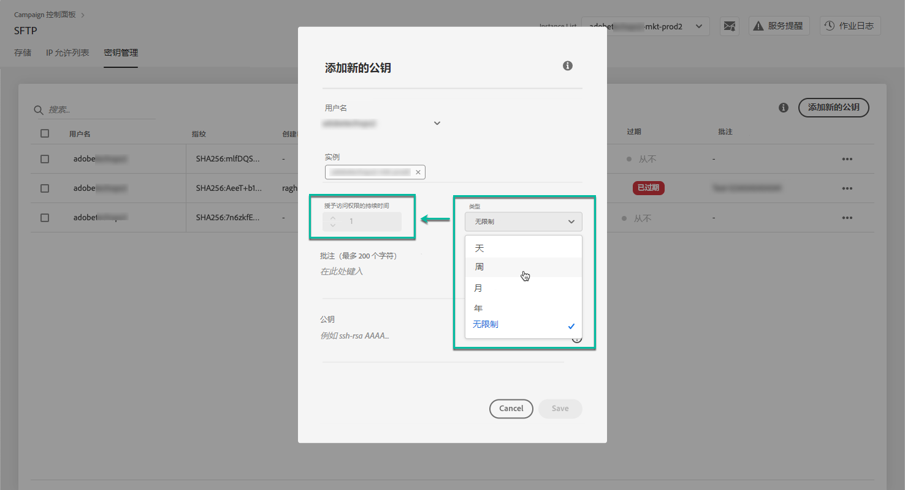
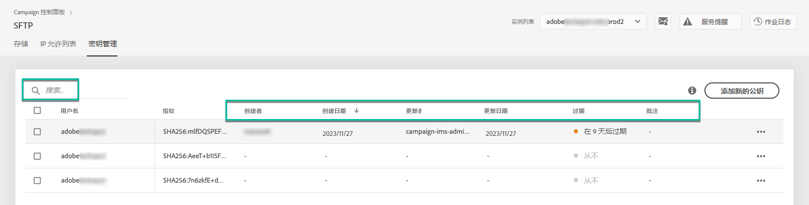
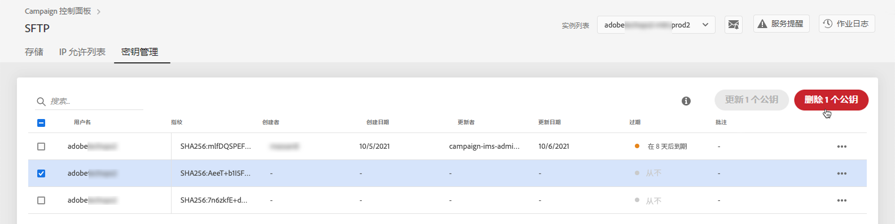
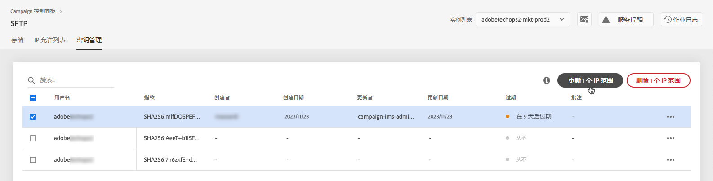

# 密钥管理 {#key-management}

>[!CONTEXTUALHELP]
>id="cp_key_management"
>title="关于公钥管理"
>abstract="在此选项卡中，创建、管理和编辑您的公钥。"
>additional-url="https://images-tv.adobe.com/mpcv3/8a977e03-d76c-44d3-853c-95d0b799c870_1560205338.1920x1080at3000_h264.mp4#t=166" text="观看演示视频"

Adobe 建议所有客户使用&#x200B;**公钥和私钥对**&#x200B;建立其与 SFTP 服务器的连接。

下面介绍了生成公共 SSH 密钥并添加此密钥以访问 SFTP 服务器的步骤，以及有关身份验证的建议。

服务器的访问权限设置完毕后，请记得&#x200B;**添加 IP 地址，您需要这些地址才能访问允许列表**&#x200B;的服务器，以便连接到该服务器。如需详细信息，请参阅[此部分](../../instances-settings/using/ip-allow-listing-instance-access.md)。

在使用 [Campaign v7/v8](https://experienceleague.adobe.com/docs/campaign-classic-learn/control-panel/sftp-management/generate-ssh-key.html#sftp-management) 或 [Campaign Standard](https://experienceleague.adobe.com/docs/campaign-standard-learn/control-panel/sftp-management/generate-ssh-key.html#sftp-management) 的视频中了解这一功能

## 最佳实践 {#best-practices}

**关于公共 SSH 密钥**

确保始终使用相同的身份验证连接到服务器，并且您正在使用受支持的密钥格式。

**API 与用户名和密码集成**

在极少数情况下，某些SFTP服务器上启用了基于密码的身份验证。 Adobe建议您使用基于密钥的身份验证，因为此方法更有效、更安全。 您可以通过联系客户关怀团队，请求切换到基于密钥的身份验证。

>[!IMPORTANT]
>
>如果您的密码过期，即使系统中已安装密钥，您也将无法登录 SFTP 帐户。

## 安装 SSH 密钥 {#installing-ssh-key}

>[!CONTEXTUALHELP]
>id="cp_sftp_publickey_add"
>title="公钥添加"
>abstract="为实例生成 SSH 公钥并将它添加到控制面板以访问 SFTP 服务器。"

>[!IMPORTANT]
>
>对于SSH密钥，您必须始终遵循组织指南。 以下步骤只是如何创建SSH密钥的一个示例，它们可以用作向团队或内部网络组传达要求的有用参考点。

1. 导航至 **[!UICONTROL 密钥管理]** 选项卡，然后单击 **[!UICONTROL 添加新公钥]** 按钮。

   

1. 在打开的对话框中，选择要为其创建公钥的用户名以及要为其激活密钥的服务器。

   

   >[!NOTE]
   >
   >控制面板将检查给定实例上的给定用户名是否处于活动状态，并允许您在一个或多个实例上激活密钥。
   >
   >可以为每个用户添加一个或多个公共 SSH 密钥。

1. 为了更好地管理公钥，您可以设置每个密钥的可用期限。 要执行此操作，请在 **[!UICONTROL 类型]** 下拉列表，并在相应的字段中定义持续时间。 有关公钥过期的更多信息，请参阅 [本节](#expiry).

   

   >[!NOTE]
   >
   >默认情况下， **[!UICONTROL 类型]** 字段设置为 **[!UICONTROL 无限制]**，这意味着公钥永不过期。

1. 在 **[!UICONTROL 注释]** 字段中，您可以指示添加此公钥的原因（原因、对象等）。

1. 为了能够填写 **[!UICONTROL 公共密钥]** 字段，则需要生成公共SSH密钥。 根据您的操作系统执行以下步骤。

   **Linux 和 Mac：**

   使用终端生成公钥和私钥对：
   1. 输入以下命令：`ssh-keygen -m pem -t rsa -b 2048 -C "your_email@example.com"`。
   1. 在出现提示时，为您的密钥提供名称。如果 .ssh 目录不存在，系统将为您创建一个目录。
   1. 在出现提示时输入密码，然后重新输入一次。也可保留为空。
   1. 密钥对“name”和“name.pub”由系统创建。搜索“name.pub”文件，然后将其打开。该文件应具有以您指定的电子邮件地址结尾的字母数字字符串。

   **Windows：**

   您可能需要安装第三方工具，该工具将帮助您以相同格式“name.pub”生成私钥/公钥对。

1. 打开 .pub 文件，然后将以“ssh..”开头的整个字符串复制并粘贴到控制面板。

   

   >[!NOTE]
   >
   >此 **[!UICONTROL 公共密钥]** 字段仅接受OpenSSH格式。 公共 SSH 密钥大小应为 **2048 位**。

1. 单击 **[!UICONTROL 保存]** 按钮以创建键。 控制面板保存公钥及其关联的指纹，并使用SHA256格式进行加密。

>[!IMPORTANT]
>
>如果创建的密钥用于与以前从未连接到选定SFTP服务器的系统建立连接，则需要先将该系统的公共IP添加到该允许列表，然后才能将该系统与SFTP服务器一起使用。 请参阅[此章节](ip-range-allow-listing.md)。

您可以使用指纹将保存在计算机上的私钥与保存在控制面板中的相应公钥进行匹配。

通过“**...**”按钮，您可以删除现有密钥，或将其关联的指纹复制到剪贴板。

## 管理公钥 {#managing-public-keys}

您创建的公钥将显示在 **[!UICONTROL 密钥管理]** 选项卡。

您可以根据创建日期或编辑日期、创建或编辑项目的用户以及IP范围到期对项目进行排序。

您还可以通过开始键入名称或注释来搜索公钥。

要编辑一个或多个IP范围，请参阅 [本节](#editing-public-keys).

要从列表中删除一个或多个公钥，请选择它们，然后单击 **[!UICONTROL 删除公钥]** 按钮。

### 到期 {#expiry}

此 **[!UICONTROL 过期]** 列会显示公钥过期前的剩余天数。

如果您订阅了 [电子邮件警报](../../performance-monitoring/using/email-alerting.md)，您将在公钥过期的10天和5天前以及过期日期当天通过电子邮件接收通知。 收到警报后，您可以 [编辑公钥](#editing-public-keys) 以根据需要延长有效期。

过期公钥将在7天后自动删除。 它显示为 **[!UICONTROL 已过期]** 在 **[!UICONTROL 过期]** 列。 在这7天内：

* 已过期的公钥无法再用于连接到SFTP服务器。

* 您可以 [编辑](#editing-public-keys) 公钥已过期并更新其持续时间，以便再次可用。

* 您可以从列表中将其删除。

## 编辑公钥 {#editing-public-keys}

>[!CONTEXTUALHELP]
>id="cp_sftp_publickey_update"
>title="编辑公钥"
>abstract="更新选定的公钥以访问您的 SFTP 服务器。"

要编辑公钥，请执行以下步骤。

>[!NOTE]
>
>您只能编辑自2021年10月发布控制面板以来创建的公钥。

1. 从中选择一个或多个项目 **[!UICONTROL 密钥管理]** 列表。
1. 单击 **[!UICONTROL 更新公钥]** 按钮。

   

1. 您只能编辑公钥到期和/或添加新注释。

   >[!NOTE]
   >
   >要以OpenSSH格式修改用户名、实例和公钥，请删除公钥并创建一个符合您需求的新密钥。

1. 保存您的更改。
