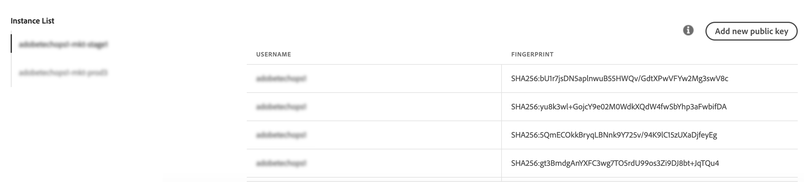

# 密钥管理 {#key-management}

Adobe 建议所有客户使用&#x200B;**公钥和私钥对**&#x200B;建立其与 SFTP 服务器的连接。

下面介绍了生成公共SSH密钥并添加它以访问SFTP服务器的步骤，以及有关身份验证的建议。

设置对服务器的访问权限后，请记住将 **需要访问服务器的IP地址列入白名单** ，以便您可以连接到该服务器。 如需详细信息，请参阅[此部分](../../instances-settings/using/ip-whitelisting-instance-access.md)。

>[!NOTE]
>
>当前无法删除SSH公钥。

## 最佳实践 {#best-practices}

**关于公共SSH密钥**

请确保始终使用相同的身份验证连接到服务器，并且密钥使用支持的格式。

**API与用户名和密码集成**

在某些SFTP服务器上启用基于口令的身份验证非常罕见。 Adobe建议您使用基于密钥的身份验证，因为此方法更加有效和安全。 您可以联系客户服务部门请求切换到基于密钥的身份验证。

>[!CAUTION]
>
>如果密码过期，即使系统中安装了密钥，您也无法登录SFTP帐户。

## 安装SSH密钥 {#installing-ssh-key}

>[!CAUTION]
>
>以下步骤仅是SSH密钥创建的示例，请遵循与SSH密钥相关的组织准则。 以下示例仅是如何做到这一点的一个示例，并作为向团队或内部网络组传达要求的有用参考点。

1. 导览至选 **[!UICONTROL Key Management]**项卡，然后单击按**[!UICONTROL Add new public key]** 钮。

   

1. 在打开的对话框中，选择要为其创建公钥的用户名以及要为其激活密钥的服务器。

   >[!NOTE]
   >
   >该界面将检查给定实例上的给定用户名是否处于活动状态，并为您提供在一个或多个实例上激活密钥的选项。
   >
   >可为每个用户添加一个或多个公共SSH密钥。

   

1. 复制粘贴公共SSH密钥。 要生成公钥，请按照以下与操作系统对应的步骤操作：

   >[!NOTE]
   >
   >公共SSH密钥大小应 **为2048位**。

   **Linux和Mac:**

   使用终端生成公钥和私钥对：
   1. 输入以下命令： `ssh-keygen -t rsa -C <your_email@example.com>`.
   1. 在出现提示时，为您的键提供名称。 如果。ssh目录不存在，系统将为您创建一个。
   1. 在出现提示时输入密码短语，然后重新输入。 也可将其留空。
   1. 系统会创建“name”和“name.pub”键对。 搜索“name.pub”文件，然后打开它。 它应具有以您指定的电子邮件地址结尾的字母数字字符串。
   **Windows:**

   您可能需要安装第三方工具，该工具将帮助您以相同格式“name.pub”生成私钥／公钥对。

1. 打开。pub文件，然后复制并粘贴以“ssh..”开头的整个字符串 进入控制面板。

   

1. 单击 **[!UICONTROL Save]**按钮以创建键。 控制面板会保存公钥及其关联的指纹，并使用SHA256格式进行加密。

您可以使用指纹将保存在计算机上的私钥与保存在控制面板中的相应公钥相匹配。

“**...**” 按钮允许您删除现有密钥，或将其关联的指纹复制到剪贴板中。

