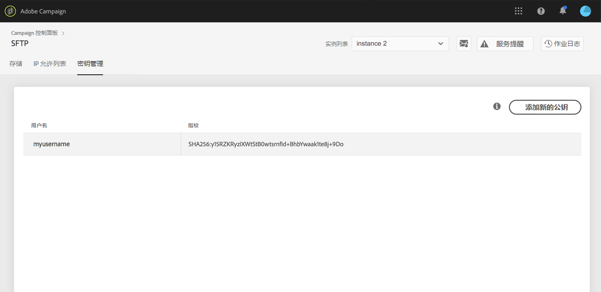
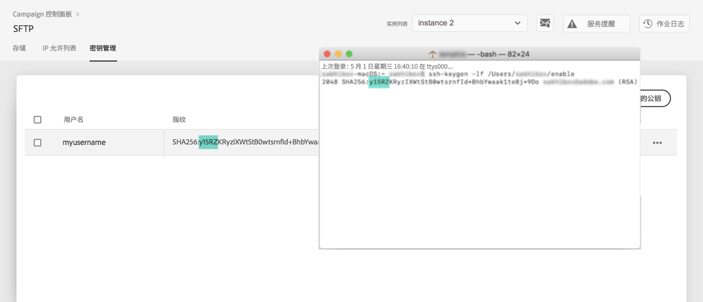

# 登录 SFTP 服务器 {#logging-into-sft-server}

以下步骤详细介绍了如何通过 SFTP 客户端应用程序连接 SFTP 服务器。

通过观看[视频](https://video.tv.adobe.com/v/34759?captions=chi_hans&quality=12)了解此功能

在登录到服务器之前，请确保：

* 您的 SFTP 服务器是&#x200B;**由 Adobe 托管**。
* 已在服务器端设置您的&#x200B;**用户名**。您可以直接在控制面板的 SFTP 信息卡的&#x200B;**密钥管理**&#x200B;选项卡中查看此信息。
* 您有一个&#x200B;**私钥和公钥对**&#x200B;用来登录 SFTP 服务器。请参阅[此小节](../../sftp/using/key-management.md)，了解有关如何添加 SSH 密钥的更多信息。
* 在 SFTP 服务器上，您的&#x200B;**公共 IP 地址已添加到允许列表**。如果没有，请参阅[此小节](../../sftp/using/ip-range-allow-listing.md)，了解有关如何将 IP 范围添加到允许列表的更多信息。
* 您有权访问 **SFTP 客户端软件**。您可以向 IT 部门询问他们建议使用的 SFTP 客户端应用程序，或者在互联网上搜索一个应用程序（如果您的公司政策允许这样做）。

要连接到 SFTP 服务器，请执行以下步骤：

1. 启动控制面板，然后从 **[!UICONTROL SFTP]** 信息卡选择&#x200B;**[!UICONTROL 密钥管理]**&#x200B;选项卡。

   

1. 启动 SFTP 客户端应用程序，从控制面板中复制粘贴服务器地址，接着输入“campaign.adobe.com”，然后填写您的用户名。

   

1. 在 **[!UICONTROL SSH 私钥]**&#x200B;字段中，选择存储在计算机上的私钥文件。它对应于与您的公钥同名的文本文件，不带“.pub”扩展名（例如“enable”）。

   

   **[!UICONTROL 密码]**&#x200B;字段中会自动填充文件中的私钥。

   

   您可以将私钥或公钥的指纹与 SFTP 信息卡的“密钥管理”选项卡中显示的密钥的指纹进行比较，从而检查您尝试使用的密钥是否已保存在控制面板中。

   

   >[!NOTE]
   >
   >如果您使用的是 Mac 计算机，则可以通过运行下列命令来查看存储在您计算机上的私钥的指纹：
   >
   >`ssh-keygen -lf <path of the privatekey>`

1. 填写完所有信息后，单击&#x200B;**[!UICONTROL 连接]**，登录到 SFTP 服务器。

   
