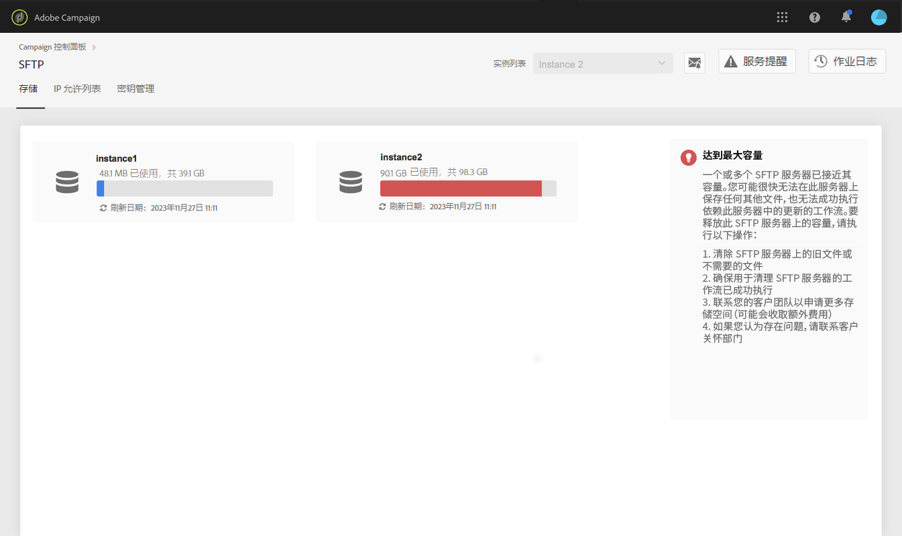

# SFTP存储管理 {#sftp-storage-management}

>[!CONTEXTUALHELP]
>id=&quot;cp_storage&quot;
>title=&quot;关于存储容量&quot;
>abstract=&quot;在此选项卡中，您可以查看SFTP服务器的存储容量和利用率信息。 此处仅显示您有权访问的SFTP服务器。 请联系您的管理员以请求访问其他SFTP服务器。”
>additional-url=&quot;https://images-tv.adobe.com/mpcv3/8a977e03-d76c-44d3-853c-95d0b799c870_1560205338.1920x1080at3000_h264.mp4&quot; text=&quot;观看演示视频&quot;

根据您的合同条款，您的SFTP服务器上可能提供了不同的存储容量。

您必须定期监视每个SFTP服务器的可用空间。 否则，您可能无法再在服务器上保存任何其他文件，也无法成功执行依赖此服务器更新的工作流。

**相关主题：**

* [Campaign Standard教程视频](https://docs.adobe.com/content/help/en/campaign-learn/campaign-standard-tutorials/administrating/control-panel/monitoring-server-capacity-whitelisting-adding-ssh-key.html)
* [Campaign Classic教程视频](https://docs.adobe.com/content/help/en/campaign-learn/campaign-classic-tutorials/administrating/control-panel-acc/managing-sftp-servers.html)

## 访问存储容量信息 {#accessing-storage-capacity-information}

标题 **[!UICONTROL Top utilized SFTP disk capacity]** 中的部分包括连接到您有权访问的实例的前三个最常用服务器。 此信息在SFTP卡的每个选项卡中都可用。

有关您有权访问的所有实例所使用的空间的信息，请参阅SFTP **[!UICONTROL Storage]** 卡的选项卡。 每次刷新页面时都会更新它。

对于每个实例，可视警报会告知您其存储超过其容量的时间：

* **橙色**:超过80%的容量，
* **红色**:这个实例超过了其容量的90%。

还提供其他提示，帮助您了解在服务器接近其容量时如何继续操作。

## 存储容量用完时的最佳实践 {#best-practices-when-capacity-runs-out}

1. **从旧文件或不必要的文件中清除SFTP服务器**。 有关如何访问SFTP服务器文件夹的详细信息，请参阅 [此部分](../../sftp/using/logging-into-sftp-server.md)。
1. 确保成功 **执行清理** SFTP服务器的工作流。 有关Adobe Campaign中技术工作流程的详细信息，请参阅专用的 [Campaign Classic](https://docs.campaign.adobe.com/doc/AC/en/WKF__General_operation_Building_a_workflow.html#Technical_workflows) 和 [Campaign Standard](https://helpx.adobe.com/campaign/standard/administration/using/technical-workflows.html) 文档。
1. 联系您的客户团队以请求 **更多存储** （可能需要支付额外费用）。
1. 如果您认为存在问题，请联系&#x200B;**客户关怀团队**。
