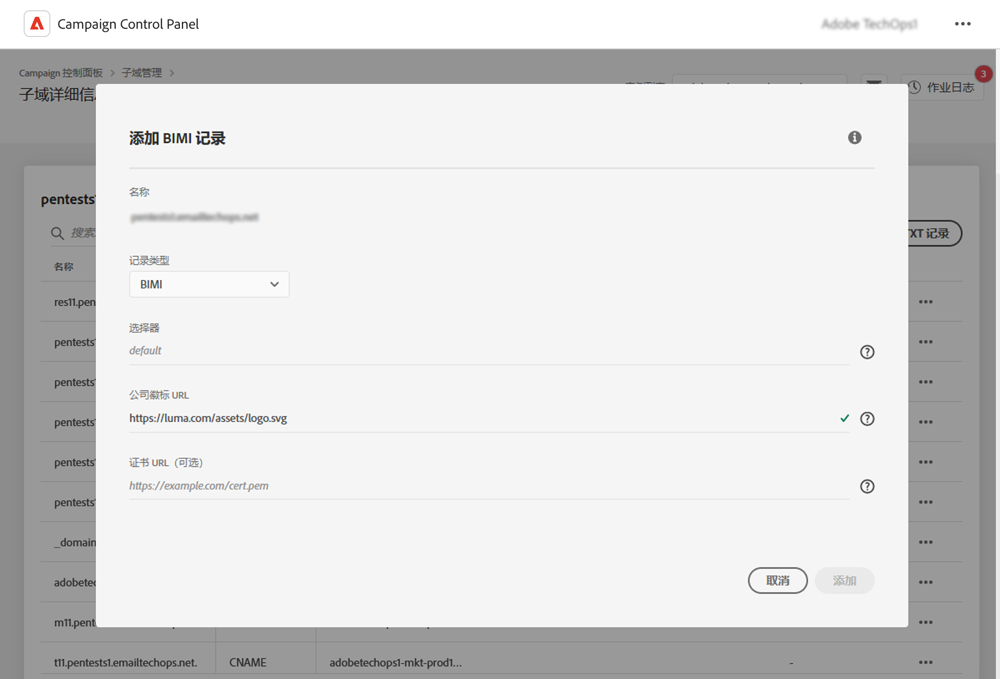

# 添加 BIMI 记录 {#dmarc}

## 关于 BIMI 记录 {#about}

消息识别品牌指示器 (BIMI) 是一种行业标准，用于在邮箱提供商收件箱中的发件人电子邮件旁边显示认证徽标，以增强品牌辨识度和信任度。

有关 BIMI 实施的详细信息，请参阅 [Adobe 可投放性最佳实践指南](https://experienceleague.adobe.com/docs/deliverability-learn/deliverability-best-practice-guide/additional-resources/technotes/implement-bimi.html)

{width="70%" align="center"}

## 限制和先决条件 {#limitations}

* SPF、DKIM 和 DMARC 记录是创建 BIMI 记录的先决条件。

* BIMI 记录需要在 DNS 中发布，对于完全委派域，可以通过控制面板进行发布。[了解有关子域配置方法的更多信息](subdomains-branding.md#subdomain-delegation-methods)

* DMARC 记录先决条件：

   * 组织域的记录策略类型必须设置为“隔离”或“拒绝”。DMARC 策略类型设置为“无”时，无法创建 BIMI 记录。
   * 应用 DMARC 策略的电子邮件百分比必须为 100%。BIMI 不支持将 DMARC 策略百分比设置为小于 100%。

[了解如何配置 DMARC 记录](dmarc.md)

## 为子域添加 BIMI 记录 {#add}

要为子域添加 BIMI 记录，请执行以下步骤：

1. 从子域列表中，单击所需子域旁边的省略号按钮，然后选择&#x200B;**[!UICONTROL 子域详细信息]**。

1. 单击&#x200B;**[!UICONTROL 添加 TXT 记录]**&#x200B;按钮，然后从&#x200B;**[!UICONTROL 记录类型]**&#x200B;下拉列表中选择 **[!UICONTROL BIMI]**。

   

1. 此&#x200B;**[!UICONTROL 选择器]**&#x200B;字段允许您为记录指定 BIMI 选择器。BIMI 选择器是可以分配给 BIMI 记录的唯一标识符。这样，您就可以为给定子域定义多个徽标。邮箱提供商目前不支持此功能。

1. 在&#x200B;**[!UICONTROL 公司徽标 URL]** 中，指定包含徽标的 SVG 文件的 URL。

1. 尽管&#x200B;**[!UICONTROL 证书 URL]** 是可选项，但对于 Gmail 和 Apple 等邮箱提供商而言，这是必需项。因此，我们建议您获取认证标志证书 (VMC)，以真正利用 BIMI。

   +++如何获取 VMC？

   获取 VMC 的主要步骤如下：

   1. 在 VMC 签发部门认可的知识产权局将您的品牌徽标注册为商标。如果您拥有法律团队，我们建议您与其合作，以将您的徽标注册为商标或验证其已注册为商标。

   1. 验证徽标已注册为商标后，请联系 DigiCert 或 Entrust 证书颁发机构 (CA) 申请 VMC。

   1. 当 VMC 获得批准时，您将收到一个实体证书保密邮件 (PEM) 文件。将您从 CA 获取的任何其他中间证书附加到此 PEM 文件。将 PEM 文件（以及附加文件）上传到公共 Web 服务器，并记下 PEM 文件 URL。您将在 BIMI TXT 记录中使用该 URL。

   1. 特定子域的子域详细信息页面中显示 BIMI 记录后，您就可以通过[此处](https://bimigroup.org/bimi-generator/)的 BIMI 检查器检查 BIMI 记录是否可以正常运行。

   有关 BIMI 实施的详细信息，请参阅 [BIMI 标准文档](https://bimigroup.org/implementation-guide/)
   +++

1. 单击&#x200B;**[!UICONTROL 添加]**，确认创建 BIMI 记录。

BIMI 记录创建过程大约需要 5 分钟，之后会显示在子域的详细信息屏幕中。[了解如何监测子域的 TXT记 录](gs-txt-records.md#monitor)
