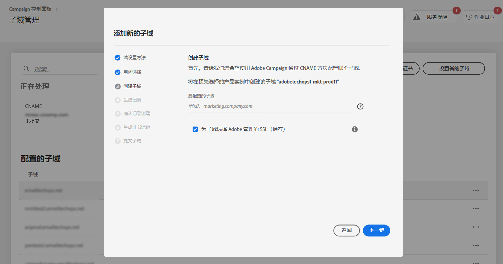
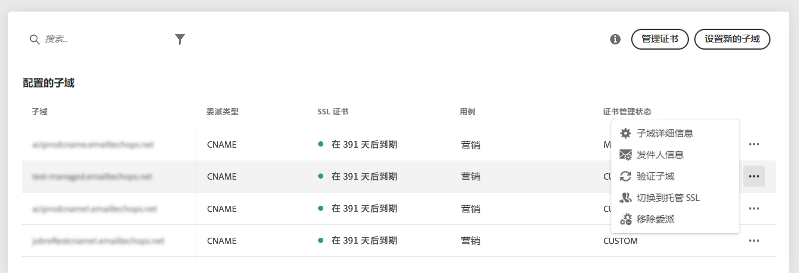
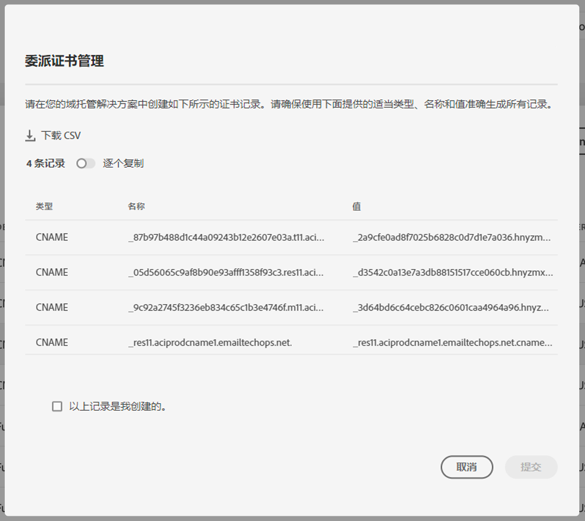

# 将子域的 SSL 证书委派给 Adobe {#delegate-ssl-certificates}

>[!CONTEXTUALHELP]
>id="cp_managed_ssl"
>title="将子域的 SSL 证书委派给 Adobe"
>abstract="通过控制面板，可让 Adobe 管理您的子域的 SSL 证书。如果您使用 CNAME 设置您的子域，则将自动生成并提供证书记录，以便在您的域托管解决方案中生成证书。"

强烈建议将子域的 SSL 证书管理委派给 Adobe，因为 Adobe 每年都会自动创建证书并在证书过期前续订证书。

如果使用 CNAME 来设置子域委派，Adobe 将提供证书记录以将其用于域托管解决方案，从而生成证书。

可以在设置新子域或已委派子域时向 Adobe 委派 SSL 证书。

>[!NOTE]
>
>Adobe 管理的 SSL 是一项免费功能，可供用户免费使用。将子域证书委派给 Adobe 是以透明的方式进行的，对您的营销活动和可投放性没有影响。[了解有关 SSL 证书管理的更多信息](monitoring-ssl-certificates.md#management)

## 委派新子域的 SSL 证书 {#new}

要在设置新子域时委派SSL证书，请启用 **[!UICONTROL 子域选择使用Adobe托管SSL]** 子域配置向导选项。 稍后将在配置向导中提供要复制到托管解决方案中的证书记录。有关详细步骤，请参见[本部分](setting-up-new-subdomain.md)。

{width="70%" align="left"}

## 为已委派的子域委派 SSL 证书 {#delegated}

要为已委派的子域委派SSL证书，请单击所需子域旁边的省略号按钮，然后单击 **[!UICONTROL 切换到托管SSL]**.

{width="70%" align="left"}

此时将显示一个对话框，其中包含 Adobe 自动生成的证书记录。逐个复制这些记录，或者下载 CSV 文件，然后导航到域托管解决方案以生成匹配的证书。

请确保所有证书记录均已生成至您的域托管解决方案中。如果一切配置正确，请确认记录创建，然后单击 **[!UICONTROL 提交]**.

{width="70%" align="left"}
