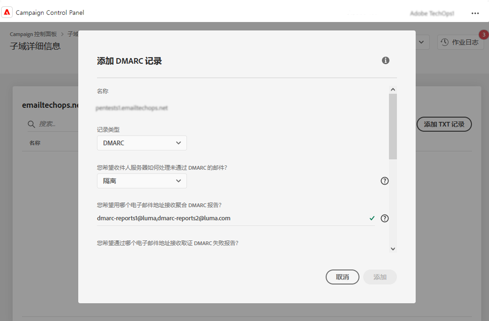
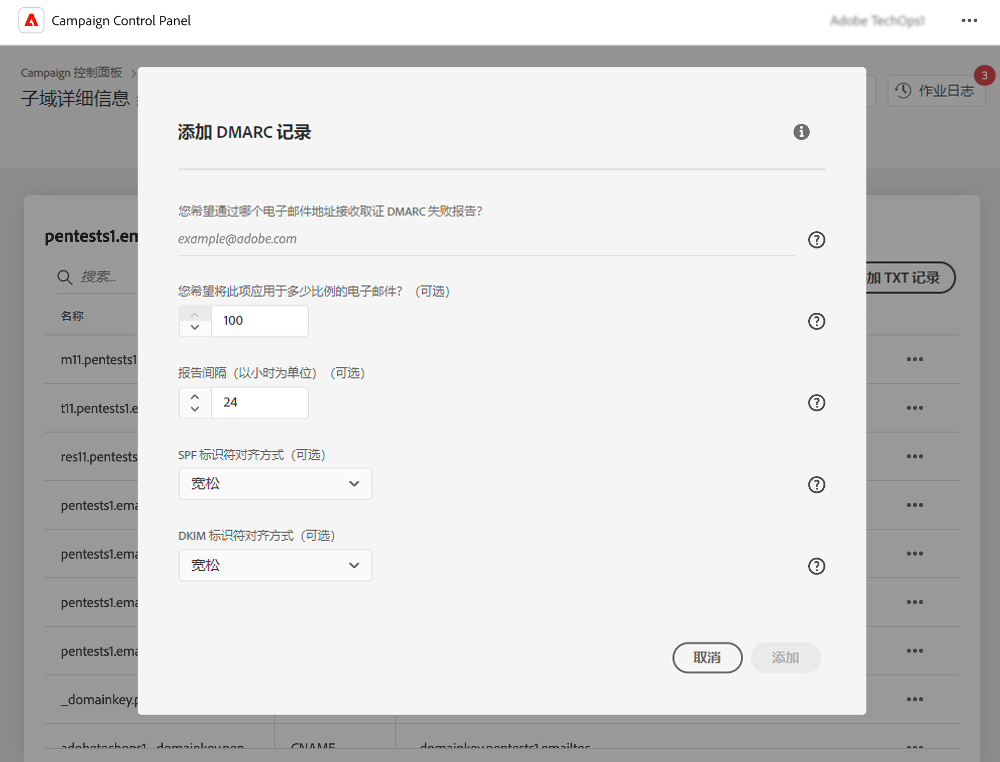

# 添加 DMARC 记录 {#dmarc}

## 关于 DMARC 记录 {#about}

基于域的邮件身份验证、报告和符合性 (DMARC) 是一种电子邮件身份验证协议标准，可帮助组织保护其电子邮件域免受网络钓鱼和欺骗攻击。 它允许您确定邮箱提供商应如何处理未通过 SPF 和 DKIM 检查的电子邮件，从而提供一种验证发件人域并防止未经授权而恶意使用域的方法。

有关 DMARC 实施的详细信息，请参阅 [Adobe 可投放性最佳实践指南](https://experienceleague.adobe.com/docs/deliverability-learn/deliverability-best-practice-guide/additional-resources/technotes/implement-dmarc.html?lang=zh-Hans)

## 限制和先决条件 {#limitations}

* SPF 和 DKIM 记录是创建 DMARC 记录的先决条件。
* 只能使用完全子域委派为子域添加 DMARC 记录。 [了解有关子域配置方法的更多信息](subdomains-branding.md#subdomain-delegation-methods)

## 为子域添加 DMARC 记录 {#add}

要为子域添加 DMARC 记录，请执行以下步骤：

1. 从子域列表中，单击所需子域旁边的省略号按钮，然后选择&#x200B;**[!UICONTROL Subdomain details]**。

1. 单击&#x200B;**[!UICONTROL Add TXT record]**&#x200B;按钮，然后从&#x200B;**[!UICONTROL Record Type]**&#x200B;下拉列表选择 **[!UICONTROL DMARC]**。

   

1. 当您的一封电子邮件失败时，选择收件人服务器应遵循的&#x200B;**[!UICONTROL Policy Type]**。可用的策略类型包括：

   * **[!UICONTROL None]**，
   * **[!UICONTROL Quarantine]**（放置到垃圾邮件文件夹），
   * **[!UICONTROL Reject]**（阻止电子邮件）。

   作为最佳实践，建议您逐步推出 DMARC 实施，方法是将 DMARC 策略从 p=none 提升到 p=quarantine，再提升到 p=reject，以便让您了解 DMARC 的潜在影响。

   * **第 1 步：**&#x200B;分析您收到的反馈并使用 (p=none)，这告知接收者不对身份验证失败的邮件执行任何操作，但仍会向发件人发送电子邮件报告。 此外，如果合法邮件未通过身份验证，则查看和修复 SPF/DKIM 的问题。

   * **第 2 步：**&#x200B;确定 SPF 和 DKIM 是否一致并通过所有合法电子邮件的身份验证，然后将策略移至 (p=quarantine)，这会告知电子邮件接收服务器隔离身份验证失败的电子邮件（这通常意味着将这些邮件放入垃圾邮件文件夹）。 如果策略设置为隔离，则建议您从一小部分电子邮件开始。

   * **第 3 步：**&#x200B;将策略调整为 (p=reject)。 注意：请谨慎使用此策略，并确定它是否适合您的组织。 p= reject 策略告知接收者完全拒绝（退回）验证失败的域的所有电子邮件。 启用此策略后，只有经域验证为 100% 经过身份验证的电子邮件才有机会进入收件箱。

   >[!NOTE]
   >
   > DMARC 记录策略类型设置为“无”时，无法创建 BIMI 记录。

1. 填写应接收 DMARC 报告的电子邮件地址。 当您的其中一封电子邮件失败时，系统会自动将 DMARC 报告发送到您选择的电子邮件地址：

   * 汇总 DMARC 报告可提供高级信息，例如给定时间段内失败的电子邮件数量。
   * 取证 DMARC 故障报告提供了详细信息，例如故障电子邮件来自哪个 IP 地址。

1. 如果 DMARC 策略设置为“无”，请输入适用于 100% 电子邮件的百分比。

   如果策略设置为“拒绝”或“隔离”，建议您从一小部分电子邮件开始。 当来自您的域的更多电子邮件通过接收服务器的身份验证时，请使用较高的百分比缓慢更新您的记录。

   >[!NOTE]
   >
   >如果您的域使用 BIMI，则 DMARC 策略的百分比值必须为 100%。 BIMI 不支持将此值设置为小于 100% 的 DMARC 策略。

   

1. DMARC 报告每 24 小时发送一次。 您可以在&#x200B;**[!UICONTROL Reporting Interval]**&#x200B;字段中更改报告发送频率。 最小授权间隔时间为 1 小时，最大授权值为 2190 小时（即 3 个月）。

1. 在 **SPF** 和 **[!UICONTROL DKIM Identifier Alignment]**&#x200B;字段，指定检查电子邮件的 SPF 和 DKIM 身份验证时收件人服务器的严格程度。

   * **[!UICONTROL Relaxed]**&#x200B;模式：即使电子邮件是从子域发送的，服务器也接受身份验证，
   * **[!UICONTROL Strict]**&#x200B;模式：仅当发送人域与 SPF 和 DKIM 域完全匹配时，该模式才接受身份验证。

   假设我们正在处理 `http://www.luma.com` 域。 在“宽松”模式下，来自 `marketing.luma.com` 子域的电子邮件将由服务器进行授权，但在“严格”模式下它们会被拒绝。

1. 单击&#x200B;**[!UICONTROL Add]**&#x200B;以确认创建 DMARC 记录。

创建 DMARC 记录后（大约 5 分钟），该记录会显示在子域的详细信息屏幕中。 [了解如何监测子域的 TXT记 录](gs-txt-records.md#monitor)
