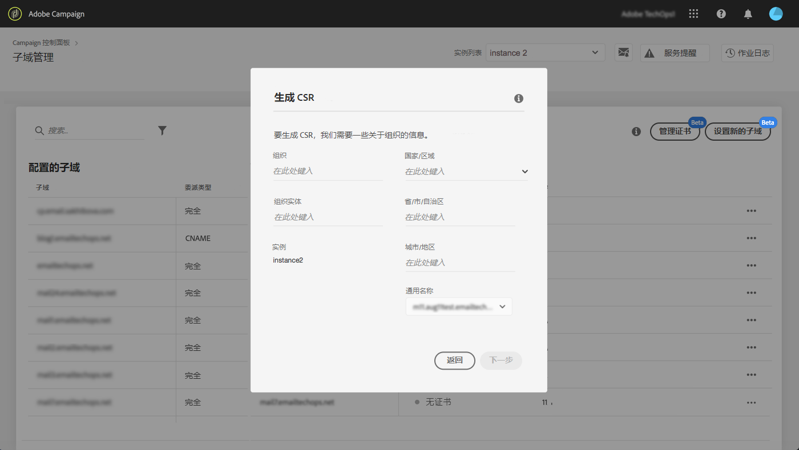
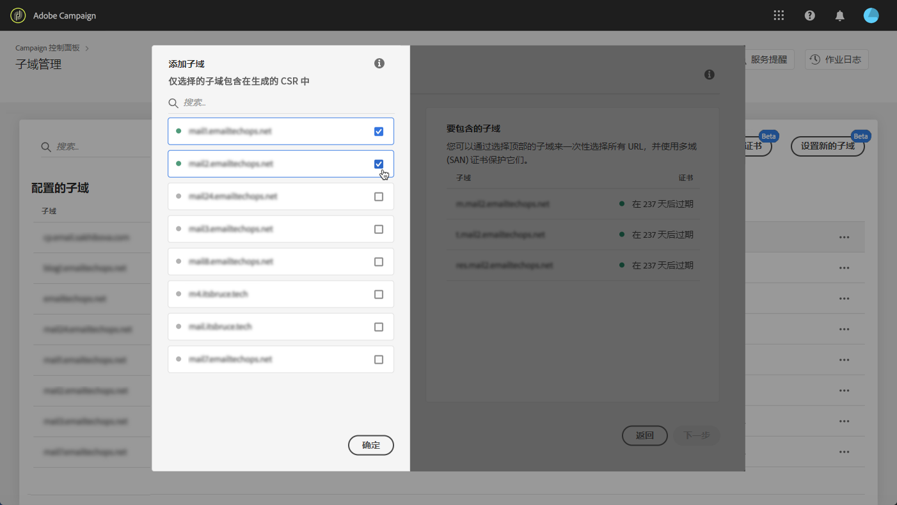
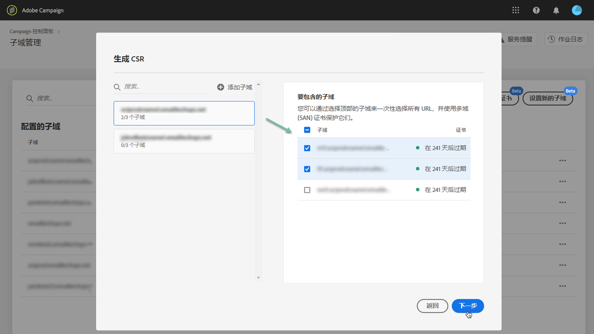
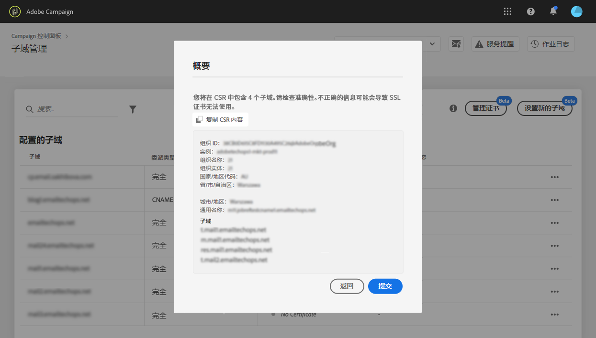
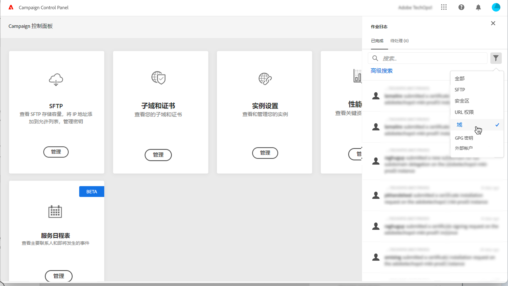
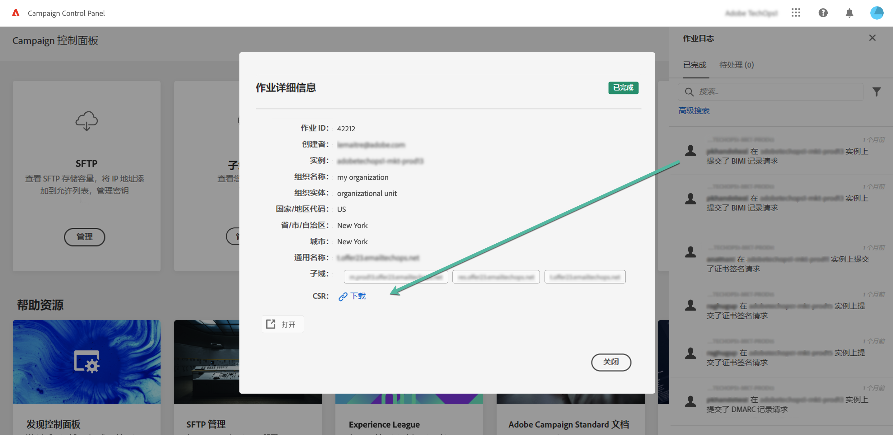

# 生成CSR {#generating-csr}

>[!CONTEXTUALHELP]
>id="cp_generate_csr"
>title="CSR生成"
>abstract="在购买证书之前，必须为您计划保护的实例和子域生成证书签名请求。"

>[!CONTEXTUALHELP]
>id="cp_select_subdomains"
>title="选择 CSR的子域"
>abstract="您可以选择在证书签名请求中包含所有子域或仅包含特定子域。只有选定的子域将通过购买的 SSL 证书进行认证。"
>additional-url="https://experienceleague.adobe.com/docs/control-panel/using/subdomains-and-certificates/subdomains-branding.html?lang=zh-Hans" text="关于子域品牌化"

## 生成CSR {#generate}

要生成证书签名请求 (CSR)，请执行以下步骤：

1. 在 **[!UICONTROL Subdomains & Certificates]**&#x200B;卡中，选择所需的实例，然后单击 **[!UICONTROL Manage Certificate]** 按钮。

   

1. 选择 **[!UICONTROL 1 - Generate a CSR]**，然后单击 **[!UICONTROL Next]** 以启动向导，引导您完成 CSR 生成过程。

   

1. 此时将显示一个表单，其中包含生成 CSR 所需的所有详细信息。

   请确保完整准确地填写所请求的信息，否则可能无法续订证书（如有必要，请与您的内部团队、安全部门和 IT 团队联系），然后单击 **[!UICONTROL Next]**。

   * **[!UICONTROL Organization]**：官方组织名称。
   * **[!UICONTROL Organization Unit]**：链接到子域的单位（示例：营销、IT）。
   * **[!UICONTROL Instance]**（预填充）：与子域关联的 Campaign 实例的 URL。
   * **[!UICONTROL Common name]**:默认情况下会选择通用名称，您可以根据需要选择一个子域。

   

1. 选择要包含在 CSR 中的子域，然后单击 **[!UICONTROL OK]**。

   

1. 所选子域将显示在列表中。对于每个子域，选择要包含的子域，然后单击 **[!UICONTROL Next]**。

   

1. 此时将显示要包含在 CSR 中的子域的摘要。单击 **[!UICONTROL Submit]**&#x200B;以确认您的请求。

   

   >[!NOTE]
   >
   >的 **[!UICONTROL Copy CSR content]** 按钮可复制与CSR相关的所有信息（组织ID、实例、组织名称、公用名称、包含的子域等）

1. 将自动生成并下载与您的选择相对应的 .csr 文件。您现在可以使用它从公司批准的认证中心购买 SSL 证书。如果您需要再次下载CSR，请按照 [此部分](#download).

生成并下载CSR后，您可以使用它从贵组织批准的证书颁发机构购买SSL证书。

购买SSL证书后，您将能够在实例上安装该证书以保护子域。 [了解详情](install-ssl-certificate.md)

## 下载CSR {#download}

要购买SSL证书，您首先需要下载证书签名请求。 CSR在生成后会自动下载。 您还可以随时从作业日志中再次下载它：

1. 在 **[!UICONTROL Job Logs]**，选择 **[!UICONTROL Finished]** 选项卡，然后过滤列表以显示与子域管理相关的作业。

   

1. 打开与生成CSR相对应的作业，然后单击 **[!UICONTROL Downbload]** 链接以获取.csr文件。

   
