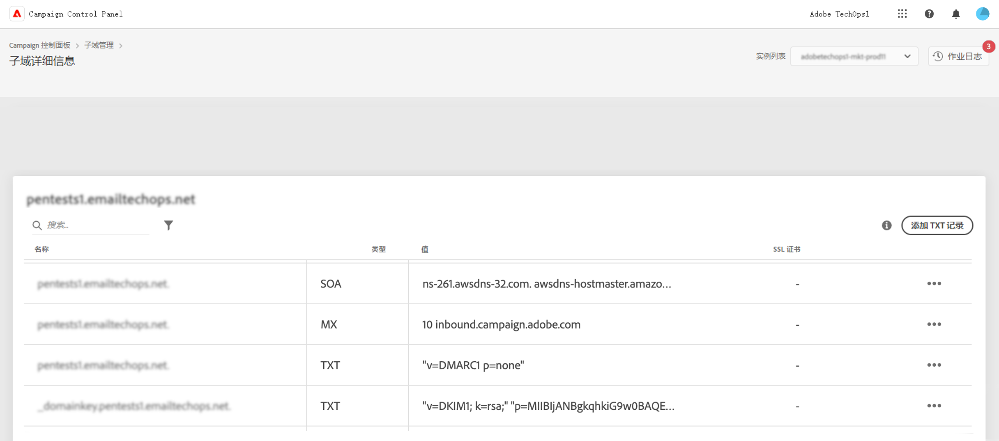

# 开始使用 TXT 记录 {#managing-txt-records}

>[!CONTEXTUALHELP]
>id="cp_siteverification_add"
>title="管理 TXT 记录"
>abstract="TXT 记录是一种 DNS 记录类型，用于提供有关域的文本信息，外部源可以读取该信息。控制面板允许您向子域添加三种类型的记录：Google Site Verification、DMARC 和 BIMI 记录。"

## 关于 TXT 记录 {#about}

TXT 记录是一种 DNS 记录类型，用于提供有关域的文本信息，外部源可以读取该信息。控制面板允许您向子域添加三种类型的记录：

* **Google TXT 记录**&#x200B;允许您证明自己拥有域，从而确保电子邮件的高收件率和低垃圾邮件率。 [了解如何添加 Google TXT 记录](managing-txt-records.md)
* **DMARC 记录**&#x200B;提供一种验证发件人域并防止未经授权将域用于恶意目的的方式。[了解如何添加 DMARC 记录](dmarc.md)
* **BIMI 记录**&#x200B;允许您在邮箱提供商收件箱中的电子邮件旁边显示认证徽标，以增强品牌辨识度和信任度。[了解如何添加 BIMI 记录](bimi.md)

## 监控子域的记录 {#monitor}

您可以通过访问子域的详细信息，监控已为每个子域添加的所有 TXT 记录。

在此屏幕中，将显示选定子域的所有 TXT 类型记录，并在其配置的“值”列中显示信息。 要删除 Google TXT、DMARC 或 BIMI记录，请单击省略号按钮，然后选择“删除”。 您还可以根据需要编辑 DMARC 和 BIMI 记录。

