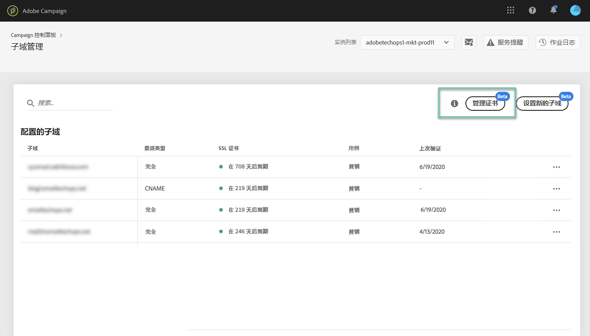
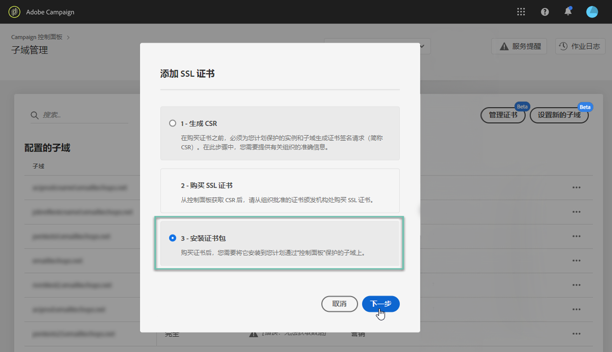
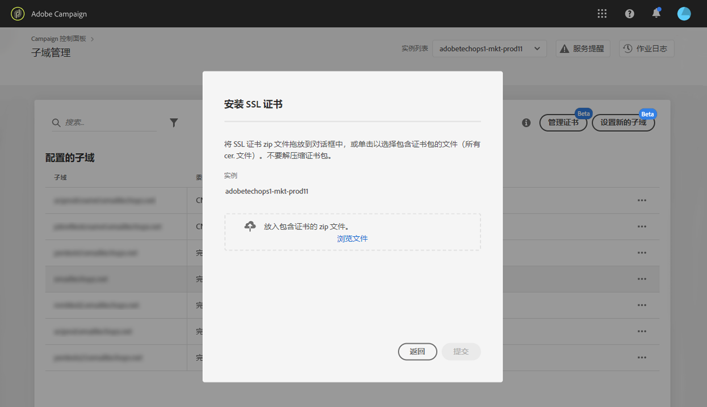

# 安装 SSL 证书 {#installing-ssl-certificate}

>[!CONTEXTUALHELP]
>id="cp_install_ssl_certificate"
>title="SSL证书安装"
>abstract="安装从您的组织批准的认证中心购买的 SSL 证书。"
>additional-url="https://experienceleague.adobe.com/docs/control-panel/using/subdomains-and-certificates/subdomains-branding.html?lang=zh-Hans" text="关于子域品牌化"

购买 SSL 证书后，您可以在实例上安装该证书。继续之前，请确保您了解以下先决条件：

* 证书签名请求 (CSR) 必须是从控制面板中生成的。否则，您将无法从控制面板安装证书。
* 证书签名请求(CSR)应与已配置为与Adobe一起使用的子域相匹配。 例如，它不能包含比已配置的子域多的子域。
* 证书应具有当前日期。无法安装将来日期的证书，也不能是过期日期（即必须是有效的开始和结束日期）。
* 证书应由受信任的认证中心 (CA) 颁发，如 Comodo、DigiCert、GoDaddy 等。
* 证书的大小应为 2048 位，算法应为 RSA。
* 证书应采用 X.509 PEM 格式。
* 支持 SAN 证书。
* 不支持通配符证书。
* ZIP 文件或证书不应受密码保护。
* ZIP 文件应仅包含以下内容（最好是单个文件）：
   * 最终实体证书。
   * 中间证书链（按适当顺序排列）。
   * 根证书（可选）。

要安装证书，请执行以下步骤：

1. 在 **[!UICONTROL Subdomains & Certificates]**&#x200B;卡中，选择所需的实例，然后单击 **[!UICONTROL Manage Certificate]** 按钮。

   

1. 选择 **[!UICONTROL 3 - Install Certificate Bundle]**，然后单击 **[!UICONTROL Next]** 以启动向导，引导您完成证书安装过程。

   

1. 选择包含要安装的证书的 .zip 文件，然后单击 **[!UICONTROL Submit]**。

   

>[!NOTE]
>
>证书将安装在 CSR 中包含的所有域/子域上。证书中存在的任何其他域/子域将不在考虑范围之内。

安装 SSL 证书后，证书的过期日期和状态图标会相应更新。
