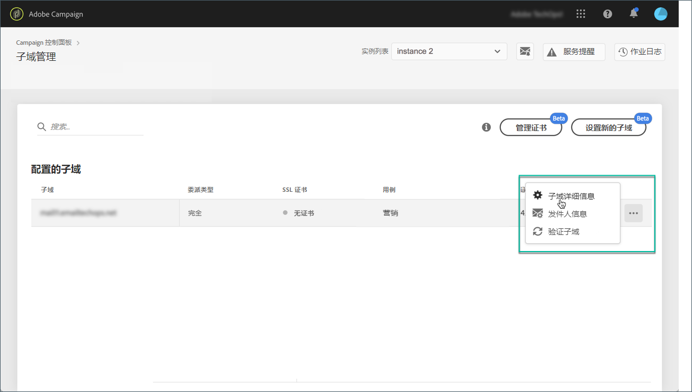
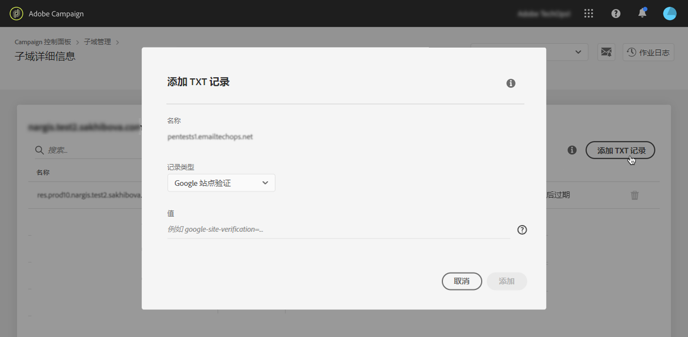
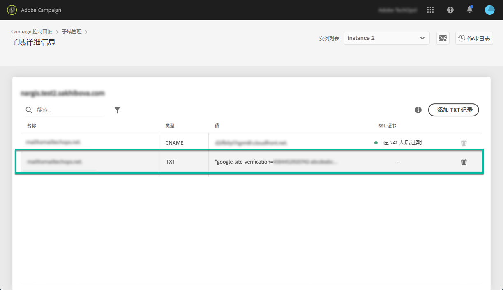

# 管理TXT记录 {#managing-txt-records}

>[!CONTEXTUALHELP]
>id=&quot;cp_siteverification_add&quot;
>title=&quot;管理TXT记录&quot;
>abstract=&quot;Google等某些服务要求您向域设置中添加TXT记录以验证您拥有该域。&quot;

## 关于TXT记录 {#about-txt-records}

TXT记录是一种DNS记录类型，用于提供域的文本信息，外部源可以读取该域。

为了确保高收件箱率和低垃圾邮件率，Google等某些服务要求您在域设置中添加TXT记录以验证您拥有域。

目前，Gmail是最受欢迎的电子邮件地址提供商之一。 为了确保电子邮件的良好交付性和成功投放到Gmail地址，Adobe Campaign允许您向子域添加特殊的Google站点验证TXT记录，以确保其经过验证。

## 为子域添加Google TXT记录 {#adding-a-google-txt-record}

要将Google TXT记录添加到用于通过电子邮件发送Gmail地址的子域，请执行以下步骤：

1. 导航到卡 **[!UICONTROL Subdomain and Certificates]** 片。

1. 选择您的实例，然后打开要向其添加DNS记录的子域的详细信息。

   

1. 单击该 **[!UICONTROL Add TXT record]** 按钮，然后输入在G套件管理工具中生成的值。 有关详细信息，请参阅 [G Suite管理帮助](https://support.google.com/a/answer/183895)。

   

1. 单击按 **[!UICONTROL Add]** 钮进行确认。

   

添加TXT记录后，您需要由Google验证它。 为此，请导航到G Suite管理工具，然后启动验证步骤(请参阅 [G Suite管理帮助](https://support.google.com/a/answer/183895))。

要删除记录，请从记录列表中选择该记录，然后单击删除按钮。

>[!NOTE]
>
>可以从DNS记录列表中删除的唯一记录是您之前添加的记录（在我们的例子中是Google TXT记录）。
