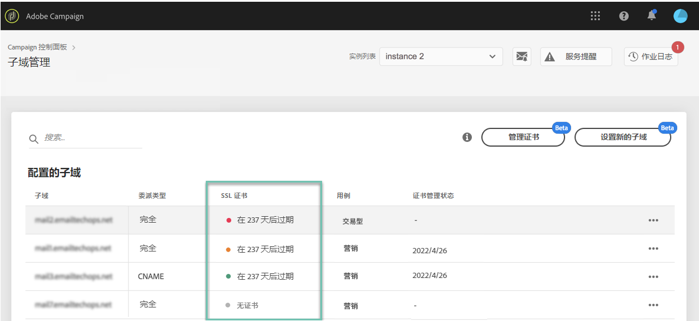

# 监视子域的SSL证书 {#monitoring-ssl-certificates}

## 关于SSL证书 {#about-ssl-certificates}

Adobe Campaign建议您保护托管登录页面的子域，尤其是那些收集客户敏感信息的子域。

**SSL（安全套接字层）加密** ，可确保您委托给Adobe的子域是安全的。 当您的客户填写Web表单或访问由Adobe Campaign托管的登录页面时，默认情况下，信息会通过非安全协议(HTTP)发送。 要确保更多安全性，请使用HTTPS协议保护发送的信息。 例如，您的“http://info.mywebsite.com/”子域地址现在将为“https://info.mywebsite.com/”。

**委派的子域本身不安装SSL证书**。 它们安装在关联的子域上，主要是托管登录页面、资源页面和其他子域。

**SSL证书的提供期限为特定时间段** （1年、60天等）。 证书过期后，您可能会在访问登录页面或使用子域中的资源时遇到问题。 为避免这种情况，控制面板允许您监视子域的SSL证书，并启动其续订过程。

## 监视SSL证书 {#monitoring-certificates}

在选择卡时，子域的SSL证书状态可直接从子域列表中获 **[!UICONTROL Subdomains & Certificates]**得。

子域按SSL证书的最近过期日期进行排列，其中包含过期的可视信息（以天为单位）:

* **绿色**:子域未在未来60天内过期的证书。
* **橙色**:一个或多个子域有一个证书，该证书将在接下来的60天内过期。
* **红色**:一个或多个子域有一个证书，该证书将在30天内过期。
* **灰色**:尚未为子域安装证书。

要获取有关子域的更多详细信息，请单击 **[!UICONTROL Subdomain Details]**按钮。
此时将显示所有相关子域的列表。 它通常包括登陆页面、资源页面等的子域。

该选 **[!UICONTROL Sender info]**项卡提供有关所配置收件箱的信息（发送者、回复、错误电子邮件）。

如果您的子域的某个SSL证书即将过期，您可以直接从控制面板续订它。 有关此内容的详细信息，请参阅此部分：续 [订子域的SSL证书](../../subdomains-certificates/using/renewing-subdomain-certificate.md)。

>[!NOTE]
>
>Beta版中将很快提供控制面板中的证书续订。 同时，请参阅本页 [以了解有关如何在控制面板中监视证书的更多信息](https://helpx.adobe.com/campaign/kb/control-panel-subdomains-certificates.html) 。
