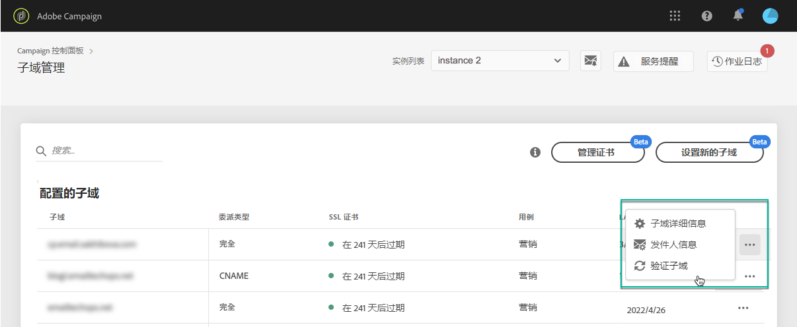

# 监控子域 {#monitoring-subdomains}

必须监控子域，以确保所有子域都正确配置以与Adobe Campaign一起使用。

在选择&#x200B;**[!UICONTROL Subdomains & Certificates]**&#x200B;卡时，可以直接访问每个生产实例的子域列表。

**[!UICONTROL Last verification]**&#x200B;列指示上次验证子域的时间。 您可以随时单击&#x200B;**...** / **[!UICONTROL Verify subdomain]**&#x200B;按钮。

>[!IMPORTANT]
>
>Adobe不建议使用没有证书日期的子域，因为这可能意味着这些子域可能存在一些可交付性问题。

启动验证时，将执行多个操作以检查子域是否正确配置（实例租户检查、电子邮件发送测试等）

如果子域的验证失败，请与Adobe客户服务部门联系以进一步调查。

**相关主题：**

* [续订子域的 SSL 证书](../../subdomains-certificates/using/renewing-subdomain-certificate.md)
* [子域品牌化](../../subdomains-certificates/using/subdomains-branding.md)
