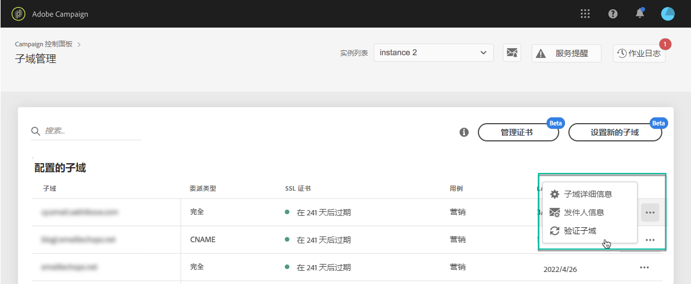

# 监控子域 {#monitoring-subdomains}

重要的是，要监控子域以确保所有子域均已正确配置，以便与 Adobe Campaign 配合使用。

选择&#x200B;**[!UICONTROL 子域和证书]**&#x200B;信息卡时，可以直接访问每个生产实例的子域列表。

**[!UICONTROL 上次验证]**&#x200B;列会指明上次验证子域的时间。 您可以通过单击 **...**/**[!UICONTROL 验证子域]**&#x200B;按钮随时进行验证。

>[!IMPORTANT]
>
>Adobe 不建议使用没有证书日期的子域，因为这可能意味着此类子域可能存在某些可投放性问题。

启动验证时，会执行若干操作来检查子域是否正确配置（例如租户检查、电子邮件发送测试等） 如果子域验证失败，请联系Adobe客户关怀部门以进一步调查。

**相关主题：**

* [续订子域的 SSL 证书](../../subdomains-certificates/using/renewing-subdomain-certificate.md)
* [子域品牌化](../../subdomains-certificates/using/subdomains-branding.md)
