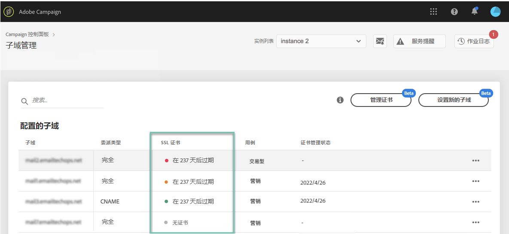

# 监视子域 {#monitoring-subdomains}

必须监控子域，以确保所有子域均正确配置以与Adobe Campaign配合使用。

选择卡时，可以直接访问每个生产实例的子域列 **[!UICONTROL Subdomains & Certificates]**表。

要获取有关子域的更多详细信息，请单击 **[!UICONTROL Subdomain Details]**按钮。
此时将显示所有相关子域的列表。 它通常包括登陆页面、资源页面等的子域。

该选 **[!UICONTROL Sender info]**项卡提供有关所配置收件箱的信息（发送者、回复、错误电子邮件）。

在子域列表中，列 **[!UICONTROL Last verification]**指示上次验证子域的时间。** 您可以随时通过单击…… **./按**[!UICONTROL Verify subdomain]** 钮。

>[!CAUTION]
>
>Adobe不建议使用没有验证日期的子域，因为这可能意味着这些子域可能存在一些可交付性问题。

启动验证时，将执行多个操作以检查子域是否正确配置：

1. 控制面板检查子域是否属于实例租户。
1. 使用该子域的实例从该实例向一组“250ok”（第三方电子邮件分析和交付性平台）的测试收件人发送电子邮件。
1. 收到电子邮件后，250ok将读取电子邮件标题并检查SPF和DKIM是否已设置且有效。
1. 控制面板连续轮询250ok的传送状态约20分钟。 如果SPF和DKIM通过，则表示所请求的子域已经过验证，并且已完全配置并可用于发送电子邮件。
