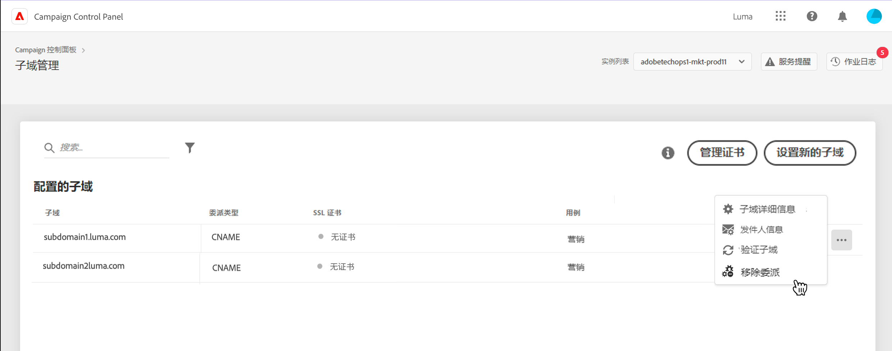
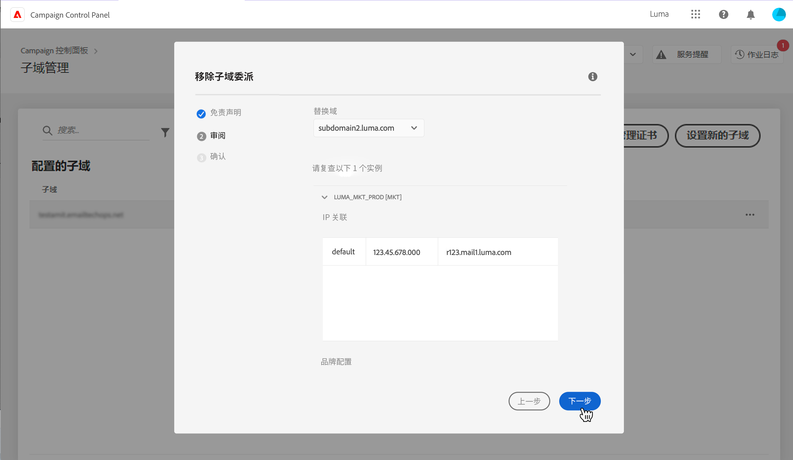
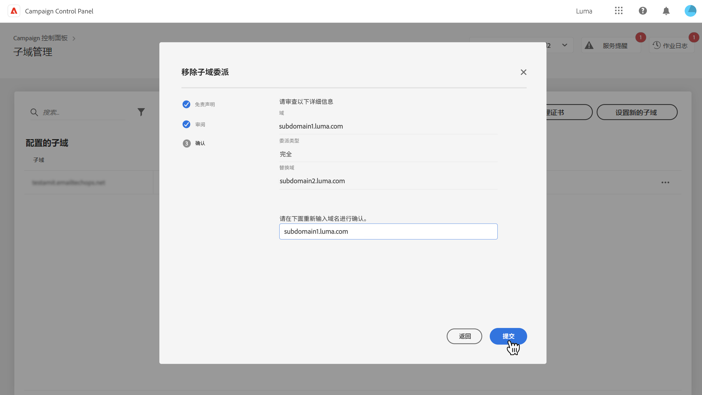
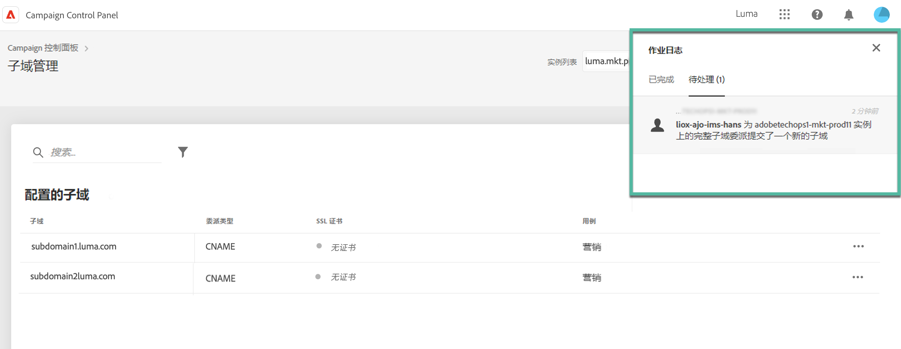
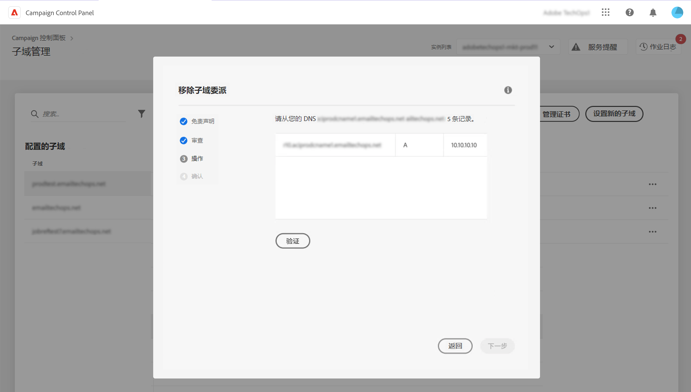

# 移除对 Adobe 的子域委派 {#remove-delegated--subdomains}

>[!CONTEXTUALHELP]
>id="cp_subdomain_undelegate"
>title="移除子域委派"
>abstract="借助此屏幕，您可以移除对 Adobe 的子域委派。请记住，此过程在执行完成之前无法撤消，并且不可逆。  如果您尝试移除所选实例的主域委派，将会提示您选择替换它的域。"

控制面板允许您删除已使用CNAME完全委派给Adobe或委派的子域的委派。

## 重要说明 {#important}

在继续之前，请仔细考虑移除过程触发后所产生的影响：

* 一旦触发该过程，在执行完成之前，子域委派移除操作将无法撤消并且不可逆。
* 当另一个子域正在进行类似的过程时，无法移除其他子域委派。
* 在子域上移除的委派只有在移除 3 天后才能重新委派。

## 移除子域委派 {#steps}

要移除对 Adobe 的子域委派，请执行以下步骤：

1. 单击要移除的域委派旁边的省略号按钮，然后选择 **[!UICONTROL Remove delegated subdomain]**。

   

1. 查看免责声明，确认移除对 Adobe 的域委派。

1. 查看有关与子域关联的实例的信息，包括相关的 IP 亲和度和品牌配置。

   如果您正在移除所选实例的主域委派，则需要使用 **[!UICONTROL Replacement Domain]** 列表选择替换它的域。

   单击 **[!UICONTROL Next]** 以继续移除。

   

1. 如果删除CNAME类型委派，或者将主域替换为使用CNAME委派的域，则附加 **[!UICONTROL Action]** 显示用于管理DNS记录的步骤。 [在本节中了解详情](#dns)

1. 查看显示的摘要。要确认删除，请键入要移除委派的域 URL，然后单击 **[!UICONTROL Submit]**。

   

开始移除委派后，待处理作业会一直显示在作业日志中，直到完成为止。

## DNS记录管理 {#dns}

要使用CNAME配置域委派，控制面板要求您在DNS服务器上添加特定记录。 [了解如何使用CNAME设置子域](setting-up-new-subdomain.md#use-cnames)

删除CNAME类型委派时，您需要 **删除这些DNS记录** 以避免出现任何问题。 此外，如果您要删除主子域的委派，并将其替换为已使用CNAME委派的域，则可能需要 **添加DNS记录** ，具体取决于为子域设置的IP相关性。

下表列出了要执行的操作，具体取决于您删除的委派类型以及用于设置替换域的委派类型。

| 已删除委派 | 替换域 | 所需操作 |
|  ---  |  ---  |  ---  |
| 完全 | 无替换域 | 无需执行任何操作 |
| 完全 | CNAME | 添加DNS记录（根据IP相关性可选） |
| 完全 | 完全 | 无需执行任何操作 |
| CNAME | 无替换域 | 删除DNS记录 |
| CNAME | CNAME | 删除和添加DNS记录（根据IP相关性可选） |
| CNAME | 完全 | 删除DNS记录 |

要执行此操作，请附加 **[!DNL Action]** 步骤。 此屏幕会根据上下文列出要删除或添加的DNS记录。

### 删除DNS记录

1. 导航到DNS服务器，并删除控制面板中列出的记录。
1. 返回控制面板并单击 **[!UICONTROL Next]** 以继续删除委派。

### 添加DNS记录

1. 导航到DNS服务器，并添加控制面板中列出的记录。
1. 等待DNS添加生效。
1. 返回控制面板并单击 **[!UICONTROL Verify]**.
1. 成功验证记录添加后，单击 **[!UICONTROL Next]** 以继续删除委派。

## 错误代码 {#FAQ}

此部分列出了在尝试移除子域委派时可能遇到的错误消息：

| 错误代码 | 消息 | 说明 |
|  ---  |  ---  |  ---  |
| 8002 | 无法处理请求的委派域移除操作，因为正在进行类似的重叠请求，请在 3 天后重试 | 所选实例的子域委派移除作业已在处理中。等待 3 天以开始新的删除作业。 |
| 8003 | 此实例不支持请求的委派域移除操作。 | 由于技术问题，所选子域不支持移除委派，请联系客户关怀团队。 |
| 8004 | 不允许请求的委派域移除操作，因为此实例中只有一个域。 | 只为所选实例委派了一个子域。不允许移除委派。 |
| 8005 | 此配置不支持请求的委派域移除操作。 | 由于技术问题，所选子域不支持移除委派，请联系客户关怀团队。 |
| 8006 | 由于未知原因，不允许请求的委派域移除操作。请联系客户关怀团队。 | 由于未知问题，所选实例不支持移除委派，请联系客户关怀团队。 |
