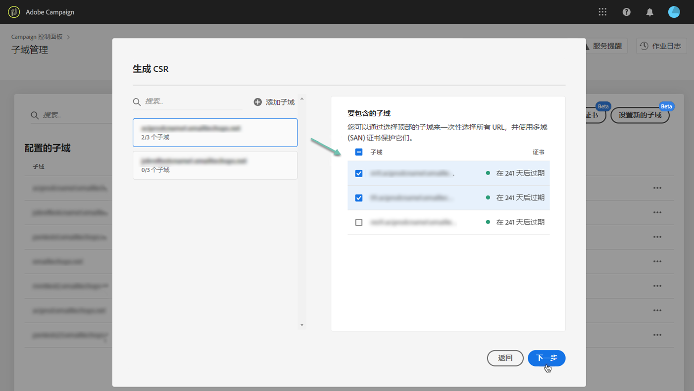
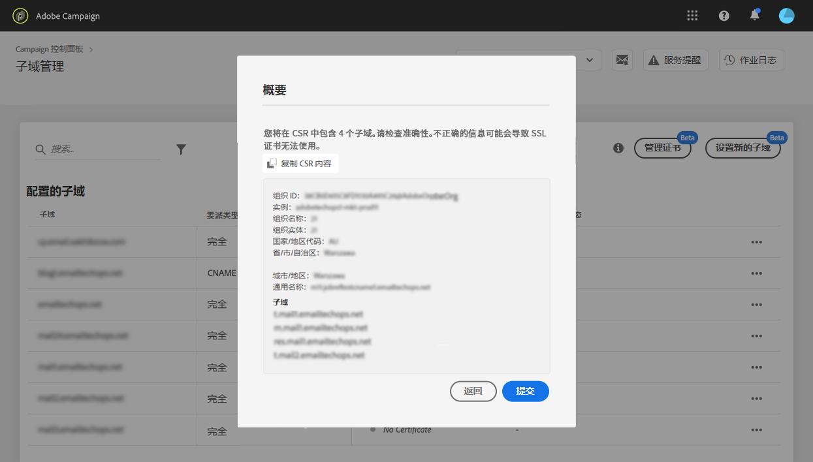

# 续订子域的 SSL 证书 {#renewing-subdomains-ssl-certificates}

>[!CONTEXTUALHELP]
>id="cp_add_ssl_certificate"
>title="添加 SSL 证书"
>abstract="要添加 SSL 证书，您需要生成 CSR，为子域购买 SSL 证书并安装证书捆绑包。"
>additional-url="https://docs.adobe.com/content/help/zh-Hans/control-panel/using/subdomains-and-certificates/renewing-subdomain-certificate.html#generating-csr" text="生成证书签名请求 (CSR)"
>additional-url="https://docs.adobe.com/content/help/zh-Hans/control-panel/using/subdomains-and-certificates/renewing-subdomain-certificate.html#installing-ssl-certificate" text="如何安装 SSL 证书"

>[!IMPORTANT]
>
>控制面板的子域配置在测试版中可用，并且如有频繁更新和修改，恕不另行通知。

## 关于证书续订 {#about-certificate-renewal-process}

SSL 证书续订过程包括以下 3 个步骤：

1. **生成证书签名请求 (CSR)**
Adobe 客户关怀团队会为您生成 CSR。您需要提供生成 CSR 所需的一些信息（如公用名称、组织名称和地址等）。
1. **购买 SSL 证书**
生成 CSR 后，您可以下载并使用它从公司批准的认证中心购买 SSL 证书。
1. **安装 SSL 证书**
购买 SSL 证书后，可将其安装到所需子域。

## 生成证书签名请求 (CSR) {#generating-csr}

>[!CONTEXTUALHELP]
>id="cp_generate_csr"
>title="生成 CSR"
>abstract="在购买证书之前，必须为您计划保护的实例和子域生成证书签名请求。"

>[!CONTEXTUALHELP]
>id="cp_select_subdomains"
>title="选择 CSR的子域"
>abstract="您可以选择在证书签名请求中包含所有子域或仅包含特定子域。只有选定的子域将通过购买的 SSL 证书进行认证。"
>additional-url="https://docs.adobe.com/content/help/zh-Hans/control-panel/using/subdomains-and-certificates/renewing-subdomain-certificate.html#generating-csr" text="生成证书签名请求 (CSR)"
>additional-url="https://docs.adobe.com/content/help/zh-Hans/control-panel/using/subdomains-and-certificates/subdomains-branding.html" text="关于子域品牌化"

要生成证书签名请求 (CSR)，请执行以下步骤：

1. 在 **[!UICONTROL Subdomains & Certificates]**&#x200B;卡中，选择所需的实例，然后单击 **[!UICONTROL Manage Certificate]** 按钮。

   

1. 选择 **[!UICONTROL 1 - Generate a CSR]**，然后单击 **[!UICONTROL Next]** 以启动向导，引导您完成 CSR 生成过程。

   

1. 此时将显示一个表单，其中包含生成 CSR 所需的所有详细信息。

   请确保完整准确地填写所请求的信息，否则可能无法续订证书（如有必要，请与您的内部团队、安全部门和 IT 团队联系），然后单击 **[!UICONTROL Next]**。

   * **[!UICONTROL Organization]**：官方组织名称。
   * **[!UICONTROL Organization Unit]**：链接到子域的单位（示例：营销、IT）。
   * **[!UICONTROL Instance]**（预填充）：与子域关联的 Campaign 实例的 URL。

   

1. 选择要包含在 CSR 中的子域，然后单击 **[!UICONTROL OK]**。

   

1. 所选子域将显示在列表中。对于每个子域，选择要包含的子域，然后单击 **[!UICONTROL Next]**。

   

1. 此时将显示要包含在 CSR 中的子域的摘要。单击 **[!UICONTROL Submit]**&#x200B;以确认您的请求。

   

1. 将自动生成并下载与您的选择相对应的 .csr 文件。您现在可以使用它从公司批准的认证中心购买 SSL 证书。

   >[!NOTE]
   >
   >如果未保存/下载 CSR，它将丢失，您将必须重新生成它。

## 使用 CSR 购买证书 {#purchasing-certificate}

从控制面板获取证书签名请求 CSR 后，从您的组织批准的认证中心购买 SSL 证书。

## 安装 SSL 证书 {#installing-ssl-certificate}

>[!CONTEXTUALHELP]
>id="cp_install_ssl_certificate"
>title="安装 SSL 证书"
>abstract="安装从您的组织批准的认证中心购买的 SSL 证书。"
>additional-url="https://docs.adobe.com/content/help/zh-Hans/control-panel/using/subdomains-and-certificates/subdomains-branding.html" text="关于子域品牌化"

购买 SSL 证书后，您可以在实例上安装该证书。继续之前，请确保您了解以下先决条件：

* 证书签名请求 (CSR) 必须是从控制面板中生成的。否则，您将无法从控制面板安装证书。
* 证书签名请求(CSR)应与已配置为与Adobe一起使用的子域相匹配。 例如，它不能包含已配置的子域。
* 证书应具有当前日期。无法安装将来日期的证书，也不能是过期日期（即必须是有效的开始和结束日期）。
* 证书应由受信任的认证中心 (CA) 颁发，如 Comodo、DigiCert、GoDaddy 等。
* 证书的大小应为 2048 位，算法应为 RSA。
* 证书应采用 X.509 PEM 格式。
* 支持 SAN 证书。
* 不支持通配符证书。
* ZIP 文件或证书不应受密码保护。
* ZIP 文件应仅包含以下内容（最好是单个文件）：
   * 最终实体证书。
   * 中间证书链（按适当顺序排列）。
   * 根证书（可选）。

要安装证书，请执行以下步骤：

1. 在 **[!UICONTROL Subdomains & Certificates]**&#x200B;卡中，选择所需的实例，然后单击 **[!UICONTROL Manage Certificate]** 按钮。

   

1. 选择 **[!UICONTROL 3 - Install Certificate Bundle]**，然后单击 **[!UICONTROL Next]** 以启动向导，引导您完成证书安装过程。

   

1. 选择包含要安装的证书的 .zip 文件，然后单击 **[!UICONTROL Submit]**。

   

>[!NOTE]
>
>证书将安装在 CSR 中包含的所有域/子域上。证书中存在的任何其他域/子域将不在考虑范围之内。

安装 SSL 证书后，证书的过期日期和状态图标会相应更新。

**相关主题：**

* [添加 SSL 证书（教程视频）](https://docs.adobe.com/content/help/en/campaign-learn/campaign-standard-tutorials/administrating/control-panel/adding-ssl-certificates.html)
* [子域品牌化](../../subdomains-certificates/using/subdomains-branding.md)
* [监控子域](../../subdomains-certificates/using/monitoring-subdomains.md)