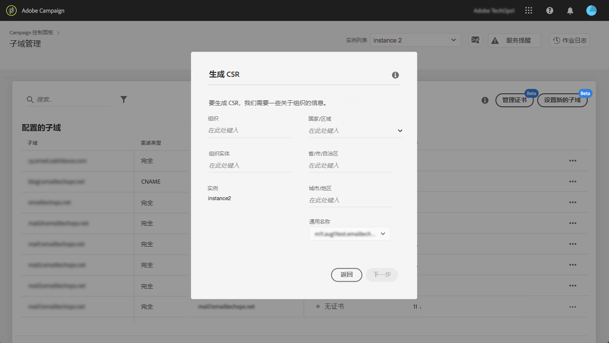

# 续订子域的SSL证书 {#renewing-subdomains-ssl-certificates}

## 关于证书续订 {#about-certificate-renewal-process}

SSL证书续订过程包括3个步骤，所有步骤都直接从控制面板执行：

1. **生成证书签名请求(CSR)** Adobe客户关怀将为您生成CSR。 您需要提供生成CSR所需的一些信息（如公用名称、组织名称和地址等）。
1. **购买SSL证书**&#x200B;生成CSR后，您可以下载它并使用它从贵公司批准的认证中心购买SSL证书。
1. **安装SSL证书购**&#x200B;买SSL证书后，可以将其安装到所需的子域上。

## 生成证书签名请求(CSR) {#generating-csr}

要生成证书签名请求(CSR)，请执行以下步骤：

1. 在卡 **[!UICONTROL Subdomains & Certificates]**中，选择所需的实例，然后单击按**[!UICONTROL Manage Certificate]** 钮。

   

1. 选 **[!UICONTROL Generate a CSR]**择，然**[!UICONTROL Next]** 后单击以启动向导，该向导将引导您完成CSR生成过程。

   

1. 此时会显示一个表单，其中包含生成CSR所需的所有详细信息。

   确保完整、准确地填写所请求的信息（如有必要，请与您的内部团队、安全和IT团队联系），然后单击 **[!UICONTROL Next]**。

   * **[!UICONTROL Organization]**:
   * **[!UICONTROL Organization Unit]**:
   * **[!UICONTROL Instance]**:与子域关联的系列活动实例的URL。
   

1. 选择要包含在CSR中的子域，然后单击 **[!UICONTROL OK]**。

   

1. 所选子域显示在列表中。 对于每个子域，选择要包含的子域，然后单击 **[!UICONTROL Next]**。

   

1. 此时将显示要包含在CSR中的子域的摘要。 单击 **[!UICONTROL Submit]**以确认您的请求。

   

1. 系统会自动生成并下载与您的选择相对应的。csr文件。 您现在可以使用它从您的公司批准的认证中心购买SSL证书。

## 使用CSR购买证书 {#purchasing-certificate}

从控制面板获取证书签名请求CSR后，从您的组织批准的认证中心购买SSL证书。

## 安装SSL证书 {#installing-ssl-certificate}

购买SSL证书后，请按照以下步骤将其安装到实例中。

1. 在卡 **[!UICONTROL Subdomains & Certificates]**中，选择所需的实例，然后单击按**[!UICONTROL Manage Certificate]** 钮。

   

1. 单击 **[!UICONTROL Install SSL Certificate]**，然**[!UICONTROL Next]** 后启动向导，该向导将指导您完成证书安装过程。

   

1. 选择包含要安装的证书的。zip文件，然后单击 **[!UICONTROL Submit]**。

   
