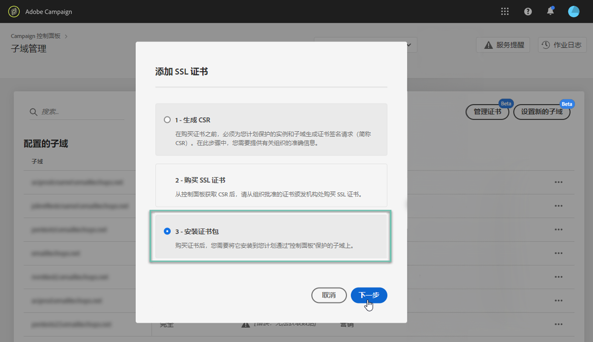
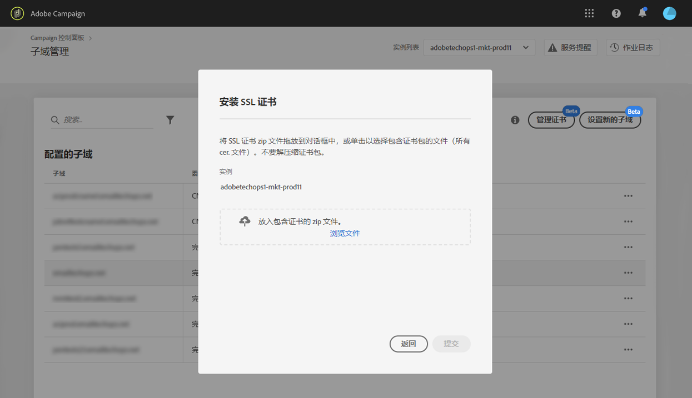

# 续订 SSL 证书 {#renewing-subdomains-ssl-certificates}

>[!CONTEXTUALHELP]
>id="cp_add_ssl_certificate"
>title="SSL 证书续订"
>abstract="要续订 SSL 证书，您需要生成 CSR，为子域购买 SSL 证书并安装证书捆绑包。仅当选择手动管理证书而不是将其委派给Adobe时，才需要执行此操作。 "

>[!NOTE]
>
>仅当选择自己管理证书而不是将此过程委派给Adobe时，才需要续订子域的SSL证书。 强烈建议将子域的SSL证书的管理委派给Adobe，因为Adobe将每年自动创建证书并在证书过期前续订证书。 [了解有关SSL证书管理的更多信息](monitoring-ssl-certificates.md#management)

SSL 证书续订过程包括以下 3 个步骤：

1. **生成证书签名请求 (CSR)**

   在购买证书之前，必须为您计划保护的实例和子域生成证书签名请求。您需要提供生成 CSR 所需的一些信息（如通用名称、组织名称和地址等）。[了解详情](#generate)

1. **购买 SSL 证书**

   生成 CSR 后，您可以将其用于从公司批准的认证中心购买 SSL 证书。

1. **安装 SSL 证书**

   在所需子域上安装购买的 SSL 证书以确保安全。[了解详情](#install)

在介绍 [Campaign v7/v8](https://experienceleague.adobe.com/docs/campaign-classic-learn/control-panel/subdomains-and-certificates/adding-ssl-certificates.html?lang=zh-Hans#subdomains-and-certificates) 或 [Campaign Standard](https://experienceleague.adobe.com/docs/campaign-standard-learn/control-panel/subdomains-and-certificates/adding-ssl-certificates.html?lang=zh-Hans#adding-ssl-certificates) 使用方法的视频中了解这一功能

**相关主题：**

* [可投放性最佳实践指南 - 适用于 Adobe Campaign 的 SSL 证书请求流程](https://experienceleague.adobe.com/docs/deliverability-learn/deliverability-best-practice-guide/additional-resources/campaign/ac-ssl-certificate-request.html?lang=zh-Hans)
* [子域品牌化](../../subdomains-certificates/using/subdomains-branding.md)
* [监测子域](../../subdomains-certificates/using/monitoring-subdomains.md)

## 生成 CSR {#generate}

>[!CONTEXTUALHELP]
>id="cp_generate_csr"
>title="CSR 生成"
>abstract="在购买证书之前，必须为您计划保护的实例和子域生成证书签名请求。"

>[!CONTEXTUALHELP]
>id="cp_select_subdomains"
>title="选择 CSR的子域"
>abstract="您可以选择在证书签名请求中包含所有子域或仅包含特定子域。只有选定的子域将通过购买的 SSL 证书进行认证。"

要生成证书签名请求 (CSR)，请执行以下步骤：

1. 在 **[!UICONTROL Subdomains & Certificates]**&#x200B;卡中，选择所需的实例，然后单击 **[!UICONTROL Manage Certificate]** 按钮。

   

1. 选择 **[!UICONTROL 1 - Generate a CSR]**，然后单击 **[!UICONTROL Next]** 以启动向导，引导您完成 CSR 生成过程。

   

1. 此时将显示一个表单，其中包含生成 CSR 所需的所有详细信息。

   请确保完整准确地填写所请求的信息，否则可能无法续订证书（如有必要，请与您的内部团队、安全部门和 IT 团队联系），然后单击 **[!UICONTROL Next]**。

   * **[!UICONTROL Organization]**：官方组织名称。
   * **[!UICONTROL Organization Unit]**：链接到子域的单位（示例：营销、IT）。
   * **[!UICONTROL Instance]**（预填充）：与子域关联的 Campaign 实例的 URL。
   * **[!UICONTROL Common name]**：默认情况下选中通用名称，您可以根据需要选择子域之一。

   

1. 选择要包含在 CSR 中的子域，然后单击 **[!UICONTROL OK]**。

   

1. 所选子域将显示在列表中。对于每个子域，选择要包含的子域，然后单击 **[!UICONTROL Next]**。

   

1. 此时将显示要包含在 CSR 中的子域的摘要。单击 **[!UICONTROL Submit]**&#x200B;以确认您的请求。

   

   >[!NOTE]
   >
   >此 **[!UICONTROL Copy CSR content]** 按钮可让您复制与CSR相关的所有信息（组织ID、实例、组织名称、通用名称、包含的子域等）

1. 将自动生成并下载与您的选择相对应的 .csr 文件。您现在可以使用它从公司批准的认证中心购买 SSL 证书。如果您需要再次下载CSR，请按照中详述的步骤操作 [本节](#download).

生成并下载CSR后，您可以使用它从组织批准的认证中心购买SSL证书。

购买SSL证书后，您可以在实例上安装该证书，以保护子域。 [了解详情](#install)

## 下载CSR {#download}

要购买SSL证书，您首先需要下载证书签名请求。 CSR在生成后会自动下载。 您还可以随时从作业日志中再次下载它：

1. 在 **[!UICONTROL Job Logs]**，选择 **[!UICONTROL Finished]** 选项卡，然后筛选列表以显示与子域管理相关的作业。

   

1. 打开与CSR生成对应的作业，然后单击 **[!UICONTROL Downbload]** 用于获取.csr文件的链接。

   

## 安装 SSL 证书 {#install}

>[!CONTEXTUALHELP]
>id="cp_install_ssl_certificate"
>title="SSL 证书安装"
>abstract="安装从您的组织批准的认证中心购买的 SSL 证书。"

购买 SSL 证书后，您可以在实例上安装该证书。继续之前，请确保您了解以下先决条件：

* 证书签名请求 (CSR) 必须是从控制面板中生成的。否则，您将无法从控制面板安装证书。
* 证书签名请求(CSR)应与已配置为与Adobe一起使用的子域匹配。 例如，它包含的子域不能多于已配置的子域。
* 证书应具有当前日期。无法安装将来日期的证书，也不能是过期日期（即必须是有效的开始和结束日期）。
* 证书应由受信任的认证中心 (CA) 颁发，如 Comodo、DigiCert、GoDaddy 等。
* 证书的大小应为 2048 位，算法应为 RSA。
* 证书应采用 X.509 PEM 格式。
* 支持 SAN 证书。
* 不支持通配符证书。
* ZIP 文件或证书不应受密码保护。
* ZIP 文件应仅包含以下内容（最好是单个文件）：
   * 最终实体证书。
   * 中间证书链（按适当顺序排列）。
   * 根证书（可选）。

要安装证书，请执行以下步骤：

1. 在 **[!UICONTROL Subdomains & Certificates]**&#x200B;卡中，选择所需的实例，然后单击 **[!UICONTROL Manage Certificate]** 按钮。

   

1. 选择 **[!UICONTROL 3 - Install Certificate Bundle]**，然后单击 **[!UICONTROL Next]** 以启动向导，引导您完成证书安装过程。

   

1. 选择包含要安装的证书的 .zip 文件，然后单击 **[!UICONTROL Submit]**。

   

>[!NOTE]
>
>证书将安装在 CSR 中包含的所有域/子域上。证书中存在的任何其他域/子域将不在考虑范围之内。

安装 SSL 证书后，证书的过期日期和状态图标会相应更新。
