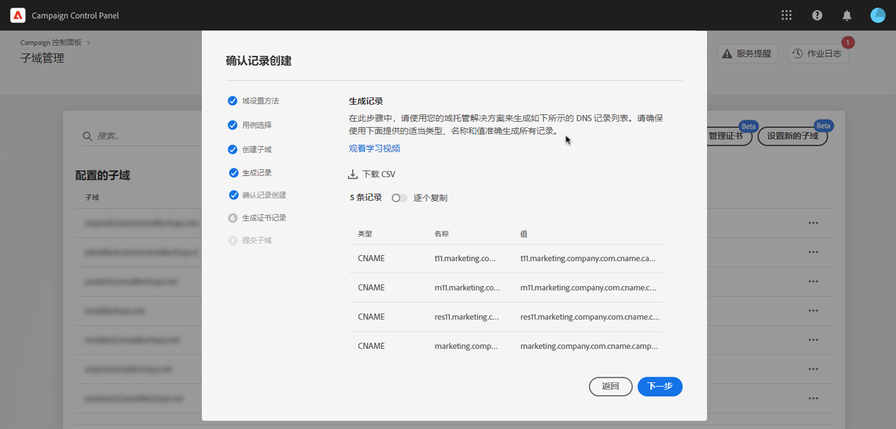
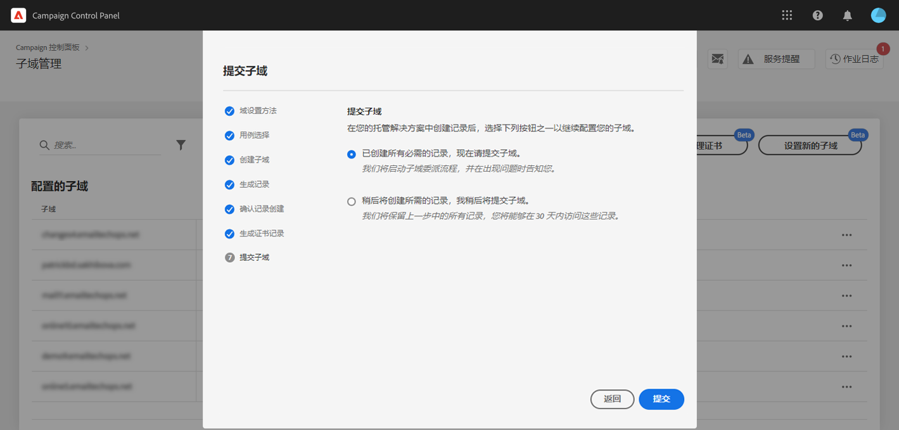

# 设置新子域 {#setting-up-subdomain}

>[!CONTEXTUALHELP]
>id="cp_subdomain_management"
>title="设置新子域并管理证书"
>abstract="您需要设置一个新子域并管理子域的 SSL 证书，以开始使用 Adobe Campaign 发送电子邮件或发布登陆页面。"
>additional-url="https://experienceleague.adobe.com/docs/control-panel/using/subdomains-and-certificates/monitoring-ssl-certificates.html?lang=zh-Hans" text="监控 SSL 证书"

## 必读 {#must-read}

本页面提供有关如何使用完全子域委派或 CNAME 设置新子域的信息。[子域品牌化](../../subdomains-certificates/using/subdomains-branding.md)一节介绍了有关这两种方法的全局概念。

**相关主题：**

* [监测子域](../../subdomains-certificates/using/monitoring-subdomains.md)

### 实例选择

子域配置仅可用于&#x200B;**生产**&#x200B;实例。

如果您在向导中选择的实例之前没有设置子域，则第一个配置的子域将成为该实例的&#x200B;**主子域**，而且您以后将无法更改它。因此，将为使用此主子域的其他子域创建&#x200B;**反向 DNS 记录**。**其他子域的回复地址和退回地址将从主子域生成。**

### 将子域的 SSL 证书委派给 Adobe

设置新子域时，您可以让 Adobe 管理 SSL 证书。强烈建议这样做，因为 Adobe 每年都会自动创建证书并在证书过期前续订。

如果使用 CNAME 来设置子域委派，Adobe 将提供证书记录以将其用于域托管解决方案，从而生成证书。

>[!NOTE]
>
>Adobe 管理的 SSL 是一项免费功能，可供用户免费使用。[了解有关 SSL 证书管理的更多信息](monitoring-ssl-certificates.md#management)

### 名称服务器配置

配置名称服务器时，请确保&#x200B;**从不将根子域委派给 Adobe**。否则，域将仅能与 Adobe 配合使用。任何其他用途都不可能实现，例如向组织的员工发送内部电子邮件。

此外，**不要为此新子域创建单独的区域文件**。

## 完全子域委派 {#full-subdomain-delegation}

>[!CONTEXTUALHELP]
>id="cp_add_new_subdomain"
>title="添加新子域"
>abstract="Adobe 建议完全委派子域。 但是，您可以使用 CNAME 或自定义方法来设置子域。"
>additional-url="https://experienceleague.adobe.com/docs/control-panel/using/subdomains-and-certificates/setting-up-new-subdomain.html?lang=zh-Hans" text="设置新子域"
>additional-url="https://helpx.adobe.com/cn/enterprise/using/support-for-experience-cloud.html" text="联系客户关怀团队"

>[!CONTEXTUALHELP]
>id="cp_add_subdomain_create_delegate"
>title="创建和委派子域"
>abstract="创建您希望在托管解决方案中与 Adobe Campaign 一起使用的子域，并将其委派给 Adobe。"
>additional-url="https://experienceleague.adobe.com/docs/control-panel/using/subdomains-and-certificates/setting-up-new-subdomain.html?lang=zh-Hans" text="设置新子域"

>[!CONTEXTUALHELP]
>id="cp_add_subdomain_submit"
>title="提交子域"
>abstract="确认并提交在上一步中配置的子域。"
>additional-url="https://experienceleague.adobe.com/docs/control-panel/using/subdomains-and-certificates/setting-up-new-subdomain.html?lang=zh-Hans" text="设置新子域"

要将子域完全委派给 Adobe Campaign，请遵循以下步骤。

在介绍如何使用 [Campaign v7/v8](https://experienceleague.adobe.com/docs/campaign-classic-learn/control-panel/subdomains-and-certificates/subdomain-delegation.html?lang=zh-Hans#subdomains-and-certificates) 或 [Campaign Standard](https://experienceleague.adobe.com/docs/campaign-standard-learn/control-panel/subdomains-and-certificates/subdomain-delegation.html?lang=zh-Hans#subdomains-and-certificates) 的视频中了解这一功能

1. 在&#x200B;**[!UICONTROL 子域和证书]**&#x200B;信息卡中，选择所需的生产实例，然后单击&#x200B;**[!UICONTROL 设置新子域]**。

   

1. 单击&#x200B;**[!UICONTROL 下一步]**&#x200B;以确认完整委派方法。

   

1. 在您的组织使用的托管解决方案中创建所需的子域和名称服务器。为此，请复制并粘贴向导中显示的 Adobe 名称服务器信息。有关如何在托管解决方案中创建子域的详细信息，请参阅[教程视频](https://video.tv.adobe.com/v/32692?captions=chi_hans)。

   >[!NOTE]
   >
   > 对于 Adobe Campaign Standard，委派的子域将允许您同时发送&#x200B;**营销**&#x200B;和&#x200B;**事务性**&#x200B;通信。

   

1. 在使用相应的 Adobe 名称服务器信息创建子域后，单击&#x200B;**[!UICONTROL 下一步]**。

1. 如果选择了 Campaign v7/v8 实例，请为子域选择所需的用例：**营销通信**&#x200B;或&#x200B;**事务性与操作性通信**。[此小节](../../subdomains-certificates/using/subdomains-branding.md#about-subdomains-use-cases)中介绍了有关子域用例的全局概念。

   

1. 输入您在托管解决方案中创建的子域，然后单击&#x200B;**[!UICONTROL 提交]**。

   确保填写要委派的子域的&#x200B;**全名**。例如，要委派“email.weretail.com”子域，请键入“email.weretail.com”。

1. 要将子域 SSL 证书的生成委派给 Adobe，请启用&#x200B;**[!UICONTROL 为子域选择 Adobe 管理的 SSL]** 选项。[了解有关 SSL 证书委派的更多信息](delegate-ssl.md)

   

提交子域后，控制面板将执行各种检查和配置步骤。有关详细信息，请参阅[子域检查和配置](#subdomain-checks-and-configuration)。

## 使用 CNAME 的子域配置 {#use-cnames}

>[!CONTEXTUALHELP]
>id="cp_add_cname_subdomain_create_delegate"
>title="配置子域"
>abstract="在此屏幕中，指定要使用 CNAME 配置的子域。"
>additional-url="https://experienceleague.adobe.com/docs/control-panel/using/subdomains-and-certificates/setting-up-new-subdomain.html?lang=zh-Hans" text="设置新子域"

>[!CONTEXTUALHELP]
>id="cp_add_cname_records"
>title="生成记录"
>abstract="导航到您的托管解决方案，以生成此屏幕中显示的 DNS 记录列表。"
>additional-url="https://experienceleague.adobe.com/docs/control-panel/using/subdomains-and-certificates/setting-up-new-subdomain.html?lang=zh-Hans" text="设置新子域"

>[!CONTEXTUALHELP]
>id="cp_add_cname_subdomain_submit"
>title="提交子域"
>abstract="确认并提交在上一步中配置的子域。"
>additional-url="https://experienceleague.adobe.com/docs/control-panel/using/subdomains-and-certificates/setting-up-new-subdomain.html?lang=zh-Hans" text="设置新子域"

要使用 CNAME 配置子域，请遵循以下步骤。

在介绍如何使用 [Campaign v7/v8](https://experienceleague.adobe.com/docs/campaign-classic-learn/control-panel/subdomains-and-certificates/delegating-subdomains-using-cname.html?lang=zh-Hans#subdomains-and-certificates) 或 [Campaign Standard](https://experienceleague.adobe.com/docs/campaign-standard-learn/control-panel/subdomains-and-certificates/delegating-subdomains-using-cname.html?lang=zh-Hans) 的视频中了解这一功能

1. 在&#x200B;**[!UICONTROL 子域和证书]**&#x200B;信息卡中，选择所需的生产实例，然后单击&#x200B;**[!UICONTROL 设置新子域]**。

   

1. 选择 **[!UICONTROL CNAME]** 方法，然后单击&#x200B;**[!UICONTROL 下一步]**。

   

1. 如果选择了 Campaign v7/v8 实例，请为子域选择所需的用例：**营销通信**&#x200B;或&#x200B;**事务性与操作性通信**。[此小节](../../subdomains-certificates/using/subdomains-branding.md#about-subdomains-use-cases)中介绍了有关子域用例的全局概念。

   

1. 输入您在托管解决方案中创建的子域。

   要将子域 SSL 证书的生成委派给 Adobe，请启用&#x200B;**[!UICONTROL 为子域选择 Adobe 管理的 SSL]** 选项。[了解有关 SSL 证书委派的更多信息](delegate-ssl.md)

   

   >[!NOTE]
   >
   >确保填写要设置的子域的&#x200B;**全名**。例如，要配置“usoffers.email.weretail.com”子域，请键入“usoffers.email.weretail.com”。

1. 此时将显示要放入您的 DNS 服务器中的记录列表。逐个复制这些记录，或者下载 CSV 文件，然后导航到您的域托管解决方案以生成匹配的 DNS 记录。

   

1. 确保前面步骤中的所有 DNS 记录均已生成至您的域托管解决方案中。如果一切配置正确，请选择第一条语句，然后单击&#x200B;**[!UICONTROL 下一步]**&#x200B;确认。

   如果要创建记录并稍后提交子域配置，请选择第二条语句。然后，您就可以直接从子域管理屏幕的&#x200B;**[!UICONTROL 正在处理]**&#x200B;区域恢复子域配置。请注意，要放在您的服务器上的 DNS 记录将由控制面板保存 30 天。在这之后，您必须从头开始配置子域。

   >[!NOTE]
   >
   >如果您选择不将 SSL 证书委派给 Adobe，则这是子域配置的最后一步。单击&#x200B;**[!UICONTROL 提交]**&#x200B;按钮。

   

1. 如果您选择将子域的证书委派给 Adobe，则会自动生成证书记录。逐个复制这些记录，或者下载 CSV 文件，然后导航到域托管解决方案以生成匹配的证书。

   

1. 请确保所有证书记录均已生成至您的域托管解决方案中。如果一切配置正确，请选择第一条语句，然后单击&#x200B;**[!UICONTROL 提交]**&#x200B;确认。

   

提交子域后，控制面板将执行各种检查和配置步骤。有关详细信息，请参阅[子域检查和配置](#subdomain-checks-and-configuration)。

## 子域检查和配置 {#subdomain-checks-and-configuration}

1. 提交子域后，控制面板将检查它是否正确指向 Adobe NS 记录，并确认此子域不存在“授权开始”(SOA) 记录。

   >[!NOTE]
   >
   >请注意，当子域配置运行时，其他控制面板请求将进入队列并仅在子域配置完成后才会执行，以防止出现任何性能问题。

1. 如果检查成功，控制面板将开始设置包含 DNS 记录、其他 URL、收件箱等的子域。

   

   您可以通过单击子域配置&#x200B;**[!UICONTROL 详细信息]**&#x200B;按钮，获取有关配置进度的更多详情。

   

1. 最终，**投放评估团队**&#x200B;将收到有关新子域的通知，以便对其进行审核。配置子域后，审核过程最长可能需要 10 个工作日。

   >[!IMPORTANT]
   >
   >执行的可投放性检查包括反馈循环和垃圾邮件投诉循环测试。因此，我们不建议在审核完成之前使用子域，因为它可能导致子域声誉受损。
   >
   >但请注意，您可以在子域上执行与 SSL 证书相关的操作，即使可投放性审核仍在处理中。

1. 在流程结束时，子域将配置为与 Adobe Campaign 实例配合使用，并将创建以下元素：

   * **具有以下 DNS 记录的子域**：SOA、MX、CNAME、DKIM、SPF、TXT；
   * 用于托管镜像、资源、跟踪页面和域密钥的&#x200B;**其他子域**；
   * **收件箱**：发件人、错误、回复。

   默认情况下，控制面板中的“回复”收件箱配置为清除电子邮件且不可查看。如果要监控营销活动的“回复”收件箱，请勿使用此地址。

您可以通过单击&#x200B;**[!UICONTROL 子域详细信息]**&#x200B;和&#x200B;**[!UICONTROL 发送人信息]**&#x200B;按钮，获取有关子域的更多详情。

## 故障排除 {#troubleshooting}

* 在某些情况下，子域配置会完成，但子域可能无法成功验证。子域将保留在&#x200B;**[!UICONTROL 已配置]**&#x200B;列表中，作业日志中包括有关该错误的信息。如果您在解决此问题时遇到麻烦，请联系客户关怀团队。
* 如果子域在配置后显示为“未验证”，请启动新的子域验证（**...**/**[!UICONTROL 验证子域]**）。如果它仍显示相同的状态，原因可能是对收件人架构进行了一些自定义操作，无法使用标准流程进行验证。请尝试使用该子域发送活动。
* 如果子域配置在可交付性审核步骤中耗时过长（超过 10 个工作日），请联系客户关怀。
